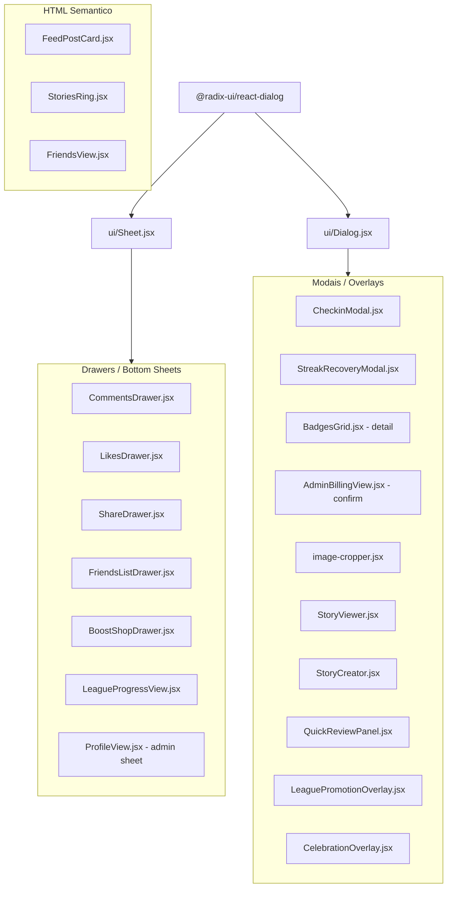

# Plano de Acessibilidade (a11y) -- FitRank

## Diagnostico Atual

O projeto possui **17 overlays custom** (drawers, modais, overlays) sem nenhuma feature de acessibilidade (focus trap, `aria-modal`, `role="dialog"`, Escape handler, retorno de foco). A unica dependencia Radix e `@radix-ui/react-popover`. Shadcn UI esta parcialmente adotado -- apenas `popover.jsx` e `command.jsx` usam primitivos de biblioteca.

### Mapa de componentes afetados

---

## Epic 1 -- Primitivos Acessiveis (Foundation)

Criar os building blocks `Dialog` e `Sheet` em `src/components/ui/` usando `@radix-ui/react-dialog`, seguindo o padrao Shadcn. Estes primitivos entregam **automaticamente**: focus trap, `aria-modal="true"`, `role="dialog"`, handler Escape, retorno de foco ao trigger.

### US 1.1 -- Instalar `@radix-ui/react-dialog`
- `pnpm add @radix-ui/react-dialog`
- Unica dependencia nova necessaria; Sheet e Dialog sao variantes do mesmo primitivo Radix.

### US 1.2 -- Criar `src/components/ui/dialog.jsx`
- Padrao Shadcn: `DialogRoot`, `DialogTrigger`, `DialogPortal`, `DialogOverlay`, `DialogContent`, `DialogHeader`, `DialogFooter`, `DialogTitle`, `DialogDescription`, `DialogClose`.
- Overlay com backdrop blur + dark theme (`bg-black/60 backdrop-blur-sm`).
- Content centralizado com animacao `animate-in fade-in`.
- Referencia: [shadcn/ui dialog](https://ui.shadcn.com/docs/components/dialog).

### US 1.3 -- Criar `src/components/ui/sheet.jsx`
- Variante do Dialog para bottom sheets e paineis laterais.
- Props: `side` (`bottom` | `right` | `left` | `top`), default `bottom`.
- Side `bottom`: `rounded-t-2xl`, slide-up animation -- replica o visual atual dos drawers.
- Herda focus trap, Escape, aria-modal do Radix Dialog internamente.
- Incluir `SheetRoot`, `SheetTrigger`, `SheetContent`, `SheetHeader`, `SheetTitle`, `SheetDescription`, `SheetClose`.

### US 1.4 -- Testes manuais dos primitivos
- Verificar focus trap (Tab cicla dentro do dialog).
- Verificar Escape fecha.
- Verificar retorno de foco ao elemento que abriu.
- Verificar `aria-modal="true"` e `role="dialog"` no DOM.

---

## Epic 2 -- Migrar Drawers para Sheet

Substituir os 7 drawers custom pelo primitivo `Sheet` (Epic 1), mantendo visual identico.

### US 2.1 -- Migrar `CommentsDrawer.jsx`
- Arquivo: [src/components/views/CommentsDrawer.jsx](src/components/views/CommentsDrawer.jsx)
- Substituir `div.fixed.inset-0` + backdrop manual por `SheetContent side="bottom"`.
- Mover `onClose` para o `SheetRoot open/onOpenChange`.
- Adicionar `SheetTitle` (ex.: "Comentarios") para `aria-labelledby`.
- Remover backdrop `div onClick={onClose}` manual.
- Botao X: manter como `SheetClose` com `aria-label="Fechar comentarios"`.

### US 2.2 -- Migrar `LikesDrawer.jsx`
- Arquivo: [src/components/views/LikesDrawer.jsx](src/components/views/LikesDrawer.jsx)
- Mesmo padrao da US 2.1. `SheetTitle`: "Curtidas".

### US 2.3 -- Migrar `ShareDrawer.jsx`
- Arquivo: [src/components/views/ShareDrawer.jsx](src/components/views/ShareDrawer.jsx)
- `SheetTitle`: "Compartilhar".

### US 2.4 -- Migrar `FriendsListDrawer.jsx`
- Arquivo: [src/components/views/FriendsListDrawer.jsx](src/components/views/FriendsListDrawer.jsx)
- `SheetTitle`: "Amigos" ou titulo dinamico.
- Corrigir tambem: backdrop do menu contextual interno (linha ~84) -- usar Radix Popover ou `SheetClose` pattern.

### US 2.5 -- Migrar `BoostShopDrawer.jsx`
- Arquivo: [src/components/views/BoostShopDrawer.jsx](src/components/views/BoostShopDrawer.jsx)
- `SheetTitle`: "Loja de Boosts".

### US 2.6 -- Migrar drawer em `LeagueProgressView.jsx`
- Arquivo: [src/components/views/LeagueProgressView.jsx](src/components/views/LeagueProgressView.jsx)
- Identificar o bottom sheet interno e envolver com `Sheet`.

### US 2.7 -- Migrar admin sheet em `ProfileView.jsx`
- Arquivo: [src/components/views/ProfileView.jsx](src/components/views/ProfileView.jsx) (~linhas 344-389)
- Painel "Administrador" como `Sheet side="bottom"`.

---

## Epic 3 -- Migrar Modais para Dialog

Substituir os 10 modais/overlays custom pelo primitivo `Dialog` (Epic 1).

### US 3.1 -- Migrar `CheckinModal.jsx`
- Arquivo: [src/components/views/CheckinModal.jsx](src/components/views/CheckinModal.jsx)
- Envolver conteudo existente em `DialogContent`.
- `DialogTitle`: "Registrar Treino".
- Manter botao "Fechar" como `DialogClose`.

### US 3.2 -- Migrar `StreakRecoveryModal.jsx`
- Arquivo: [src/components/views/StreakRecoveryModal.jsx](src/components/views/StreakRecoveryModal.jsx)
- `DialogTitle`: "Recuperar Streak".

### US 3.3 -- Migrar modal de detalhe em `BadgesGrid.jsx`
- Arquivo: [src/components/views/BadgesGrid.jsx](src/components/views/BadgesGrid.jsx)
- O bloco `selected` (modal de badge) vira `Dialog`.
- `DialogTitle`: nome da badge selecionada.

### US 3.4 -- Migrar confirmacao em `AdminBillingView.jsx`
- Arquivo: [src/components/views/AdminBillingView.jsx](src/components/views/AdminBillingView.jsx)
- Modal de confirmacao vira `Dialog` com `role="alertdialog"` (acao destrutiva).

### US 3.5 -- Migrar `image-cropper.jsx`
- Arquivo: [src/components/ui/image-cropper.jsx](src/components/ui/image-cropper.jsx)
- Fullscreen crop vira `DialogContent` com `className="max-w-none w-full h-full"`.
- `DialogTitle`: "Recortar Imagem" (pode ser `sr-only` se nao quiser titulo visivel).

### US 3.6 -- Migrar `StoryViewer.jsx`
- Arquivo: [src/components/views/StoryViewer.jsx](src/components/views/StoryViewer.jsx)
- Fullscreen dialog. `DialogTitle` sr-only: "Visualizar Story".
- Painel de "Visualizacoes" (~346-410) interno permanece como esta.

### US 3.7 -- Migrar `StoryCreator.jsx`
- Arquivo: [src/components/views/StoryCreator.jsx](src/components/views/StoryCreator.jsx)
- `DialogTitle` sr-only: "Criar Story".

### US 3.8 -- Migrar `QuickReviewPanel.jsx`
- Arquivo: [src/components/admin/moderation/QuickReviewPanel.jsx](src/components/admin/moderation/QuickReviewPanel.jsx)
- Fullscreen review dialog. Escape ja e tratado no pai -- manter compatibilidade.

### US 3.9 -- Migrar overlays de celebracao
- [LeaguePromotionOverlay.jsx](src/components/views/LeaguePromotionOverlay.jsx) e [CelebrationOverlay.jsx](src/components/views/CelebrationOverlay.jsx)
- Overlays nao-modais (sem focus trap necessario) -- avaliar se `Dialog` com `modal={false}` e mais adequado, ou se basta adicionar `role="status"` + `aria-live="polite"` como announcements.
- Decisao: usar `role="status"` com `aria-live="polite"` (sao celebracoes temporarias, nao requerem interacao obrigatoria).

---

## Epic 4 -- HTML Semantico no Feed

### US 4.1 -- `FeedPostCard`: `span` -> `button` no nome da legenda
- Arquivo: [src/components/views/FeedPostCard.jsx](src/components/views/FeedPostCard.jsx) (~linhas 221-234)
- Substituir `` por `<button type="button" className="inline font-semibold text-white hover:underline">`.
- Remover `role="button"` e `tabIndex` manuais (o `<button>` fornece tudo nativamente).

### US 4.2 -- `FeedPostCard`: `aria-label` nos botoes de icone
- Adicionar `aria-label` em:
  - Menu: `aria-label="Mais opcoes"` + `aria-expanded={menuOpen}` + `aria-haspopup="menu"`
  - Like: `aria-label={liked ? "Descurtir" : "Curtir"}` + `aria-pressed={liked}`
  - Comentarios: `aria-label="Comentarios"`
  - Compartilhar: `aria-label="Compartilhar"`

### US 4.3 -- `StoriesRing`: corrigir `div role="button"` com botao aninhado
- Arquivo: [src/components/views/StoriesRing.jsx](src/components/views/StoriesRing.jsx) (~linhas 20-48)
- Substituir `
` por `<button type="button" onClick={handleSelfTap}>`.
- Mover botao Plus para fora do botao principal (evitar interativo dentro de interativo), ou tornar o Plus uma acao separada posicionada com CSS.
- Adicionar `aria-label="Seu story"` no botao principal e `aria-label="Criar story"` no Plus.

### US 4.4 -- `HashtagFeedView`: `aria-label` no botao voltar
- Arquivo: [src/components/views/HashtagFeedView.jsx](src/components/views/HashtagFeedView.jsx) (~linha 101)
- Adicionar `aria-label="Voltar"`.

---

## Epic 5 -- HTML Semantico no FriendsView

### US 5.1 -- Mover `onClick` do icone para o `button`
- Arquivo: [src/components/views/FriendsView.jsx](src/components/views/FriendsView.jsx) (~linhas 48-50)
- Antes: `<button><UserPlus onClick={...} /></button>`
- Depois: `<button onClick={...} aria-label="Buscar pessoas"><UserPlus aria-hidden="true" /></button>`

### US 5.2 -- `aria-label` em botoes de icone
- Botao voltar (~linha 40): `aria-label="Voltar"`
- Botao UserPlus (~linha 48): `aria-label="Buscar pessoas"`
- Botao MoreHorizontal (~linha 316): `aria-label="Mais opcoes para [nome]"` (dinamico)
- Mesmo para `FriendsListDrawer.jsx`: fechar (X) e MoreHorizontal.

### US 5.3 -- Completar padrao ARIA Tabs
- Arquivo: [src/components/views/FriendsView.jsx](src/components/views/FriendsView.jsx) (~linhas 53-93)
- Ja tem `role="tablist"`, `role="tab"`, `aria-selected` -- falta:
  - `id` em cada tab e `aria-controls` apontando para o painel.
  - `role="tabpanel"` + `aria-labelledby` + `id` no conteudo de cada aba.
  - Navegacao por setas (Left/Right) entre tabs (padrao WAI-ARIA Tabs).

### US 5.4 -- Backdrop do menu contextual
- Substituir `
` por logica de `onBlur`/`onFocusOutside` ou Radix Popover para o menu de acoes.

---

## Epic 6 -- Sliders, ARIA Labels Restantes e Polish

### US 6.1 -- Slider de zoom no crop
- Arquivo: [src/components/ui/image-cropper.jsx](src/components/ui/image-cropper.jsx) (~linhas 77-88)
- Adicionar `aria-label="Nivel de zoom"`, `aria-valuemin`, `aria-valuemax`, `aria-valuenow` no `<input type="range">`.

### US 6.2 -- `PhotoCompareSlider` acessivel
- Arquivo: [src/components/ui/PhotoCompareSlider.jsx](src/components/ui/PhotoCompareSlider.jsx)
- Adicionar `role="slider"`, `aria-label="Comparar antes e depois"`, `aria-valuemin="0"`, `aria-valuemax="100"`, `aria-valuenow={position}`, `tabIndex={0}`.
- Adicionar handler de teclado (Left/Right arrows) para mover o slider.

### US 6.3 -- Sweep de `aria-label` em botoes de icone restantes
- Varredura em todos os componentes para botoes que contem apenas icone (Lucide) sem `aria-label`.
- Componentes conhecidos: botoes de fechar (X) em todos os drawers/modais, botoes de voltar (ArrowLeft/ChevronLeft) em views diversas.
- Padrao: `aria-label="Fechar"` para X, `aria-label="Voltar"` para setas.

### US 6.4 -- Imagem do FeedPostCard
- `alt=""` -> `alt` descritivo quando possivel (ex.: `alt={post.display_name + ' - treino'}`) ou manter `alt=""` com `aria-hidden="true"` se realmente decorativa.

---

## Ordem de Execucao Recomendada

```mermaid
gantt
  title Cronograma de Implementacao a11y
  dateFormat X
  axisFormat %s

  section Epic1_Foundation
  US1.1_Instalar_Radix_Dialog :e1a, 0, 1
  US1.2_Criar_dialog.jsx :e1b, 1, 2
  US1.3_Criar_sheet.jsx :e1c, 2, 3
  US1.4_Testes_primitivos :e1d, 3, 4

  section Epic4_Feed_Semantic
  US4.1_span_to_button :e4a, 1, 2
  US4.2_aria_labels_feed :e4b, 2, 3
  US4.3_StoriesRing :e4c, 2, 3
  US4.4_HashtagFeed :e4d, 2, 3

  section Epic5_Friends_Semantic
  US5.1_onClick_fix :e5a, 1, 2
  US5.2_aria_labels_friends :e5b, 2, 3
  US5.3_ARIA_tabs :e5c, 3, 4
  US5.4_backdrop_menu :e5d, 4, 5

  section Epic6_Sliders_Polish
  US6.1_crop_slider :e6a, 1, 2
  US6.2_compare_slider :e6b, 1, 2
  US6.3_sweep_aria :e6c, 4, 5
  US6.4_img_alt :e6d, 4, 5

  section Epic2_Drawers
  US2.1_CommentsDrawer :e2a, 4, 5
  US2.2_LikesDrawer :e2b, 4, 5
  US2.3_ShareDrawer :e2c, 5, 6
  US2.4_FriendsListDrawer :e2d, 5, 6
  US2.5_BoostShopDrawer :e2e, 6, 7
  US2.6_LeagueProgress :e2f, 6, 7
  US2.7_ProfileAdmin :e2g, 7, 8

  section Epic3_Modals
  US3.1_CheckinModal :e3a, 8, 9
  US3.2_StreakModal :e3b, 8, 9
  US3.3_BadgesGrid :e3c, 9, 10
  US3.4_AdminBilling :e3d, 9, 10
  US3.5_ImageCropper :e3e, 10, 11
  US3.6_StoryViewer :e3f, 10, 11
  US3.7_StoryCreator :e3g, 11, 12
  US3.8_QuickReview :e3h, 11, 12
  US3.9_Celebrations :e3i, 12, 13
```

**Epics 4, 5, 6** (semantica e ARIA) podem ser executadas **em paralelo** com a Epic 1 (foundation), pois nao dependem dos primitivos Dialog/Sheet. As Epics 2 e 3 (migracao de drawers e modais) dependem da Epic 1.

---

## Notas Tecnicas

- **Dependencia nova unica:** `@radix-ui/react-dialog` -- Sheet e Dialog sao o mesmo primitivo com variantes de posicao.
- **Visual inalterado:** as migracoes devem preservar exatamente a aparencia atual (classes Tailwind, animacoes). O Radix Dialog e unstyled -- apenas fornece a mecanica a11y.
- **CelebrationOverlay e LeaguePromotionOverlay** nao sao modais tradicionais (sao celebracoes auto-dismiss); usar `role="status"` + `aria-live` em vez de Dialog.
- **Escopo estimado:** ~30 User Stories, tocando ~25 arquivos.
