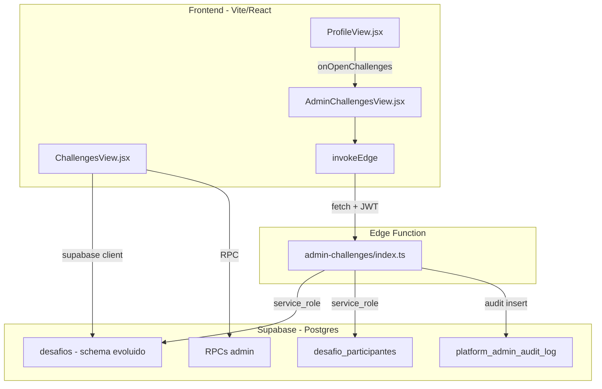
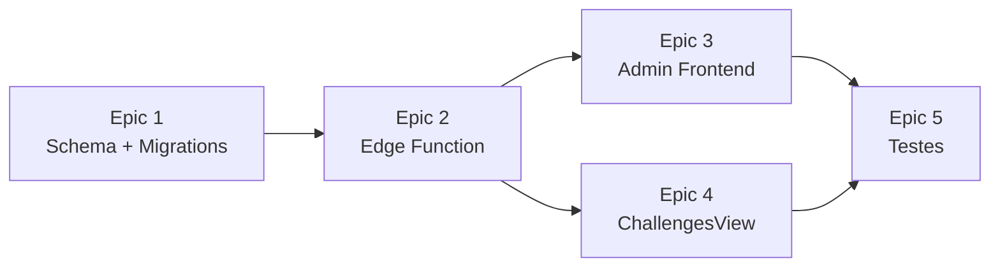

# Plano de Implementacao — Gestao de Desafios (Admin Master)

## Visao Geral da Arquitetura



## Estado Atual (Referencia)

- **Tabela `desafios`** ([supabase/migrations/20250408100200_epic_1_2c_desafios_pagamentos_rls.sql](supabase/migrations/20250408100200_epic_1_2c_desafios_pagamentos_rls.sql)): `id, tenant_id, nome, ativo, mes_referencia` com `UNIQUE(tenant_id, mes_referencia)`
- **Trigger** `bump_desafio_points_on_checkin` ([supabase/migrations/20250409120000_epic_2_leaderboard_desafio_storage.sql](supabase/migrations/20250409120000_epic_2_leaderboard_desafio_storage.sql)): incrementa `pontos_desafio` baseado em `des.ativo = true` e `date_trunc('month', des.mes_referencia)`
- **Frontend usuario**: [src/components/views/ChallengesView.jsx](src/components/views/ChallengesView.jsx) busca 1 desafio ativo por mes via `.maybeSingle()`
- **Componente reutilizavel**: [src/components/ui/WorkoutTypeMultiSelect.jsx](src/components/ui/WorkoutTypeMultiSelect.jsx) ja existe com cmdk + popover
- **Edge Functions admin** seguem padrao consistente: CORS, Bearer JWT, `is_platform_master`, `service_role` client, zod, `insertPlatformAudit`
- **Navegacao admin**: estado `view` em [src/App.jsx](src/App.jsx), botoes em [src/components/views/ProfileView.jsx](src/components/views/ProfileView.jsx)

---

## Epic 1 — Evolucao do Schema `desafios`

### Migration 1.1: `20260411100000_desafios_evolve_schema.sql`

Adicionar colunas novas com defaults seguros para nao quebrar dados existentes:

```sql
ALTER TABLE public.desafios
  ADD COLUMN IF NOT EXISTS descricao text NOT NULL DEFAULT '',
  ADD COLUMN IF NOT EXISTS status text NOT NULL DEFAULT 'ativo'
    CHECK (status IN ('rascunho', 'ativo', 'encerrado', 'cancelado')),
  ADD COLUMN IF NOT EXISTS tipo_treino text[] NOT NULL DEFAULT '{}',
  ADD COLUMN IF NOT EXISTS data_inicio date,
  ADD COLUMN IF NOT EXISTS data_fim date,
  ADD COLUMN IF NOT EXISTS criado_por uuid REFERENCES public.profiles(id),
  ADD COLUMN IF NOT EXISTS max_participantes integer,
  ADD COLUMN IF NOT EXISTS updated_at timestamptz NOT NULL DEFAULT now();
```

**Backfill** dos registros existentes:
- `data_inicio = mes_referencia`
- `data_fim = (mes_referencia + interval '1 month' - interval '1 day')::date`
- `status = CASE WHEN ativo THEN 'ativo' ELSE 'encerrado' END`

**Trigger de sincronia** `ativo <-> status` (backward compat): ao atualizar `status`, seta `ativo = (status = 'ativo')`. Isso garante que `ChallengesView.jsx` continua funcionando sem alteracao no Epic 1.

### Migration 1.2: `20260411100100_desafios_drop_unique_mes.sql`

- `ALTER TABLE public.desafios DROP CONSTRAINT desafios_tenant_id_mes_referencia_key;`
- Adicionar `CHECK (data_fim IS NULL OR data_inicio IS NULL OR data_fim >= data_inicio)`

### Migration 1.3: `20260411100200_desafios_admin_rls.sql`

Novas policies para CRUD do platform_admin (via `service_role` nas Edge Functions, as policies servem como defesa em profundidade):

```sql
CREATE POLICY desafios_admin_all ON public.desafios
  FOR ALL TO authenticated
  USING (EXISTS (
    SELECT 1 FROM public.profiles p
    WHERE p.id = auth.uid() AND p.is_platform_master
  ))
  WITH CHECK (EXISTS (
    SELECT 1 FROM public.profiles p
    WHERE p.id = auth.uid() AND p.is_platform_master
  ));
```

Manter a policy de SELECT existente `desafios_select_tenant` para usuarios normais.

### Migration 1.4: `20260411100300_audit_target_type_desafio.sql`

Atualizar o CHECK constraint de `platform_admin_audit_log.target_type` para incluir `'desafio'`:

```sql
ALTER TABLE public.platform_admin_audit_log
  DROP CONSTRAINT IF EXISTS platform_admin_audit_log_target_type_check;
ALTER TABLE public.platform_admin_audit_log
  ADD CONSTRAINT platform_admin_audit_log_target_type_check
  CHECK (target_type IN ('user', 'checkin', 'tenant', 'none', 'desafio'));
```

### Migration 1.5: `20260411100400_bump_desafio_date_range.sql`

Atualizar o trigger `bump_desafio_points_on_checkin` para usar `data_inicio/data_fim` quando disponiveis, com fallback para `mes_referencia`:

```sql
-- Substitui a logica de mes_referencia por range data_inicio..data_fim
WHERE dp.user_id = new.user_id
  AND des.tenant_id = new.tenant_id
  AND des.status = 'ativo'
  AND new.checkin_local_date >= COALESCE(des.data_inicio, des.mes_referencia)
  AND new.checkin_local_date <= COALESCE(des.data_fim,
    (des.mes_referencia + interval '1 month' - interval '1 day')::date)
```

### Migration 1.6: `20260411100500_desafios_admin_rpcs.sql`

RPCs para o admin:

- **`admin_desafios_list`**: listagem cross-tenant com filtros (tenant_id, status, periodo), contagem de participantes, paginacao. `security definer`, check `is_platform_master`.
- **`admin_desafio_participantes`**: ranking de um desafio especifico com dados do participante (para o admin ver). `security definer`, check `is_platform_master`.

---

## Epic 2 — Edge Function `admin-challenges`

### Arquivo: `supabase/functions/admin-challenges/index.ts`

Seguir exatamente o padrao de [admin-tenants/index.ts](supabase/functions/admin-tenants/index.ts):

**Imports e setup:**
- `@supabase/supabase-js@2.49.1`, `zod@3.24.2`
- CORS: `GET, POST, PATCH, DELETE, OPTIONS`
- Auth: Bearer JWT -> `is_platform_master` -> 403
- Service role client `admin`
- Helper `insertPlatformAudit` (copiar padrao existente)
- Helper `jsonResponse`

**Schemas Zod:**

```typescript
const createSchema = z.object({
  tenant_id: z.string().uuid(),
  nome: z.string().min(1).max(200),
  descricao: z.string().max(2000).default(''),
  tipo_treino: z.array(z.string().min(1).max(100)).default([]),
  data_inicio: z.string().regex(/^\d{4}-\d{2}-\d{2}$/),
  data_fim: z.string().regex(/^\d{4}-\d{2}-\d{2}$/),
  max_participantes: z.number().int().min(1).nullable().default(null),
  status: z.enum(['rascunho', 'ativo']).default('rascunho')
});

const updateSchema = z.object({
  id: z.string().uuid(),
  nome: z.string().min(1).max(200).optional(),
  descricao: z.string().max(2000).optional(),
  tipo_treino: z.array(z.string().min(1).max(100)).optional(),
  data_inicio: z.string().regex(/^\d{4}-\d{2}-\d{2}$/).optional(),
  data_fim: z.string().regex(/^\d{4}-\d{2}-\d{2}$/).optional(),
  max_participantes: z.number().int().min(1).nullable().optional(),
  status: z.enum(['rascunho','ativo','encerrado','cancelado']).optional()
});

const removeParticipantSchema = z.object({
  desafio_id: z.string().uuid(),
  user_id: z.string().uuid(),
  motivo: z.string().min(1).max(500)
});
```

**Rotas HTTP:**

- **GET** `?mode=list` — lista desafios via RPC `admin_desafios_list` com filtros (tenant_id, status, from, to, limit, offset)
- **GET** `?mode=detail&id=<uuid>` — detalhe de um desafio + participantes via RPC
- **POST** — criar desafio (validar datas coerentes, tipo_treino existe no catalogo, tenant valido)
- **PATCH** — editar desafio (regras de status: nao editar datas de desafio ativo com participantes)
- **DELETE** `?id=<uuid>` — cancelar (soft-delete: muda status para `cancelado`)

**Regras de negocio no backend:**
- `data_fim >= data_inicio`
- Se status muda de `rascunho -> ativo`: validar que `data_inicio` e `data_fim` estao preenchidos
- Se desafio ja esta `ativo` com participantes: bloquear edicao de `data_inicio`, `data_fim`, `tenant_id`
- Se desafio esta `encerrado` ou `cancelado`: bloquear qualquer edicao exceto cancelamento
- Validar `tipo_treino[]` contra RPC `admin_tipo_treino_catalog()`
- Preencher `criado_por = user.id` no POST, `mes_referencia = data_inicio` (backward compat)
- **Audit**: `desafio.create`, `desafio.update`, `desafio.activate`, `desafio.close`, `desafio.cancel`, `desafio.remove_participant`

---

## Epic 3 — CRUD Admin no Frontend

### US-DESAFIO-01: Tela de listagem — `AdminChallengesView.jsx`

Novo arquivo: [src/components/views/AdminChallengesView.jsx](src/components/views/AdminChallengesView.jsx)

Padrao identico ao [AdminTenantsView.jsx](src/components/views/AdminTenantsView.jsx):
- Props: `onBack`
- `edgeReady` memo com `is_platform_master`
- `invokeEdge('admin-challenges', supabase, { method: 'GET', searchParams: { mode: 'list', ... } })`
- Filtros: select de tenant (carregar via `invokeEdge('admin-tenants')`), select de status, inputs de data
- Lista com cards mostrando: nome, status (badge colorido), tenant, tipo_treino (chips), data_inicio - data_fim, contagem de participantes
- Botao "Novo desafio" abre formulario
- Click no card abre detalhe/edicao

### US-DESAFIO-02: Formulario de criacao/edicao

Inline no `AdminChallengesView.jsx` (toggle de estado, como nos outros admins) ou modal:
- Campos: nome (input), descricao (textarea), tenant (select dos tenants), tipo_treino (reutilizar `WorkoutTypeMultiSelect` de [src/components/ui/WorkoutTypeMultiSelect.jsx](src/components/ui/WorkoutTypeMultiSelect.jsx) com catalogo via RPC), data_inicio (date input), data_fim (date input), max_participantes (number input, opcional)
- Duracao calculada automaticamente: "X dias" exibido abaixo das datas
- Status inicial: `rascunho` por padrao
- Submit via `invokeEdge('admin-challenges', supabase, { method: 'POST', body: {...} })`

### US-DESAFIO-03: Edicao

- Mesmo formulario, pre-populado com dados do desafio
- Campos desabilitados conforme regras de status (datas locked se ativo com participantes)
- PATCH via Edge Function

### US-DESAFIO-04: Acoes de ciclo de vida

Botoes contextuais no detalhe do desafio:
- "Ativar" (rascunho -> ativo): `PATCH { id, status: 'ativo' }` com dialog de confirmacao
- "Encerrar" (ativo -> encerrado): dialog com confirmacao
- "Cancelar" (qualquer -> cancelado): dialog com confirmacao + textarea de motivo

### US-DESAFIO-05: Participantes

Panel/secao dentro do detalhe do desafio:
- Lista de participantes com ranking (via RPC `admin_desafio_participantes`)
- Acao "Remover participante" com modal de motivo obrigatorio
- PATCH via Edge Function com `removeParticipantSchema`

### Integracao no App

**[src/App.jsx](src/App.jsx):**
- Adicionar `import { AdminChallengesView }` 
- Adicionar rota: `{view === 'admin-challenges' && profile?.is_platform_master && <AdminChallengesView onBack={() => setView('profile')} />}`
- Adicionar callback no ProfileView: `onOpenChallenges={profile?.is_platform_master ? () => setView('admin-challenges') : undefined}`

**[src/components/views/ProfileView.jsx](src/components/views/ProfileView.jsx):**
- Adicionar prop `onOpenChallenges`
- Adicionar botao "Admin · Desafios" (entre "Admin · Tenants" e "Admin · Usuarios")

---

## Epic 4 — Adaptacao do ChallengesView.jsx (Lado Usuario)

Alterar [src/components/views/ChallengesView.jsx](src/components/views/ChallengesView.jsx):

**De:**
```javascript
.from('desafios')
.eq('ativo', true)
.eq('mes_referencia', monthStart)
.maybeSingle();
```

**Para:**
```javascript
.from('desafios')
.eq('tenant_id', tenantId)
.eq('status', 'ativo')
.lte('data_inicio', todayStr)
.gte('data_fim', todayStr)
.order('data_inicio', { ascending: true });
// Remover .maybeSingle() -> retorna array
```

Novas informacoes no card:
- Tipo(s) de treino: chips/badges com os valores de `tipo_treino[]`
- Duracao: "data_inicio - data_fim" formatado + badge "X dias restantes"
- Barra de progresso temporal (dias passados / total de dias)
- Se `max_participantes` definido: "X/Y vagas" com indicador visual

Mapear sobre array de desafios (nao mais `.maybeSingle()`), renderizando multiplos cards.

---

## Epic 5 — Testes e Qualidade

### Smoke Tests de RLS

Adicionar em [docs/rls-smoke-tests.md](docs/rls-smoke-tests.md):
- Usuario normal: SELECT desafios do proprio tenant (OK), INSERT/UPDATE/DELETE desafios (DENIED)
- Platform master: SELECT/INSERT/UPDATE/DELETE desafios de qualquer tenant (OK)
- Usuario normal: nao ve desafios `rascunho` (filtrar na query, nao no RLS)

### Testes da Edge Function

Payloads a validar:
- POST sem `nome` -> 400
- POST com `data_fim < data_inicio` -> 400
- POST com `tipo_treino` inexistente no catalogo -> 400
- POST valido -> 201 + audit log
- PATCH ativar desafio sem datas -> 400
- PATCH editar datas de desafio ativo com participantes -> 400
- GET lista com filtros -> 200
- DELETE desafio -> status `cancelado` + audit
- Chamada sem JWT -> 401
- Chamada com usuario nao-master -> 403

### Checklist Visual (Mobile-first)

- Listagem de desafios responsiva (cards empilhados)
- Formulario com inputs acessiveis (labels, aria, focus)
- Badges de status com cores consistentes: rascunho (zinc), ativo (green), encerrado (blue), cancelado (red)
- WorkoutTypeMultiSelect funciona em mobile
- ChallengesView com multiplos cards nao quebra layout

---

## Ordem de Implementacao Recomendada



1. **Epic 1** primeiro (fundacao, sem quebrar nada)
2. **Epic 2** em seguida (backend seguro antes do frontend)
3. **Epic 3 e 4** podem ser paralelos (admin e usuario sao independentes)
4. **Epic 5** ao final de cada Epic, consolidar na fase final

---

## Nomes de Arquivos Sugeridos

**Migrations (`supabase/migrations/`):**
- `20260411100000_desafios_evolve_schema.sql`
- `20260411100100_desafios_drop_unique_mes.sql`
- `20260411100200_desafios_admin_rls.sql`
- `20260411100300_audit_target_type_desafio.sql`
- `20260411100400_bump_desafio_date_range.sql`
- `20260411100500_desafios_admin_rpcs.sql`

**Edge Function:**
- `supabase/functions/admin-challenges/index.ts`

**Componentes:**
- `src/components/views/AdminChallengesView.jsx`

**Arquivos modificados:**
- `src/App.jsx` (import + rota + callback)
- `src/components/views/ProfileView.jsx` (prop + botao)
- `src/components/views/ChallengesView.jsx` (multiplos desafios + novos campos)
