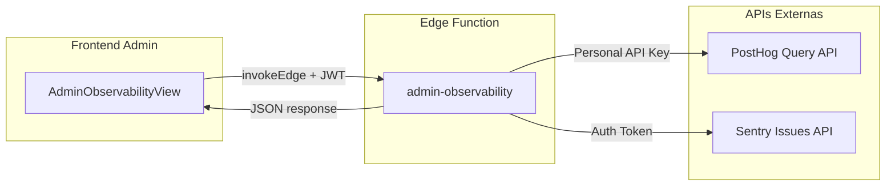

# Admin Observability Dashboard (In-App)

## Problema
As metricas de Sentry e PostHog so sao acessiveis nos sites externos. O admin master quer ver dados essenciais diretamente no FitRank, sem sair do app.

## Arquitetura

As API keys do PostHog (Personal API Key) e Sentry (Auth Token) sao **secretas** e nao podem ser expostas no frontend. Solucao: uma Edge Function proxy que valida o JWT + `is_platform_master` e repassa as queries.

## Dados Exibidos

O dashboard tera 4 secoes compactas:

- **Visao Geral**: DAU (hoje), WAU, MAU -- via PostHog TrendsQuery em `$pageview`
- **Funnel de Check-in**: conversao `checkin_started` > `checkin_submitted` > `checkin_success` -- via PostHog FunnelsQuery
- **Erros Recentes**: top 5 issues nao resolvidas do Sentry (titulo, contagem, ultima ocorrencia)
- **Web Vitals**: LCP, INP, CLS medios dos ultimos 7 dias -- via PostHog HogQLQuery em `web_vitals`

## Implementacao

### Epic 1 -- Edge Function `admin-observability`

Criar [supabase/functions/admin-observability/index.ts](supabase/functions/admin-observability/index.ts):

- Valida JWT e verifica `is_platform_master` (mesma logica das outras Edge Functions admin)
- Aceita `action` no body: `metrics` | `funnel` | `errors` | `vitals`
- Para cada action, chama a API correspondente:
  - **metrics**: POST `https://us.i.posthog.com/api/projects/{id}/query/` com `TrendsQuery` em `$pageview`, unique users, por dia/semana/mes
  - **funnel**: POST mesma URL com `FunnelsQuery`, steps: `checkin_started` > `checkin_submitted` > `checkin_success`
  - **errors**: GET `https://sentry.io/api/0/organizations/{org}/issues/?query=is:unresolved&statsPeriod=24h&limit=5`
  - **vitals**: POST PostHog com `HogQLQuery` agregando `avg(value)` por `metric` da tabela `events` onde `event = 'web_vitals'`
- Secrets necessarios no Supabase:
  - `POSTHOG_PERSONAL_API_KEY` (gerada em PostHog > Settings > Personal API Keys)
  - `POSTHOG_PROJECT_ID` (visivel em PostHog > Settings)
  - `SENTRY_AUTH_TOKEN` (gerado em sentry.io > Settings > Auth Tokens)
  - `SENTRY_ORG_SLUG` (ex: `fitrank`)
  - `SENTRY_PROJECT_SLUG` (ex: `fitrank`)

### Epic 2 -- `AdminObservabilityView.jsx`

Criar [src/components/views/AdminObservabilityView.jsx](src/components/views/AdminObservabilityView.jsx):

- **Props**: `onBack`
- **Guard**: `if (!profile?.is_platform_master) return null`
- Usa `useAuth()` para `supabase`, `profile`, `session`
- Chama `invokeEdge('admin-observability', supabase, { method: 'POST', body: { action } })` para cada secao
- Carrega tudo em paralelo no mount

**Layout** (4 cards, estilo consistente com `AdminEngagementView`):

1. **Card "Usuarios Ativos"** -- 3 numeros grandes: DAU / WAU / MAU com delta vs periodo anterior
2. **Card "Funnel de Check-in"** -- 3 steps com barras de progresso e taxa de conversao (%)
3. **Card "Erros Recentes (Sentry)"** -- lista com titulo, contagem de eventos, tempo relativo ("ha 2h")
4. **Card "Web Vitals"** -- 3 metricas (LCP, INP, CLS) com badge de rating (good/needs-improvement/poor)

**Skeleton loading** enquanto carrega, **estados de erro** por card (um card falhando nao afeta os outros).

### Epic 3 -- Integracao no App

- Importar `AdminObservabilityView` em [src/App.jsx](src/App.jsx)
- Adicionar `admin-observability` ao mapa de views em [src/lib/view-transition.js](src/lib/view-transition.js) e [src/hooks/useNavigationStack.js](src/hooks/useNavigationStack.js)
- Adicionar botao "Observabilidade" no menu admin em [src/components/views/ProfileView.jsx](src/components/views/ProfileView.jsx) (ao lado de "Engajamento", "Usuarios", etc.)
- Renderizar condicionalmente em `App.jsx`: `{view === 'admin-observability' && profile?.is_platform_master && <AdminObservabilityView onBack={goBack} />}`

### Epic 4 -- Documentacao de Setup

Atualizar [docs/observability-guide.md](docs/observability-guide.md) com:
- Como gerar o Personal API Key no PostHog
- Como gerar o Auth Token no Sentry
- Como salvar os 5 secrets no Supabase (`supabase secrets set`)
