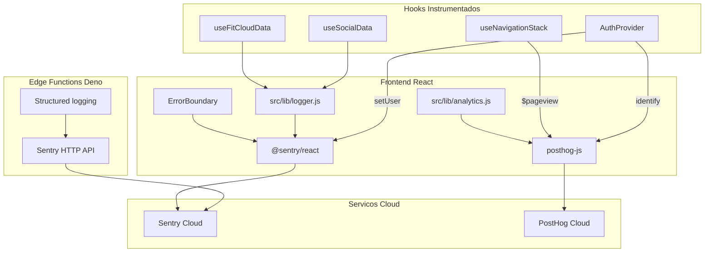

# Analytics e Observabilidade -- Plano de Implementacao

## Diagnostico Atual

- **58 chamadas** `console.error`/`console.warn` espalhadas em 13 arquivos, todas com prefixo `FitRank:`
- **Zero** Error Boundary React -- erros de renderizacao crasham silenciosamente
- **Zero** SDK de analytics ou error monitoring
- **Zero** tracking de page views, funnels ou retencao
- Tracking first-party limitado: `post_impressions` e `shares` via Supabase (nao e analytics de produto)
- Edge Functions logam apenas em stdout/stderr do Deno (sem agregacao)
- Service Worker (`register-sw.js`) so faz `console.error` em falha de registro

## Stack Escolhida

- **Sentry** (cloud, free tier: 5K errors/mo, 10K transactions/mo) -- error monitoring + performance
- **PostHog** (cloud, free tier: 1M events/mo, 5K session replays/mo) -- product analytics + funnels + session replay

## Arquitetura



---

## Epic 1 -- Sentry Error Monitoring (Foundation)

**Objetivo**: Capturar erros de renderizacao, excecoes nao tratadas e erros de API com contexto rico (usuario, tenant, view).

### US 1.1 -- Instalar e configurar Sentry React SDK

- `pnpm add @sentry/react`
- Criar [src/lib/sentry.js](src/lib/sentry.js) com `Sentry.init()`:
  - `dsn` via `VITE_SENTRY_DSN`
  - `environment`: `import.meta.env.MODE`
  - `release`: `import.meta.env.VITE_APP_VERSION` (ou git SHA via Vite define)
  - `tracesSampleRate: 0.2` (20% das transacoes)
  - `replaysSessionSampleRate: 0` (session replay pelo PostHog)
  - `integrations`: `Sentry.browserTracingIntegration()`
- Importar em [src/main.jsx](src/main.jsx) **antes** do React render

### US 1.2 -- React Error Boundary

- Criar [src/components/ui/ErrorBoundary.jsx](src/components/ui/ErrorBoundary.jsx):
  - Usar `Sentry.ErrorBoundary` com fallback UI amigavel ("Algo deu errado, recarregue")
  - Botao de reload que chama `window.location.reload()`
- Envolver o app principal em [src/App.jsx](src/App.jsx) com `<ErrorBoundary>`

### US 1.3 -- Contexto de usuario no Sentry

- Em [src/components/auth/AuthProvider.jsx](src/components/auth/AuthProvider.jsx), ao autenticar:
  - `Sentry.setUser({ id: user.id, email: user.email })`
  - `Sentry.setTag('tenant_id', profile.tenant_id)`
  - `Sentry.setTag('is_master', profile.is_platform_master)`
- No logout: `Sentry.setUser(null)`

### US 1.4 -- Sentry no Service Worker

- Em [src/lib/register-sw.js](src/lib/register-sw.js), no `onRegisterError`:
  - Enviar para Sentry via `fetch` direto ao envelope endpoint (o SW nao tem acesso ao SDK React)
  - Alternativa: propagar o erro para o main thread via `postMessage`

**Arquivos**: `src/lib/sentry.js` (novo), `src/main.jsx`, `src/App.jsx`, `src/components/ui/ErrorBoundary.jsx` (novo), `AuthProvider.jsx`, `register-sw.js`

---

## Epic 2 -- PostHog Product Analytics (Foundation)

**Objetivo**: Rastrear page views, identificar usuarios, e preparar a base para funnels e session replay.

### US 2.1 -- Instalar e configurar PostHog JS SDK

- `pnpm add posthog-js`
- Criar [src/lib/posthog.js](src/lib/posthog.js):
  - `posthog.init(VITE_POSTHOG_KEY, { api_host, autocapture: true, capture_pageview: false })` (page view manual via hook)
  - `persistence: 'localStorage+cookie'`
  - `disable_session_recording: false` (session replay ativo)
- Importar em [src/main.jsx](src/main.jsx) apos Sentry

### US 2.2 -- Identificacao de usuario

- Em [src/components/auth/AuthProvider.jsx](src/components/auth/AuthProvider.jsx):
  - `posthog.identify(user.id, { email, tenant_id, tenant_slug, is_master, league, level })`
  - `posthog.group('tenant', tenant_id, { name: tenant.name, slug: tenant.slug })`
- No logout: `posthog.reset()`

### US 2.3 -- Page view automatico via useNavigationStack

- Em [src/hooks/useNavigationStack.js](src/hooks/useNavigationStack.js), na funcao `navigate()`:
  - `posthog.capture('$pageview', { $current_url: path, view_name: newView })`
- Capturar tambem no `goBack()` e no handler de `popstate`

### US 2.4 -- Group analytics por tenant

- Configurar PostHog Groups para segmentar metricas por academia/tenant
- Permite dashboards "por tenant" sem queries customizadas

**Arquivos**: `src/lib/posthog.js` (novo), `src/main.jsx`, `AuthProvider.jsx`, `useNavigationStack.js`

---

## Epic 3 -- Centralized Logger + Migration

**Objetivo**: Substituir os 58 `console.error/warn` por um logger centralizado que envia para Sentry e mantem log local em dev.

### US 3.1 -- Criar logger utility

- Criar [src/lib/logger.js](src/lib/logger.js):
  - `logger.error(message, error?, context?)` -- `Sentry.captureException` + `console.error` em dev
  - `logger.warn(message, context?)` -- `Sentry.captureMessage(level: 'warning')` + `console.warn` em dev
  - `logger.info(message, context?)` -- so `console.log` em dev (nao envia para Sentry)
  - Contexto automatico: `{ view: currentView }` quando disponivel
- Em producao, suprimir `console.*` para manter o browser limpo

### US 3.2 -- Migrar chamadas existentes

Substituir progressivamente os 58 pontos de `console.error/warn` nos arquivos:
- [src/hooks/useFitCloudData.js](src/hooks/useFitCloudData.js) (13 chamadas)
- [src/hooks/useSocialData.js](src/hooks/useSocialData.js) (27 chamadas)
- [src/components/views/ShareDrawer.jsx](src/components/views/ShareDrawer.jsx) (3)
- [src/components/views/CommentsDrawer.jsx](src/components/views/CommentsDrawer.jsx) (2)
- [src/components/views/AdminModerationView.jsx](src/components/views/AdminModerationView.jsx) (2)
- [src/components/views/AdminEngagementView.jsx](src/components/views/AdminEngagementView.jsx) (2)
- [src/components/views/ChallengesView.jsx](src/components/views/ChallengesView.jsx) (2)
- [src/components/views/ProfileView.jsx](src/components/views/ProfileView.jsx) (2)
- Demais (5 chamadas em 5 arquivos)

### US 3.3 -- Structured logging em Edge Functions

- Criar [supabase/functions/_shared/logger.ts](supabase/functions/_shared/logger.ts):
  - JSON estruturado (`{ timestamp, level, function_name, message, error, user_id }`)
  - Envio para Sentry via HTTP envelope API (sem SDK pesado no Deno)
  - Fallback: `console.error` padrao (visivel nos Supabase Logs)
- Atualizar Edge Functions existentes para usar o logger compartilhado

**Arquivos**: `src/lib/logger.js` (novo), 13 arquivos com console.*, `supabase/functions/_shared/logger.ts` (novo), Edge Functions existentes

---

## Epic 4 -- Core Event Instrumentation

**Objetivo**: Instrumentar os eventos de produto criticos para construir funnels e medir engajamento.

### US 4.1 -- Analytics utility

- Criar [src/lib/analytics.js](src/lib/analytics.js) -- wrapper fino sobre PostHog:
  - `track(event, properties?)` -- `posthog.capture(event, props)`
  - Eventos padronizados com prefixo de dominio (ex: `checkin_started`, `social_like`, `gamification_badge_unlocked`)
  - Garante que propriedades comuns (`tenant_id`, `platform`) sao sempre incluidas

### US 4.2 -- Funnel de check-in

Eventos em [src/App.jsx](src/App.jsx) e [src/hooks/useFitCloudData.js](src/hooks/useFitCloudData.js):
- `checkin_started` (abre modal)
- `checkin_photo_selected` (foto escolhida)
- `checkin_submitted` (clicou enviar)
- `checkin_success` (retorno OK, com `{ points, streak_day }`)
- `checkin_error` (falha, com `{ error_type }`)

### US 4.3 -- Eventos sociais

Eventos em [src/hooks/useSocialData.js](src/hooks/useSocialData.js):
- `social_like` / `social_unlike`
- `social_comment_added`
- `social_share` (com `{ platform: 'instagram'|'whatsapp' }`)
- `social_story_created` / `social_story_viewed`
- `social_friend_request_sent` / `social_friend_accepted`
- `social_mention_used`

### US 4.4 -- Eventos de gamificacao

Eventos em [src/hooks/useFitCloudData.js](src/hooks/useFitCloudData.js) e [src/hooks/useSocialData.js](src/hooks/useSocialData.js):
- `gamification_badge_unlocked` (com `{ badge_key, category }`)
- `gamification_level_up` (com `{ new_level, xp }`)
- `gamification_league_promoted` (com `{ from_league, to_league }`)
- `gamification_streak_recovery` (com `{ streak_days }`)
- `gamification_boost_purchased` (com `{ boost_type, points }`)

### US 4.5 -- Eventos de auth e onboarding

Eventos em [src/components/auth/AuthProvider.jsx](src/components/auth/AuthProvider.jsx) e [src/components/auth/AuthScreen.jsx](src/components/auth/AuthScreen.jsx):
- `auth_login` / `auth_signup` / `auth_logout`
- `auth_password_reset_requested`
- `pwa_install_prompted` / `pwa_installed`

**Arquivos**: `src/lib/analytics.js` (novo), `App.jsx`, `useFitCloudData.js`, `useSocialData.js`, `AuthProvider.jsx`, `AuthScreen.jsx`, `InstallPrompt.jsx`

---

## Epic 5 -- Performance Monitoring e Web Vitals

**Objetivo**: Medir performance real dos usuarios (Core Web Vitals) e latencia das APIs.

### US 5.1 -- Web Vitals

- `pnpm add web-vitals`
- Em [src/lib/sentry.js](src/lib/sentry.js) ou arquivo dedicado:
  - `onCLS`, `onFID`, `onLCP`, `onTTFB`, `onINP`
  - Enviar para PostHog como evento `web_vitals` (com `{ metric, value, rating }`)
  - Sentry `browserTracingIntegration` ja captura LCP/FID automaticamente

### US 5.2 -- PWA metrics

- Em [src/lib/register-sw.js](src/lib/register-sw.js) e [src/components/ui/InstallPrompt.jsx](src/components/ui/InstallPrompt.jsx):
  - `pwa_sw_registered` / `pwa_sw_update_available` / `pwa_sw_update_applied`
  - `pwa_install_prompt_shown` / `pwa_install_accepted` / `pwa_install_dismissed`
  - `pwa_offline_detected` / `pwa_online_restored`

**Arquivos**: `src/lib/sentry.js`, `register-sw.js`, `InstallPrompt.jsx`, `SwUpdateToast.jsx`

---

## Epic 6 -- Dashboards, Alertas e Session Replay

**Objetivo**: Configurar dashboards pre-definidos e alertas para que o time possa agir nos dados.

### US 6.1 -- Sentry: alertas

Configurar no painel Sentry (manual, documentar em `docs/`):
- Alerta "New Issue" -- notifica no email/Slack quando surge erro novo
- Alerta "Spike" -- volume de erros sobe 3x em 1h
- Alerta "Critical" -- qualquer erro em Edge Functions

### US 6.2 -- PostHog: dashboards essenciais

Configurar no painel PostHog (manual, documentar em `docs/`):
- **Visao Geral**: DAU, WAU, MAU (baseado em `$pageview`)
- **Retencao**: cohort retention semanal
- **Funnel de Check-in**: `checkin_started` -> `checkin_submitted` -> `checkin_success`
- **Engajamento Social**: likes, comments, shares por dia
- **Feature Adoption**: stories, badges, boosts, streak recovery
- **Tenant Breakdown**: metricas agrupadas por academia

### US 6.3 -- PostHog: session replay

- Ja habilitado no SDK (US 2.1)
- Configurar sampling: 10% das sessoes normais, 100% das sessoes com erro
- Privacy: mascarar inputs sensiveis (`password`, `email`) via config do SDK

### US 6.4 -- Documentacao operacional

- Criar [docs/observability-guide.md](docs/observability-guide.md):
  - Onde ficam os dashboards (URLs)
  - Como investigar um erro no Sentry
  - Como analisar um funnel no PostHog
  - Como ver session replay de um usuario especifico
  - Variaveis de ambiente necessarias (`VITE_SENTRY_DSN`, `VITE_POSTHOG_KEY`)

**Arquivos**: `docs/observability-guide.md` (novo)

---

## Variaveis de Ambiente

```
VITE_SENTRY_DSN=https://xxxxx@oXXXXXX.ingest.sentry.io/XXXXXXX
VITE_POSTHOG_KEY=phc_xxxxxxxxxxxxxxxxxxxxxxxxxxxxxxxxxxxx
VITE_POSTHOG_HOST=https://us.i.posthog.com
VITE_APP_VERSION=1.0.0
```

## Ordem de Execucao Recomendada

1. **Epic 1** (Sentry) -- valor imediato: para de voar cego em erros
2. **Epic 3** (Logger + Migration) -- consolida logging, envia tudo pro Sentry
3. **Epic 2** (PostHog) -- comeca a ver quem usa o que
4. **Epic 4** (Core Events) -- funnels e metricas de produto
5. **Epic 5** (Performance) -- Web Vitals e PWA metrics
6. **Epic 6** (Dashboards) -- transforma dados em decisoes
