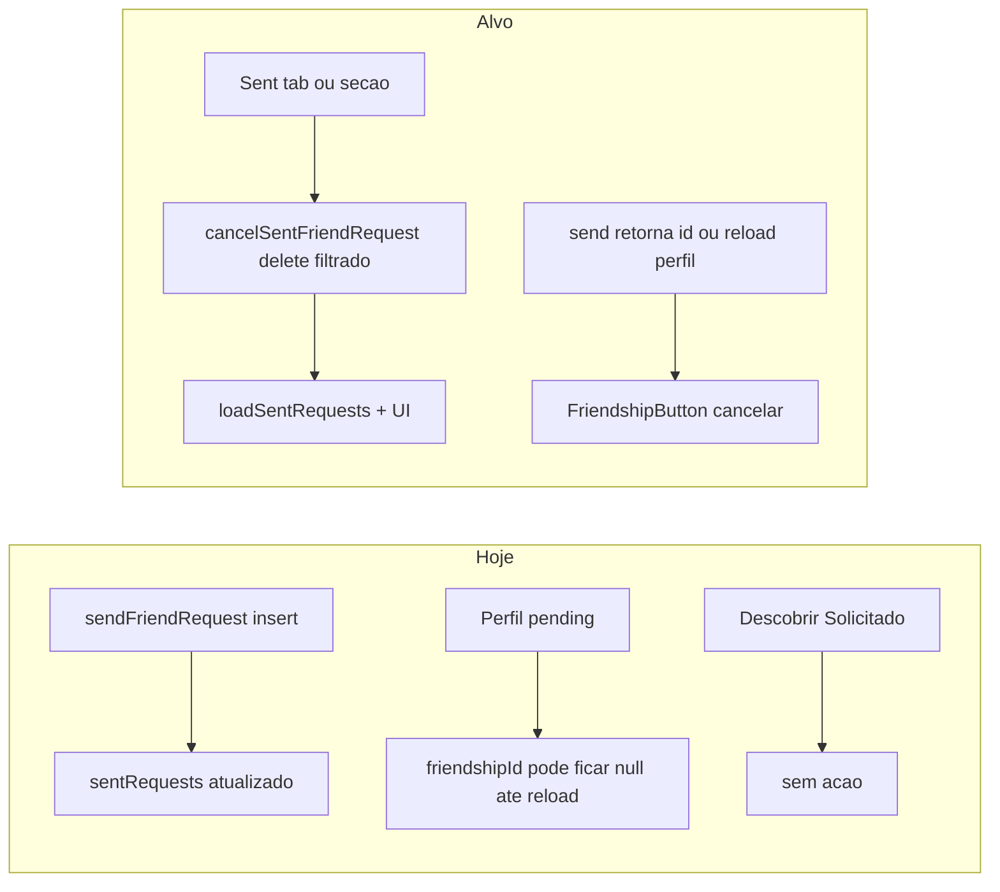

# Plano: Cancelar / desfazer solicitação de amizade pendente

## Contexto técnico (estado atual)

- Modelo: tabela [`friendships`](supabase/migrations/20260412100000_epic_social_friendships.sql) com `status` em `pending` | `accepted` | `declined`.
- **RLS relevante**: `friendships_delete` permite `delete` quando `tenant_id = current_tenant_id()` e o utilizador é **requester ou addressee** — ou seja, o **remetente de um pedido pendente já pode apagar a linha** (efeito = cancelar). Não é obrigatória nova migration só por RLS; validar em ambiente de staging que não há política posterior que restrinja (revisão rápida de migrations mais recentes que toquem em `friendships`).
- Hook: [`useSocialData.js`](src/hooks/useSocialData.js) já tem `loadSentRequests`, `sendFriendRequest`, `removeFriend` (delete por `id` sem filtrar `status`). **Declínio** do destinatário usa `update` para `declined` (`declineFriendRequest`), não é o mesmo fluxo que o remetente cancelar.
- UI hoje:
  - [`FriendsView.jsx`](src/components/views/FriendsView.jsx): tab **Descobrir** mostra "Solicitado" estático; `sentRequests` só alimenta o `Set` de IDs — **não há lista de enviadas nem ação de cancelar**.
  - [`PublicProfileView.jsx`](src/components/views/PublicProfileView.jsx): `FriendshipButton` em `pending` é só texto "Solicitação enviada"; `handleRemoveFriendAction` existe mas **só é usado no estado `accepted`**; após `handleSendRequest` só se atualiza `localFriendshipStatus` para `pending` — **não se preenche `friendshipId`**, embora a RPC [`get_user_public_profile`](supabase/migrations/20260414200600_xp_levels.sql) devolva `friendship_id` para qualquer linha entre visitante e perfil (incluindo `pending`).

## Fases e Epics

### Fase 1 — Domínio e contrato da API (hook)

**Epic A — Operação explícita de cancelamento**

| ID | User story | Critérios de aceite |
|----|------------|---------------------|
| A.1 | Como dev, quero uma função dedicada **cancelar pedido enviado** para não confundir com remover amigo aceite. | Novo método em [`useSocialData.js`](src/hooks/useSocialData.js) (ex.: `cancelSentFriendRequest(friendshipId)`): `delete` em `friendships` com `.eq('id', friendshipId).eq('requester_id', userId).eq('status', 'pending')` (defesa em profundidade além da RLS). Retorno `boolean`; log de erro em falha. |
| A.2 | Como utilizador, após cancelar, quero listas coerentes. | Após sucesso: `await loadSentRequests()`; se existir cache de amigos/pendentes relevante, invalidar o mínimo necessário (ex. só `loadSentRequests`; opcionalmente `searchUsers` não é global — ver B.2). |
| A.3 | Como produto, quero métrica de cancelamento. | Evento em [`analytics`](src/lib/analytics.js) / padrão existente (espelhar `socialFriendRequestSent`) — ex. `socialFriendRequestCancelled`. |

**Epic A (complemento) — Envio devolve identificador**

| ID | User story | Critérios de aceite |
|----|------------|---------------------|
| A.4 | Como perfil público, preciso do **id da amizade** logo após enviar, para poder cancelar sem reload completo. | Alterar `sendFriendRequest` para `.insert(...).select('id').maybeSingle()` (ou equivalente) e retornar `{ ok: boolean, friendshipId?: string }` em vez de só `boolean` **ou** expor `reloadFriendshipMeta()`; atualizar todos os call sites ([`App.jsx`](src/App.jsx), [`FriendsView.jsx`](src/components/views/FriendsView.jsx), [`FriendsStep.jsx`](src/components/onboarding/steps/FriendsStep.jsx)) com compatibilidade clara. |

---

### Fase 2 — Tela Amigos

**Epic B — Descobrir e pedidos enviados**

| ID | User story | Critérios de aceite |
|----|------------|---------------------|
| B.1 | Como utilizador na tab **Descobrir**, quero **desfazer** um "Seguir" já enviado. | Onde hoje aparece "Solicitado" ([`SearchTab`](src/components/views/FriendsView.jsx)), substituir por controlo acionável: "Cancelar" / ícone, com estado de loading e `aria-label` descritivo. Chamar `onCancelSentRequest(friendshipId)` — o `id` vem de `sentRequests.find(r => r.addressee_id === userId)` (já carregado no mount). |
| B.2 | Como utilizador, após cancelar na pesquisa, quero o resultado a mostrar de novo **Seguir**. | Atualizar estado local da linha (`friendship_status` / remover de `sentIds` otimista) após sucesso; em falha, toast ou copy mínima + revert. |
| B.3 | Como utilizador, quero ver **quem ainda não aceitou** o meu pedido. | Nova sub-secção ou tab (ex. "Enviadas" dentro de **Solicitações** ou 4.º tab): lista baseada em `sentRequests` com avatar, nome, botão "Cancelar solicitação". Reutilizar `UserRow` / padrões visuais existentes. |
| B.4 | Como utilizador de teclado/leitor de ecrã, quero ações claras. | Foco visível, `aria-busy` durante cancelamento se aplicável. |

**Entrega App**: em [`App.jsx`](src/App.jsx), passar `onCancelSentRequest={social.cancelSentFriendRequest}` (nome final alinhado ao hook) para `FriendsView`.

---

### Fase 3 — Perfil público

**Epic C — Botão de amizade em estado pendente (eu sou o remetente)**

| ID | User story | Critérios de aceite |
|----|------------|---------------------|
| C.1 | Como visitante com pedido **pendente enviado por mim**, quero **cancelar** a partir do mesmo ecrã. | Em [`FriendshipButton`](src/components/views/PublicProfileView.jsx) (ramo `pending`): oferecer ação "Cancelar solicitação" (ou secundária ao lado do estado), chamando `onCancelFriendRequest` / reutilizar prop existente se unificar semântica com `onRemoveFriend` **desde que** o contrato fique explícito no nome ou na doc do componente. |
| C.2 | Como visitante, após cancelar, quero voltar ao estado **Adicionar amigo**. | Sucesso: `localFriendshipStatus = null`, `friendshipId = null`; opcional toast curto. |
| C.3 | Como visitante que **recebeu** pedido do dono do perfil (`pending` mas eu sou addressee), **não** devo ver "cancelar envio" (copy errada). | A RPC devolve `friendship_status` + `friendship_id`; distinguir no cliente quem é `requester_id` (p.ex. estender payload da RPC com `friendship_is_outgoing boolean` **ou** segunda query leve só neste caso). **Recomendação preferível**: estender `get_user_public_profile` para incluir `friendship_requester_id` ou `friendship_is_outgoing` para o visitante decidir UI — migration SQL pequena e estável. |

**Nota**: Sem C.3, o risco é mostrar "cancelar" ao destinatário de um pedido recebido se ambos partilham `status === 'pending'` sem saber o sentido.

---

### Fase 4 — Onboarding e consistência (opcional / menor prioridade)

**Epic D — Onboarding**

| ID | User story | Critérios de aceite |
|----|------------|---------------------|
| D.1 | Como novo utilizador no passo de amigos, quero poder desfazer envio tal como na app principal. | [`FriendsStep.jsx`](src/components/onboarding/steps/FriendsStep.jsx): se após A.4 o hook expuser cancel + ids, permitir cancelar na lista (menor impacto se onboarding for raro). |

---

### Fase 5 — Qualidade e riscos

**Epic E — Validação e edge cases**

| ID | User story | Critérios de aceite |
|----|------------|---------------------|
| E.1 | Como QA, quero cenários documentados. | Matriz curta: enviar → cancelar na Descobrir; enviar → cancelar em Enviadas; enviar → cancelar no perfil público; **corrida**: aceitar no outro dispositivo enquanto cancelo (esperar erro tratado ou no-op gracioso). |
| E.2 | Como dev, quero teste automatizado mínimo se já existir padrão E2E com mocks. | Opcional: estender [`e2e/`](e2e/) com mock de `friendships` + fluxo friends (avaliar custo vs. valor). |
| E.3 | Como produto, avaliar notificações push/in-app já disparadas no `insert` pending. | Se existirem triggers ([`20260412140000_social_notification_triggers.sql`](supabase/migrations/20260412140000_social_notification_triggers.sql)), decidir se cancelamento delete deve gerar evento "revogado" ou apenas aceitar notificação órfã — **fora do MVP** salvo requisito explícito. |

---

## Ordem de implementação sugerida

1. **SQL (se C.3)**: migration com campo extra na resposta JSON de `get_user_public_profile`.
2. **Hook**: `cancelSentFriendRequest` + A.4 `sendFriendRequest` com `id` + exports no retorno de `useSocialData`.
3. **FriendsView**: B.3 lista + B.1/B.2 Descobrir + props App.
4. **PublicProfileView**: C.1–C.3 + `App` wiring (`onCancel...` ou contrato unificado).
5. **FriendsStep** (opcional), analytics, QA manual.

## Ficheiros principais a tocar

- [`src/hooks/useSocialData.js`](src/hooks/useSocialData.js) — API cancel + retorno do send.
- [`src/App.jsx`](src/App.jsx) — passar callbacks.
- [`src/components/views/FriendsView.jsx`](src/components/views/FriendsView.jsx) — UI Descobrir + Enviadas.
- [`src/components/views/PublicProfileView.jsx`](src/components/views/PublicProfileView.jsx) — `FriendshipButton` + `friendshipId` pós-send + sentido do pedido.
- [`supabase/migrations/`](supabase/migrations/) — apenas se for necessário `friendship_is_outgoing` (recomendado).

---

## Epic E — Implementação (QA, corrida e decisões)

### E.1 — Matriz QA manual

| Passos | Esperado |
|--------|-----------|
| **Descobrir** → Seguir utilizador → **Cancelar** no mesmo resultado | Pedido sai; volta **Seguir**; enviadas/coerentes após reload de listas (`loadSentRequests`). |
| **Solicitações** → secção enviadas → **Cancelar solicitação** | Linha some; mesmo utilizador volta pesquisável sem pending. |
| **Perfil público** → Adicionar amigo → **Toque para cancelar** na barra pendente **saínte** | Volta **Adicionar amigo**; sem duplicado de estado. |
| **Corrida** (QA com duas sessões/dispositivos) | Visitante tenta cancelar pendente ao mesmo tempo que o dono aceita/recusa: DELETE com `.eq('status','pending')` remove 0 linhas → `cancelSentFriendRequest` devolve `false`; hook chama **`loadSentRequests`** para sincronizar; copy em Friends / onboarding sugere aceite paralelo; em **PublicProfile**, **recarrega o perfil** (`loadProfile`) para refletir amizade aceita ou novo estado. |

### E.2 — Testes automatizados

- Smoke em [`e2e/friendship-cancel-epic-e.spec.js`](e2e/friendship-cancel-epic-e.spec.js) (baseline: app carrega). E2E fim‑a‑fim com dois utilizadores ficam como backlog opcional (mesma linha do todo `qa-optional-onboarding-e2e`).

### E.3 — Produto / notificações

- Notificações in‑app ou push já disparadas no `INSERT` pending **mantêm-se órfãs** se o remetente apaga a linha (cancelamento) — não há MVP de evento “revogado”; reabrir comportamento apenas com requisito explícito de produto ou nova Edge Function/evento DB.

---

## Fora de âmbito (a não misturar sem decisão)

- Alterar semântica de `declined` vs delete para remetente.
- Bloquear reenvio imediato após cancelar (hoje delete liberta o índice único simétrico — comportamento atual é permitir novo pedido).
