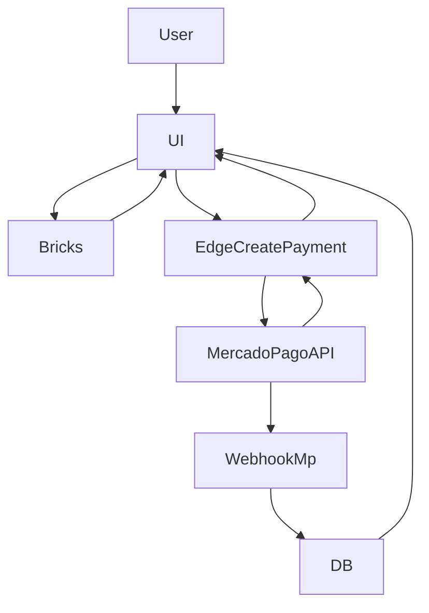

### Objetivo
- Substituir o redirecionamento para `init_point` por um checkout **embutido no app** usando **Mercado Pago Bricks** (PIX + Cartão), com criação de pagamento via **Supabase Edge Functions** (usando `MP_ACCESS_TOKEN`), e confirmação final via `mp-webhook`.

### Decisões assumidas (com base nas suas respostas)
- **Modo**: Bricks embutido.
- **Meios**: PIX + Cartão.

### Estratégia de arquitetura (segura)
- **Frontend**: renderiza Bricks e coleta os dados sensíveis (ex: token do cartão) *sem nunca expor* `MP_ACCESS_TOKEN`.
- **Backend (Edge Function)**: recebe payload validado (zod), chama Mercado Pago `POST /v1/payments` e retorna para o frontend:
  - **PIX**: QR code (texto) + QR base64 + link/copy.
  - **Cartão**: status imediato (approved/rejected/in_process) + id.
- **Confirmação/efeito no app**: continuar usando `mp-webhook` como fonte de verdade para:
  - ativar PRO
  - inscrever no desafio pago
  - registrar em `pagamentos`
  - idempotência

### Fluxos

### Mudanças no frontend (Vite/React)
- Adicionar SDK do Mercado Pago (script) e inicialização com **Public Key**.
  - **Env**: `VITE_MP_PUBLIC_KEY` (chave pública do MP, pode ficar no client).
- Criar um componente de checkout por domínio:
  - `src/components/payments/mp/ChallengeCheckoutBricks.jsx`
  - `src/components/payments/mp/ProCheckoutBricks.jsx`
- Atualizar telas:
  - `src/components/views/ChallengesView.jsx`: ao clicar “Inscrever”, abrir modal/section com Bricks (em vez de redirecionar para `url`).
  - `src/components/views/ProfileView.jsx`: ao clicar “Assinar PRO”, abrir Bricks.
- UX:
  - PIX: mostrar QR e botão “Copiar código” + polling de status (opcional) enquanto webhook confirma.
  - Cartão: mostrar resultado imediato e depois atualizar quando webhook consolidar.

### Novas Edge Functions
- Criar `supabase/functions/mp-create-payment/index.ts`
  - Responsável por `POST /v1/payments`.
  - Aceita `type: 'challenge' | 'subscription'` + ids + método de pagamento.
  - Valida JWT do usuário (diferente de webhook). `verify_jwt = true`.
  - Usa `external_reference` já definido:
    - `challenge:{userId}:{desafioId}`
    - `sub:{userId}:{planId}`
  - Retorna apenas dados necessários para UI (sem vazar payloads sensíveis).

### Ajustes no webhook e banco
- `supabase/functions/mp-webhook/index.ts`
  - Manter como está; garantir que ele lide com pagamentos criados via `/v1/payments` (mesma lógica por `external_reference`).
- Garantir que `pagamentos.id_externo` continue sendo o `payment.id` do MP (idempotência).

### Configuração
- `supabase/config.toml`
  - Adicionar `[functions.mp-create-payment] verify_jwt = true`.
- Secrets já existentes:
  - `MP_ACCESS_TOKEN` e `MP_WEBHOOK_SECRET`.
- Novo env client:
  - `VITE_MP_PUBLIC_KEY`.

### Segurança (pontos críticos)
- **Nunca** usar `MP_ACCESS_TOKEN` no frontend.
- Edge Function deve validar:
  - `user.id` do JWT
  - pertencimento ao tenant do desafio
  - `amount` vindo do banco (não confiar no client)
- Cartão exige dados do pagador/identificação (CPF) e tokenização via Bricks.

### Performance
- Carregar o script do MP **lazy** (apenas quando abrir o modal) para não impactar TTI.

### Entregáveis
- Checkout transparente em desafios pagos e PRO, mantendo webhook como fonte de verdade.