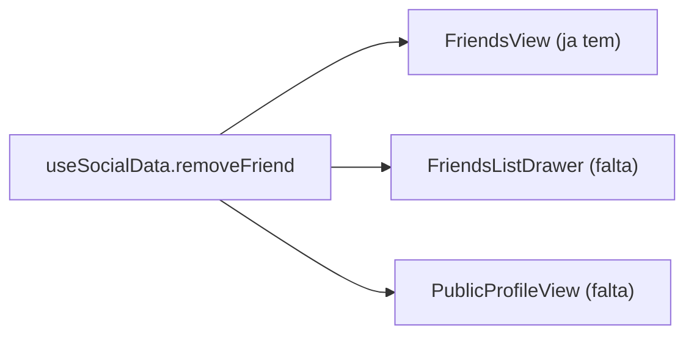

# Desfazer amizade -- Extensao a todos os pontos de contato

## Estado atual

- **`removeFriend(friendshipId)`** ja existe em [src/hooks/useSocialData.js](src/hooks/useSocialData.js) (deleta a linha em `friendships`, recarrega a lista)
- **`FriendsView.jsx`** ja usa via prop `onRemove` com menu "..." > "Remover amigo"
- **`FriendsListDrawer.jsx`** -- NAO tem opcao de remover amigo
- **`PublicProfileView.jsx`** -- `FriendshipButton` quando `status === 'accepted'` exibe um `<div>` estatico "Amigos" sem acao

## Pontos de extensao



---

## Fase 1: FriendsListDrawer -- Adicionar menu "Remover amigo"

### 1a. Nova prop `onRemove` no [FriendsListDrawer.jsx](src/components/views/FriendsListDrawer.jsx)

Adicionar `onRemove` e estado local `menuOpen` para controlar qual amigo tem o menu aberto (mesmo padrao do `FriendsTab` na `FriendsView`).

Cada item da lista ganha um botao "..." a direita. Ao clicar:
- Abre um mini dropdown com "Remover amigo" em vermelho
- Ao confirmar, chama `onRemove(friend.id)` (o `id` e o ID da friendship)
- Backdrop invisivel para fechar o menu ao clicar fora

Import adicional: `MoreHorizontal` do lucide-react.

### 1b. Wire no [ProfileView.jsx](src/components/views/ProfileView.jsx)

Adicionar prop `onRemoveFriend` no componente e passa-la ao `FriendsListDrawer`:

```jsx
<FriendsListDrawer
  friends={friends}
  loading={friendsLoading}
  onClose={() => setFriendsDrawerOpen(false)}
  onOpenProfile={onOpenProfile}
  onRemove={onRemoveFriend}
/>
```

### 1c. Wire no [App.jsx](src/App.jsx)

Adicionar ao bloco de `ProfileView`:

```jsx
onRemoveFriend={useCloud ? social.removeFriend : undefined}
```

---

## Fase 2: PublicProfileView -- Botao "Amigos" com opcao de desfazer

### 2a. Alterar `FriendshipButton` em [PublicProfileView.jsx](src/components/views/PublicProfileView.jsx)

Quando `status === 'accepted'`, transformar o `<div>` estatico em um `<button>` que abre um mini menu ou alterna para "Desfazer amizade?":

- Adicionar prop `onRemove` ao `FriendshipButton`
- Estado local `confirmOpen` no componente
- Primeiro clique: abre confirmacao inline ("Desfazer amizade?" com botoes Cancelar / Confirmar)
- Segundo clique (Confirmar): chama `onRemove()`

```jsx
if (status === 'accepted') {
  if (confirmOpen) {
    return (
      <div className="flex gap-2">
        <button onClick={() => setConfirmOpen(false)} className="...">Cancelar</button>
        <button onClick={onRemove} className="... text-red-400">Desfazer amizade</button>
      </div>
    );
  }
  return (
    <button onClick={() => setConfirmOpen(true)} className="...">
      <UserCheck /> Amigos
    </button>
  );
}
```

### 2b. Wire `onRemove` no PublicProfileView

O `PublicProfileView` ja recebe `onSendFriendRequest` mas nao `onRemoveFriend`. Precisamos:

1. Adicionar prop `onRemoveFriend` ao componente
2. Buscar o `friendship_id` da amizade ativa (ja disponivel no RPC `get_user_public_profile` ou consultando `friendships` diretamente)
3. Passar `onRemove={() => onRemoveFriend(friendshipId)}` ao `FriendshipButton`

### 2c. Wire no [App.jsx](src/App.jsx)

Adicionar ao bloco de `PublicProfileView`:

```jsx
onRemoveFriend={social.removeFriend}
```
