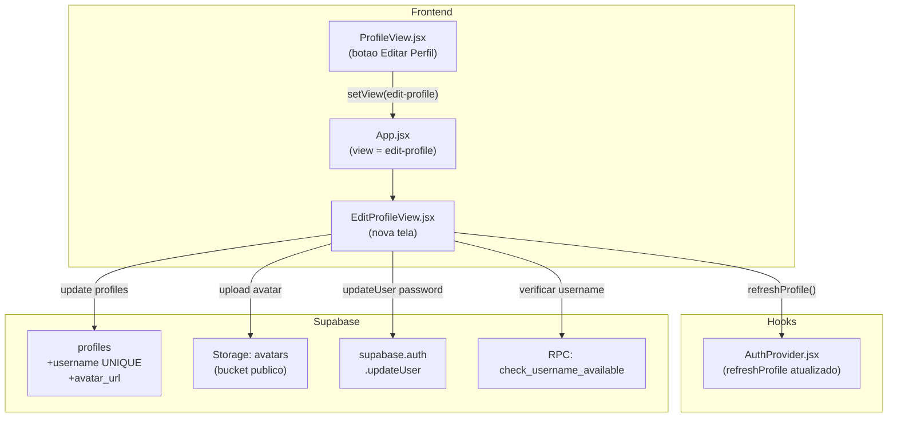

# Editar Perfil / Configuracoes da Conta

## Estado Atual do Codebase

- A tabela `profiles` **nao possui** colunas `username` nem `avatar_url` (colunas atuais: `id`, `display_name`, `nome`, `academia`, `pontos`, `streak`, `is_pro`, etc.)
- **Nao existe** constraint UNIQUE em nenhum campo de nome
- **Nao existe** bucket de Storage para avatares (apenas `checkin-photos`)
- **Nao existe** tela de edicao de perfil; o `ProfileView` exibe dados somente-leitura com icone generico `<User>`
- O perfil e carregado no [AuthProvider.jsx](src/components/auth/AuthProvider.jsx) via `.from('profiles').select(...)` e exposto pelo contexto
- Navegacao via estado `view` no [App.jsx](src/App.jsx)

## Arquitetura da Solucao



---

## Epic 1: Banco de Dados e Storage (Supabase)

### US 1.1 — Novas colunas na tabela `profiles`

Criar migration `20260412200000_profiles_username_avatar.sql`:

```sql
ALTER TABLE public.profiles
  ADD COLUMN IF NOT EXISTS username text,
  ADD COLUMN IF NOT EXISTS avatar_url text;

CREATE UNIQUE INDEX IF NOT EXISTS profiles_username_unique
  ON public.profiles (lower(username))
  WHERE username IS NOT NULL;
```

- `username` nullable (usuarios existentes nao tem)
- Index unico case-insensitive com `lower()` para garantir unicidade
- `avatar_url` armazena a URL publica do Supabase Storage

### US 1.2 — RPC para verificar disponibilidade de username

Na mesma migration, criar funcao:

```sql
CREATE OR REPLACE FUNCTION public.check_username_available(p_username text)
RETURNS boolean
LANGUAGE plpgsql SECURITY DEFINER
AS $$
BEGIN
  IF length(trim(p_username)) < 3 THEN RETURN false; END IF;
  RETURN NOT EXISTS (
    SELECT 1 FROM public.profiles
    WHERE lower(username) = lower(trim(p_username))
      AND id != auth.uid()
  );
END;
$$;
```

- `SECURITY DEFINER` para evitar que RLS bloqueie a consulta cross-tenant
- Exclui o proprio usuario da checagem (para que ele possa "manter" seu username)
- Minimo 3 caracteres

### US 1.3 — Bucket `avatars` no Supabase Storage

Na mesma migration:

```sql
INSERT INTO storage.buckets (id, name, public)
VALUES ('avatars', 'avatars', true)
ON CONFLICT (id) DO NOTHING;
```

Politicas RLS em `storage.objects` para o bucket `avatars`:
- **SELECT** para `authenticated` (leitura publica)
- **INSERT** restrito ao path `{user_id}/` do proprio usuario
- **UPDATE** restrito ao path `{user_id}/` do proprio usuario
- **DELETE** restrito ao path `{user_id}/` do proprio usuario

O path do arquivo sera: `{userId}/avatar.{ext}` (substituindo sempre o anterior)

### US 1.4 — Atualizar RLS de UPDATE em `profiles`

A policy existente `profiles_update_own` ja permite UPDATE onde `auth.uid() = id`. Verificar se ela nao restringe colunas especificas — caso contrario, nao e necessario alterar.

### US 1.5 — Aplicar migration via Supabase MCP

Executar o SQL diretamente no Supabase remoto usando `CallMcpTool` (padrao do projeto).

---

## Epic 2: Hook de Logica — Funcoes de Edicao

### US 2.1 — Atualizar `AuthProvider.jsx` para incluir novas colunas no SELECT

Em [AuthProvider.jsx](src/components/auth/AuthProvider.jsx), adicionar `username` e `avatar_url` ao `.select(...)` do `loadProfile`:

```
'id, display_name, nome, username, avatar_url, academia, pontos, streak, is_pro, last_checkin_date, created_at, is_platform_master, tenant_id, tenants (slug, name, status)'
```

### US 2.2 — Criar funcoes de edicao de perfil

Adicionar ao [useFitCloudData.js](src/hooks/useFitCloudData.js) (ou diretamente no componente via `useAuth`):

- **`updateProfile({ display_name, username, avatar_url })`**: faz `.from('profiles').update(fields).eq('id', userId)`; depois chama `refreshProfile()`
- **`uploadAvatar(file)`**: faz upload para bucket `avatars` no path `{userId}/avatar.{ext}`, com `upsert: true`; retorna `getPublicUrl()` com cache-bust via query param timestamp
- **`checkUsernameAvailable(username)`**: chama `supabase.rpc('check_username_available', { p_username })` e retorna boolean
- **`updatePassword(newPassword)`**: chama `supabase.auth.updateUser({ password: newPassword })`

### US 2.3 — Atualizar `profileToUserData` em `profile-map.js`

Em [profile-map.js](src/lib/profile-map.js), mapear `avatar_url` e `username` para o objeto `userData` para que fiquem disponiveis em toda a UI.

---

## Epic 3: Interface — `EditProfileView.jsx`

### US 3.1 — Criar componente `EditProfileView.jsx`

Novo arquivo em `src/components/views/EditProfileView.jsx`, no padrao visual do projeto (fundo preto, Tailwind, mesmo estilo do Instagram):

**Layout:**

```
[<- Voltar]                    [Salvar]

       [ Avatar circular ]
    "Alterar foto do perfil"

  ---- Informacoes Publicas ----
  | Nome Completo             |
  | Nome de Usuario (@)       |
  |   [status: disponivel/    |
  |    indisponivel]          |

  ---- Seguranca ---------------
  | > Alterar Senha           |
  |   [Nova Senha]            |
  |   [Confirmar Nova Senha]  |
```

**Detalhes de cada secao:**

- **Avatar**: div circular com imagem atual ou icone `User`. Ao clicar, abre `<input type="file" accept="image/*">` oculto. Ao selecionar, exibe preview instantaneo via `URL.createObjectURL()` antes do upload
- **Nome Completo**: input controlado, pre-preenchido com `profile.display_name`
- **Nome de Usuario**: input controlado com `@` prefix visual, pre-preenchido com `profile.username`. Debounce de 500ms que chama `checkUsernameAvailable()`. Exibe badge verde "Disponivel" ou vermelho "Indisponivel"
- **Alterar Senha**: secao colapsavel (accordion). Inputs para nova senha e confirmacao. Validacao: minimo 6 caracteres, ambos devem coincidir
- **Botao Salvar**: desabilitado se nada mudou ou se username esta indisponivel. Ao clicar: upload do avatar (se mudou) -> update do profile -> update da senha (se preenchida) -> feedback via toast

### US 3.2 — Feedback visual (Toasts)

Utilizar um toast leve (pode ser um componente simples em `src/components/ui/Toast.jsx` ou reusar o padrao do projeto) para exibir:
- "Perfil atualizado com sucesso"
- "Nome de usuario ja esta em uso"
- "Senha alterada com sucesso"
- "As senhas nao coincidem"
- "Erro ao salvar alteracoes"

---

## Epic 4: Integracao no App

### US 4.1 — Navegacao no `App.jsx`

Em [App.jsx](src/App.jsx):
- Adicionar `view === 'edit-profile'` que renderiza `<EditProfileView>`
- Passar props: `profile`, `onBack={() => setView('profile')}`, `supabase`, `refreshProfile`

### US 4.2 — Botao "Editar Perfil" no `ProfileView.jsx`

Em [ProfileView.jsx](src/components/views/ProfileView.jsx), adicionar botao "Editar perfil" (estilo Instagram — pill button abaixo do header) que chama `onEditProfile()` -> `setView('edit-profile')` no App.

### US 4.3 — Exibir avatar real em todos os componentes

Atualizar os seguintes componentes para mostrar `avatar_url` em vez do icone generico `<User>`:
- [ProfileView.jsx](src/components/views/ProfileView.jsx) — header do perfil proprio
- [FeedPostCard.jsx](src/components/views/FeedPostCard.jsx) — avatar do autor do post
- [CommentsDrawer.jsx](src/components/views/CommentsDrawer.jsx) — avatar ao lado de cada comentario
- [LikesDrawer.jsx](src/components/views/LikesDrawer.jsx) — avatar na lista de curtidas
- [PublicProfileView.jsx](src/components/views/PublicProfileView.jsx) — avatar do perfil publico

Padrao: se `avatar_url` existir, renderizar `` com `rounded-full object-cover`; senao, fallback para icone `<User>`.

### US 4.4 — Exibir `@username` nos posts e perfis

Onde aplicavel, exibir o `@username` abaixo do `display_name` (opcional nesta fase, pode ser feito como follow-up).

---

## Epic 5: Aplicar Migration no Supabase (Producao)

### US 5.1 — Executar SQL via MCP

Aplicar a migration completa no Supabase remoto usando o MCP `execute_sql`.

### US 5.2 — Validacao

Verificar que:
- Colunas `username` e `avatar_url` existem em `profiles`
- RPC `check_username_available` retorna corretamente
- Bucket `avatars` esta acessivel
- Upload e leitura publica funcionam

---

## Ordem de Execucao Recomendada

1. **Epic 1** (DB + Storage) — base de tudo
2. **Epic 5** (Aplicar migration) — garantir que o banco esta pronto
3. **Epic 2** (Hooks/logica) — funcoes que a UI vai consumir
4. **Epic 3** (EditProfileView) — tela principal
5. **Epic 4** (Integracao) — conectar tudo e atualizar avatares na UI
