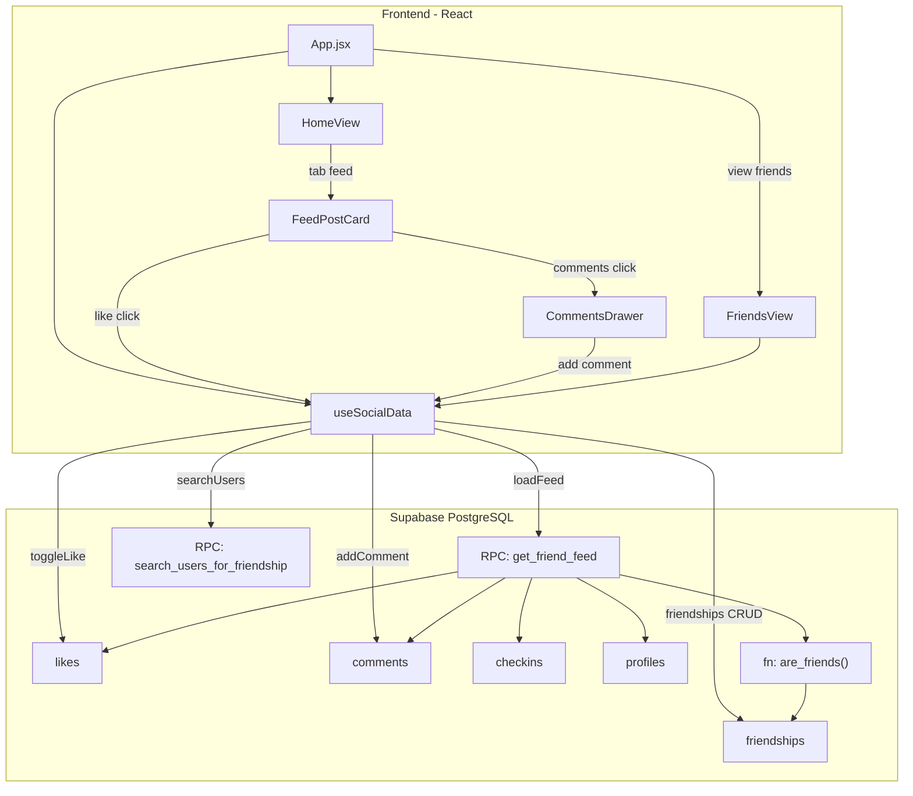

# Epico de Socializacao -- Plano de Implementacao

## Consideracoes Arquiteturais

O FitRank e um SPA Vite/React com navegacao por `useState` (sem router), autenticacao e dados via Supabase client-side, e Edge Functions para operacoes administrativas. **Nao ha Next.js nem Server Actions.** O plano esta adaptado a essa realidade:

- Queries e mutations rodam via Supabase JS client (RLS garante seguranca)
- Logica sensivel que precise de `service_role` vai em Edge Functions
- Navegacao por `setView('...')` em `App.jsx`
- Multi-tenant: todas as novas tabelas incluem `tenant_id` e RLS com `current_tenant_id()`
- Nao existe `avatar_url` em `profiles` -- o feed usara o icone `User` do lucide (consistente com o app)

---

## Step 1: Banco de Dados (Migrations SQL)

### 1a. Tabela `friendships`

Arquivo: `supabase/migrations/YYYYMMDD_epic_social_friendships.sql`

```sql
create table public.friendships (
  id uuid primary key default gen_random_uuid(),
  requester_id uuid not null references auth.users(id) on delete cascade,
  addressee_id uuid not null references auth.users(id) on delete cascade,
  tenant_id uuid not null references public.tenants(id) on delete restrict,
  status text not null default 'pending'
    check (status in ('pending', 'accepted', 'declined')),
  created_at timestamptz not null default now(),
  updated_at timestamptz not null default now(),
  constraint friendships_no_self check (requester_id <> addressee_id),
  constraint friendships_unique_pair
    unique (least(requester_id, addressee_id), greatest(requester_id, addressee_id), tenant_id)
);
```

**Indice unico `least/greatest`**: garante que nao existam duplicatas independente de quem enviou. Apenas uma friendship por par de usuarios por tenant.

**RLS:**
- SELECT: usuario autenticado ve friendships onde e `requester_id` ou `addressee_id` e `tenant_id = current_tenant_id()`
- INSERT: `requester_id = auth.uid()` e `tenant_id = current_tenant_id()` e `status = 'pending'`
- UPDATE: apenas `addressee_id = auth.uid()` pode mudar status (aceitar/recusar)
- DELETE: qualquer parte pode desfazer amizade (`requester_id = auth.uid() or addressee_id = auth.uid()`)

### 1b. Tabela `likes`

Arquivo: `supabase/migrations/YYYYMMDD_epic_social_likes.sql`

```sql
create table public.likes (
  user_id uuid not null references auth.users(id) on delete cascade,
  checkin_id uuid not null references public.checkins(id) on delete cascade,
  tenant_id uuid not null references public.tenants(id) on delete restrict,
  created_at timestamptz not null default now(),
  primary key (user_id, checkin_id)
);
```

**RLS:**
- SELECT: `tenant_id = current_tenant_id()`
- INSERT: `user_id = auth.uid()` e `tenant_id = current_tenant_id()` e checkin pertence a amigo ou a si mesmo (validado via trigger ou RLS com subquery)
- DELETE: `user_id = auth.uid()` (descurtir)

### 1c. Tabela `comments`

Arquivo: `supabase/migrations/YYYYMMDD_epic_social_comments.sql`

```sql
create table public.comments (
  id uuid primary key default gen_random_uuid(),
  user_id uuid not null references auth.users(id) on delete cascade,
  checkin_id uuid not null references public.checkins(id) on delete cascade,
  tenant_id uuid not null references public.tenants(id) on delete restrict,
  content text not null check (char_length(trim(content)) between 1 and 500),
  created_at timestamptz not null default now()
);
```

**RLS:**
- SELECT: `tenant_id = current_tenant_id()`
- INSERT: `user_id = auth.uid()` e `tenant_id = current_tenant_id()` e checkin pertence a amigo ou a si mesmo
- DELETE: `user_id = auth.uid()` (apagar proprio comentario)

### 1d. Helper SQL -- `are_friends()`

Funcao reutilizavel para as policies de likes e comments:

```sql
create or replace function public.are_friends(a uuid, b uuid)
returns boolean language sql stable security definer
set search_path = public as $$
  select exists (
    select 1 from public.friendships
    where status = 'accepted'
      and tenant_id = public.current_tenant_id()
      and least(requester_id, addressee_id) = least(a, b)
      and greatest(requester_id, addressee_id) = greatest(a, b)
  );
$$;
```

Usada nas policies INSERT de likes/comments: `user_id = auth.uid() and (checkin.user_id = auth.uid() or are_friends(auth.uid(), checkin.user_id))`.

### 1e. RPC -- `get_friend_feed`

Funcao paginada que retorna o feed com dados enriquecidos. Isso evita N+1 queries e joins pesados no frontend:

```sql
create or replace function public.get_friend_feed(
  p_limit int default 10,
  p_offset int default 0
)
returns table (
  checkin_id uuid,
  user_id uuid,
  display_name text,
  checkin_local_date date,
  tipo_treino text,
  foto_url text,
  points_awarded int,
  photo_review_status text,
  created_at timestamptz,
  likes_count bigint,
  comments_count bigint,
  has_liked boolean
)
language sql stable security definer
set search_path = public as $$
  select
    c.id,
    c.user_id,
    p.display_name,
    c.checkin_local_date,
    c.tipo_treino,
    c.foto_url,
    c.points_awarded,
    c.photo_review_status,
    c.created_at,
    coalesce(l_agg.cnt, 0),
    coalesce(cm_agg.cnt, 0),
    exists (
      select 1 from public.likes lk
      where lk.checkin_id = c.id and lk.user_id = auth.uid()
    )
  from public.checkins c
  join public.profiles p on p.id = c.user_id
  left join lateral (
    select count(*) as cnt from public.likes where checkin_id = c.id
  ) l_agg on true
  left join lateral (
    select count(*) as cnt from public.comments where checkin_id = c.id
  ) cm_agg on true
  where c.tenant_id = public.current_tenant_id()
    and c.photo_review_status = 'approved'
    and (
      c.user_id = auth.uid()
      or public.are_friends(auth.uid(), c.user_id)
    )
  order by c.created_at desc
  limit p_limit offset p_offset;
$$;
```

### 1f. RPC -- `search_users_for_friendship`

Busca de usuarios no mesmo tenant para enviar solicitacao:

```sql
create or replace function public.search_users_for_friendship(p_query text)
returns table (
  user_id uuid,
  display_name text,
  friendship_status text -- null, 'pending', 'accepted', 'declined'
)
language sql stable security definer
set search_path = public as $$
  select
    p.id,
    p.display_name,
    f.status
  from public.profiles p
  left join public.friendships f on (
    f.tenant_id = public.current_tenant_id()
    and least(f.requester_id, f.addressee_id) = least(auth.uid(), p.id)
    and greatest(f.requester_id, f.addressee_id) = greatest(auth.uid(), p.id)
  )
  where p.tenant_id = public.current_tenant_id()
    and p.id <> auth.uid()
    and p.display_name ilike '%' || p_query || '%'
  order by p.display_name
  limit 20;
$$;
```

---

## Step 2: Hook de Dados -- `useSocialData.js`

Arquivo: [src/hooks/useSocialData.js](src/hooks/useSocialData.js)

Hook dedicado para o dominio social, separado do `useFitCloudData.js` para manter modularidade.

### Funcoes expostas:

```
useSocialData({ supabase, session, profile })
```

**Estado:**
- `feed` (array), `feedLoading`, `feedPage`, `feedHasMore`
- `friends` (array), `friendsLoading`
- `pendingRequests` (array recebidas), `sentRequests` (array enviadas)

**Funcoes:**
- `loadFeed(page)` -- chama RPC `get_friend_feed` com offset
- `loadMoreFeed()` -- incrementa pagina e concatena resultados (scroll infinito)
- `refreshFeed()` -- reseta e recarrega do zero
- `toggleLike(checkinId, currentlyLiked)` -- insert/delete em `likes` com **optimistic update** no estado `feed`
- `addComment(checkinId, content)` -- insert em `comments`, incrementa `comments_count` otimisticamente
- `loadComments(checkinId)` -- busca comentarios com join no `display_name` do autor
- `searchUsers(query)` -- chama RPC `search_users_for_friendship`
- `sendFriendRequest(addresseeId)` -- insert em `friendships`
- `acceptFriendRequest(friendshipId)` -- update status para `accepted`
- `declineFriendRequest(friendshipId)` -- update status para `declined`
- `removeFriend(friendshipId)` -- delete da row
- `loadFriends()` -- select friendships com status `accepted`
- `loadPendingRequests()` -- select friendships com status `pending` onde `addressee_id = auth.uid()`

### Optimistic UI para Like:

```js
const toggleLike = useCallback(async (checkinId, currentlyLiked) => {
  // Atualiza UI imediatamente
  setFeed(prev => prev.map(item =>
    item.checkin_id === checkinId
      ? {
          ...item,
          has_liked: !currentlyLiked,
          likes_count: item.likes_count + (currentlyLiked ? -1 : 1)
        }
      : item
  ));

  // Persiste no banco
  if (currentlyLiked) {
    await supabase.from('likes').delete()
      .eq('user_id', userId).eq('checkin_id', checkinId);
  } else {
    await supabase.from('likes').insert({
      user_id: userId, checkin_id: checkinId, tenant_id: tenantId
    });
  }
}, [supabase, userId, tenantId]);
```

---

## Step 3: Integracao no App -- `App.jsx`

### 3a. Novo estado de view

Adicionar sub-views na HomeView usando tabs internas (nao mudar a barra inferior):

```
HomeView recebe uma nova prop `activeTab` ('ranking' | 'feed')
```

No `App.jsx`, estado `homeTab`:

```js
const [homeTab, setHomeTab] = useState('ranking');
```

Passado como prop para HomeView junto com as funcoes do hook social.

### 3b. Instanciar hook

```js
const social = useSocialData({
  supabase: useCloud ? supabase : null,
  session: useCloud ? session : null,
  profile: useCloud ? profile : null
});
```

### 3c. Props para HomeView

```jsx
<HomeView
  // ...existentes...
  homeTab={homeTab}
  onHomeTabChange={setHomeTab}
  feed={social.feed}
  feedLoading={social.feedLoading}
  feedHasMore={social.feedHasMore}
  onLoadMoreFeed={social.loadMoreFeed}
  onToggleLike={social.toggleLike}
  onAddComment={social.addComment}
  onLoadComments={social.loadComments}
/>
```

### 3d. View de amigos

Nova view `'friends'` renderizada quando `view === 'friends'`:

```jsx
{view === 'friends' && (
  <FriendsView
    friends={social.friends}
    pendingRequests={social.pendingRequests}
    onSearch={social.searchUsers}
    onSendRequest={social.sendFriendRequest}
    onAccept={social.acceptFriendRequest}
    onDecline={social.declineFriendRequest}
    onRemove={social.removeFriend}
    onBack={() => setView('home')}
  />
)}
```

Acessivel via botao no header da HomeView (tab "Feed") ou no ProfileView.

---

## Step 4: Componentes Frontend

### 4a. Tabs na HomeView -- `HomeView.jsx`

Adicionar tab switcher no topo (reutilizando o padrao visual do ranking period selector):

```jsx
<div className="flex rounded-xl bg-zinc-900/80 border border-zinc-800 p-1 gap-1">
  <button onClick={() => onHomeTabChange('ranking')} ...>Ranking</button>
  <button onClick={() => onHomeTabChange('feed')} ...>Feed</button>
</div>
```

- Tab "Ranking": conteudo atual (ranking de usuarios)
- Tab "Feed": novo componente do feed social

### 4b. Componente `FeedPostCard.jsx`

Arquivo: [src/components/views/FeedPostCard.jsx](src/components/views/FeedPostCard.jsx)

Card individual do feed. Estrutura visual:

```
+------------------------------------------+
| [Avatar] Nome           · ha 2 horas     |
|                                          |
| [Foto do check-in (se houver)]           |
|                                          |
| Musculacao                     +10 PTS   |
|                                          |
| [Heart] 5    [MessageCircle] 3           |
+------------------------------------------+
```

- **Header**: icone User + display_name + tempo relativo (`formatTimeAgo`)
- **Foto**: imagem do checkin se `foto_url` existir, senao icone do tipo de treino (reutilizar `workoutTypeIcon` do ProfileView -- extrair para `src/lib/workout-icons.js`)
- **Footer**: botao de like (Heart preenchido se `has_liked`, com contagem) e botao de comentarios (MessageCircle com contagem)
- **Like**: click chama `onToggleLike(checkinId, has_liked)` -- optimistic update
- **Comentarios**: click abre drawer/modal com lista de comentarios + input

### 4c. Componente `CommentsDrawer.jsx`

Arquivo: [src/components/views/CommentsDrawer.jsx](src/components/views/CommentsDrawer.jsx)

Bottom sheet (mesmo padrao do admin drawer no ProfileView):
- Lista de comentarios com avatar, nome, tempo, conteudo
- Input de texto fixo no bottom com botao "Enviar"
- Carrega comentarios via `onLoadComments(checkinId)` ao abrir

### 4d. Componente `FriendsView.jsx`

Arquivo: [src/components/views/FriendsView.jsx](src/components/views/FriendsView.jsx)

Tres secoes via tabs internas:
- **Buscar**: input de busca + resultados com botao "Adicionar"
- **Solicitacoes**: lista de pendentes com botoes "Aceitar" / "Recusar"
- **Meus Amigos**: lista com botao "Remover"

### 4e. Helper `formatTimeAgo`

Arquivo: [src/lib/dates.js](src/lib/dates.js) (ja existe, adicionar funcao)

```js
export function formatTimeAgo(dateStr) {
  const seconds = Math.floor((Date.now() - new Date(dateStr).getTime()) / 1000);
  if (seconds < 60) return 'agora';
  if (seconds < 3600) return `ha ${Math.floor(seconds / 60)} min`;
  if (seconds < 86400) return `ha ${Math.floor(seconds / 3600)}h`;
  if (seconds < 604800) return `ha ${Math.floor(seconds / 86400)}d`;
  return new Date(dateStr).toLocaleDateString('pt-BR', { day: 'numeric', month: 'short' });
}
```

### 4f. Extrair `workoutTypeIcon`

Mover o mapa de icones de treino de `ProfileView.jsx` para [src/lib/workout-icons.js](src/lib/workout-icons.js) e importar em ambos ProfileView e FeedPostCard.

---

## Diagrama de fluxo de dados



---

## Ordem de implementacao recomendada

1. **Migrations SQL** (tabelas + RLS + RPCs) -- testavel via Supabase Dashboard
2. **Hook `useSocialData`** -- logica de dados isolada
3. **`FriendsView`** -- funcional antes do feed (precisa de amigos para ter feed)
4. **Tabs na HomeView** -- infra de navegacao
5. **`FeedPostCard` + `CommentsDrawer`** -- UI do feed
6. **Integracao final no App.jsx** -- wiring de props e estado

## Nao incluso neste epico

- Avatar/foto de perfil (nao existe `avatar_url` no schema atual -- pode ser um epico futuro)
- Notificacoes push para solicitacoes de amizade (pode usar a tabela `notifications` existente em uma iteracao futura)
- Realtime no feed (polling e suficiente para v1; realtime pode ser adicionado depois no canal existente)
