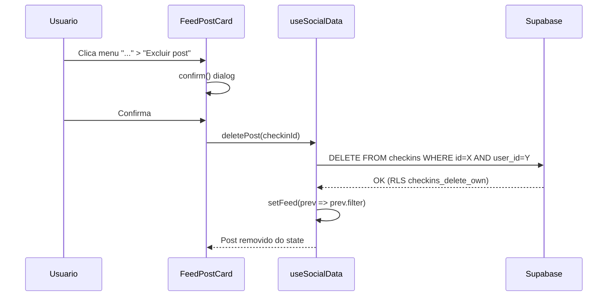

# Excluir post do feed

A feature é simples: o dono do post já vê um menu "..." com opções de privacidade. Basta adicionar uma opção "Excluir post" nesse menu, com confirmação, e a lógica de delete no hook.

A RLS policy `checkins_delete_own` **já existe** no banco de dados, permitindo que o dono delete seus próprios check-ins. Não é necessária nenhuma migration.

## Arquivos a alterar

### 1. Hook: [src/hooks/useSocialData.js](src/hooks/useSocialData.js)

Adicionar função `deletePost` que:
- Faz `supabase.from('checkins').delete().eq('id', checkinId).eq('user_id', userId)`
- Remove o post do state local `feed` via `setFeed(prev => prev.filter(...))`
- Retorna `true/false` para feedback

Exportar `deletePost` no return do hook (ao lado de `updatePostPrivacy`).

### 2. Componente: [src/components/views/FeedPostCard.jsx](src/components/views/FeedPostCard.jsx)

No menu dropdown do owner (que já tem "Desativar comentários" e "Ocultar curtidas"):
- Adicionar um separador visual (`border-t`)
- Adicionar botão "Excluir post" com icone `Trash2` em vermelho
- Ao clicar: exibe `confirm('Tem certeza que deseja excluir este post?')`
- Se confirmado: chama `onDeletePost(post.id)`
- Nova prop: `onDeletePost`

### 3. View: [src/components/views/FeedView.jsx](src/components/views/FeedView.jsx)

- Receber nova prop `onDeletePost`
- Repassar `onDeletePost` para `<FeedPostCard />`

### 4. App: [src/App.jsx](src/App.jsx)

- Passar `onDeletePost={social.deletePost}` nas duas instancias de `<FeedView />` (feed principal e PublicProfileView se aplicavel)

## Fluxo

## Observacoes

- Nao precisa de migration (RLS `checkins_delete_own` ja existe)
- Nao precisa de Edge Function (delete direto via client e seguro pela RLS)
- Likes e comments associados ao checkin serao deletados automaticamente via `ON DELETE CASCADE` nas foreign keys
- A foto no storage nao sera deletada automaticamente (pode ser tratado futuramente se necessario)