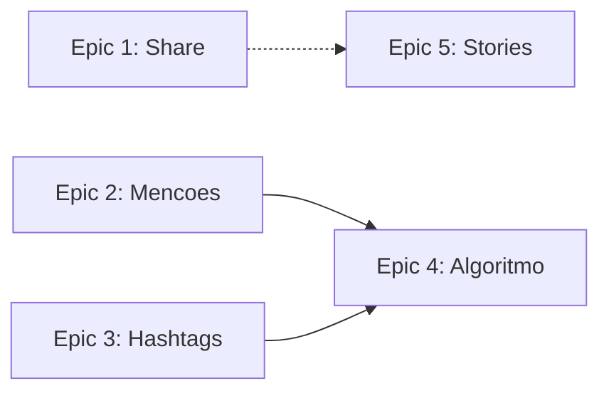
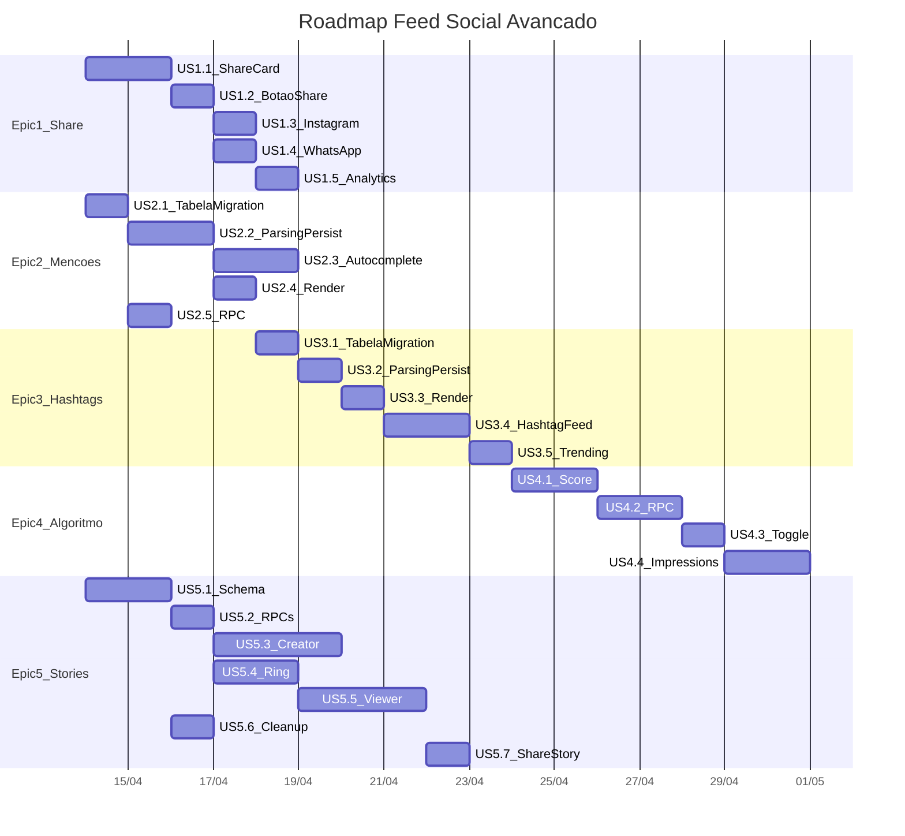

# Feed Social Avancado — FitRank

## Estado Atual

O feed existe em [`src/components/views/FeedView.jsx`](src/components/views/FeedView.jsx) com scroll infinito, likes, comentarios, privacidade por post e exclusao. O backend usa a RPC `get_friend_feed` em [`src/hooks/useSocialData.js`](src/hooks/useSocialData.js). Tabelas: `checkins`, `likes`, `comments`, `friendships`, `profiles`, `notifications`.

**Nao existem**: compartilhamento externo, mencoes, hashtags, algoritmo de relevancia, stories.

---

## Dependencias entre Epics

- Epics 1, 2, 3 e 5 sao independentes entre si e podem ser paralelizados
- Epic 4 (Algoritmo) se beneficia dos dados de mencoes e hashtags como sinais de relevancia

---

## Epic 1 — Compartilhamento Externo

**Objetivo**: Permitir que usuarios compartilhem posts do feed para Instagram Stories (branded card) e WhatsApp (foto + link).

### US 1.1 — Gerador de Share Card (Client-Side Canvas)

**Escopo**: Criar utilitario `src/lib/share-card.ts` que renderiza um `<canvas>` off-screen com:
- Fundo escuro com gradiente FitRank
- Foto do check-in centralizada
- Overlay inferior: logo FitRank, nome do usuario, tipo de treino, pontos e streak
- Exporta como `Blob` (PNG)

**Logica**: Usa `CanvasRenderingContext2D` nativo do browser (zero dependencia). Carrega a foto via `Image()`, desenha overlay com `fillText`/`roundRect`. Nao precisa de Edge Function.

**Arquivos**:
- Criar `src/lib/share-card.ts`

### US 1.2 — Botao Share no FeedPostCard

**Escopo**: Adicionar icone `Share2` (lucide) ao lado do botao de like em [`src/components/views/FeedPostCard.jsx`](src/components/views/FeedPostCard.jsx). Ao clicar, abre um bottom sheet com 2 opcoes: "Instagram Stories" e "WhatsApp".

**Arquivos**:
- Editar [`src/components/views/FeedPostCard.jsx`](src/components/views/FeedPostCard.jsx)
- Criar `src/components/views/ShareDrawer.jsx`

### US 1.3 — Compartilhar para Instagram Stories

**Escopo**: Usar a API `navigator.share()` com `files: [shareCardBlob]` em dispositivos que suportam. Fallback: download do card + instrucao "Abra o Instagram e adicione aos Stories". No mobile nativo (futuramente PWA), usar o deep link `instagram-stories://share`.

**Arquivos**:
- Editar `src/components/views/ShareDrawer.jsx`

### US 1.4 — Compartilhar para WhatsApp

**Escopo**: Montar URL `https://wa.me/?text={mensagem}` com texto motivacional + link para o app. Se `navigator.share` estiver disponivel com suporte a files, enviar a foto original junto.

**Arquivos**:
- Editar `src/components/views/ShareDrawer.jsx`

### US 1.5 — Rastreamento de Shares (Analytics)

**Escopo**: Migration SQL criando tabela `shares` (`id`, `user_id`, `checkin_id`, `tenant_id`, `platform` (instagram/whatsapp/other), `created_at`). RLS: INSERT proprio usuario, SELECT admin. Trigger de notificacao opcional (notificar dono do post que alguem compartilhou).

Hook `useSocialData`: nova funcao `trackShare(checkinId, platform)` que faz INSERT.

**Arquivos**:
- Nova migration `supabase/migrations/YYYYMMDD_shares_table.sql`
- Editar [`src/hooks/useSocialData.js`](src/hooks/useSocialData.js)

---

## Epic 2 — Mencoes (@usuario)

**Objetivo**: Permitir mencionar amigos em legendas de posts. Mencoes geram notificacao e sao clicaveis.

### US 2.1 — Tabela `mentions` + Trigger de Notificacao

**Escopo**: Migration SQL criando:
- Tabela `mentions` (`id`, `checkin_id`, `mentioned_user_id`, `mentioner_id`, `tenant_id`, `created_at`)
- RLS: SELECT mesmo tenant, INSERT proprio usuario
- Trigger: ao INSERT em `mentions`, criar notificacao tipo `mention` para `mentioned_user_id`
- Funcao helper `extract_mentions(caption text)` que retorna `text[]` de usernames encontrados via regex `@([a-zA-Z0-9_]+)`

**Arquivos**:
- Nova migration `supabase/migrations/YYYYMMDD_mentions.sql`

### US 2.2 — Parsing e Persistencia ao criar Check-in

**Escopo**: Apos criar um check-in com `feed_caption`, extrair mencoes com regex client-side e inserir na tabela `mentions`. Validar que os usernames existem e sao amigos (query em `profiles` + `are_friends`).

**Arquivos**:
- Editar [`src/hooks/useSocialData.js`](src/hooks/useSocialData.js) ou [`src/hooks/useFitCloudData.js`](src/hooks/useFitCloudData.js) (onde `insertCheckin` vive)
- Criar `src/lib/mention-parser.ts`

### US 2.3 — Autocomplete de @usuario na Legenda

**Escopo**: No fluxo de criacao de check-in (onde o usuario digita a legenda), ao digitar `@`, abrir dropdown com amigos filtrados pelo texto apos `@`. Usar a lista de amigos ja carregada em `useSocialData`.

**Arquivos**:
- Criar `src/components/ui/MentionInput.jsx` (input com autocomplete)
- Editar a tela de check-in que contem o campo de legenda

### US 2.4 — Renderizacao de Mencoes no Feed

**Escopo**: No `FeedPostCard`, parsear `feed_caption` e substituir `@username` por links clicaveis (estilizados em cor destaque, ex: `text-green-400`). Ao clicar, navegar para o perfil publico via `onOpenProfile`.

**Funcao**: `renderCaption(caption, onOpenProfile)` retorna array de `ReactNode` (texto + links).

**Arquivos**:
- Criar `src/lib/caption-renderer.jsx`
- Editar [`src/components/views/FeedPostCard.jsx`](src/components/views/FeedPostCard.jsx)

### US 2.5 — Incluir `mentions` no RPC `get_friend_feed`

**Escopo**: Atualizar a RPC para retornar array de `mentioned_usernames` por post (subquery ou lateral join em `mentions` + `profiles`). Isso permite renderizar mencoes sem query adicional por post.

**Arquivos**:
- Nova migration atualizando `get_friend_feed`

---

## Epic 3 — Hashtags e Categorias

**Objetivo**: Permitir hashtags em legendas, com pagina de exploracao e trending.

### US 3.1 — Tabelas `hashtags` e `checkin_hashtags`

**Escopo**: Migration SQL criando:
- `hashtags` (`id`, `tenant_id`, `tag` text, `usage_count` int default 0, `created_at`)
  - Indice unico em `(tenant_id, lower(tag))`
- `checkin_hashtags` (`checkin_id`, `hashtag_id`, `created_at`)
  - PK composta `(checkin_id, hashtag_id)`
- Trigger: ao INSERT/DELETE em `checkin_hashtags`, incrementar/decrementar `usage_count`
- RLS: SELECT aberto no tenant, INSERT via funcao SECURITY DEFINER

**Arquivos**:
- Nova migration `supabase/migrations/YYYYMMDD_hashtags.sql`

### US 3.2 — Parsing e Persistencia de Hashtags

**Escopo**: Ao criar check-in, extrair hashtags do caption via regex `#([a-zA-Z0-9_\u00C0-\u017F]+)` (suporte a acentos). Fazer UPSERT em `hashtags` e INSERT em `checkin_hashtags`.

Funcao RPC `upsert_checkin_hashtags(p_checkin_id, p_tags text[])` SECURITY DEFINER.

**Arquivos**:
- Adicionar a migration acima
- Editar logica de criacao de check-in em [`src/hooks/useFitCloudData.js`](src/hooks/useFitCloudData.js)
- Criar `src/lib/hashtag-parser.ts`

### US 3.3 — Renderizacao de Hashtags no Feed

**Escopo**: Estender o `caption-renderer.jsx` (criado no Epic 2) para tambem estilizar `#hashtag` como links clicaveis (ex: `text-blue-400`). Ao clicar, filtrar o feed pela hashtag.

**Arquivos**:
- Editar `src/lib/caption-renderer.jsx`
- Editar [`src/components/views/FeedPostCard.jsx`](src/components/views/FeedPostCard.jsx)

### US 3.4 — Pagina de Exploracao por Hashtag

**Escopo**: Nova view `HashtagFeedView.jsx` que carrega posts filtrados por hashtag. Nova RPC `get_hashtag_feed(p_tag, p_limit, p_offset)` retornando check-ins publicos do tenant com aquela hashtag.

**Arquivos**:
- Criar `src/components/views/HashtagFeedView.jsx`
- Nova migration com RPC `get_hashtag_feed`
- Editar [`src/App.jsx`](src/App.jsx) para navegacao

### US 3.5 — Trending Hashtags

**Escopo**: RPC `get_trending_hashtags(p_limit)` que retorna top N hashtags do tenant ordenadas por `usage_count` nos ultimos 7 dias (filtro em `checkin_hashtags.created_at`). Exibir carrossel horizontal no topo do feed.

**Arquivos**:
- Nova migration com RPC
- Editar [`src/components/views/FeedView.jsx`](src/components/views/FeedView.jsx) (trending chips no topo)
- Editar [`src/hooks/useSocialData.js`](src/hooks/useSocialData.js) (carregar trending)

---

## Epic 4 — Algoritmo de Relevancia

**Objetivo**: Substituir feed cronologico por ranking de relevancia, com toggle para modo cronologico.

### US 4.1 — Definicao do Score de Relevancia

**Escopo**: Criar funcao SQL `calculate_post_score(checkin)` com pesos:

| Sinal | Peso | Logica |
|-------|------|--------|
| Recencia | 40% | Decay exponencial: `exp(-hours_since_post / 24)` |
| Engajamento | 25% | `(likes_count * 2 + comments_count * 3) / max_engagement` normalizado |
| Proximidade social | 20% | Amigo direto = 1.0, amigo de amigo = 0.5 (futuro), self = 0.8 |
| Diversidade de autor | 10% | Penalizar posts consecutivos do mesmo autor |
| Hashtag match | 5% | Bonus se usuario ja interagiu com a mesma hashtag |

**Arquivos**:
- Nova migration `supabase/migrations/YYYYMMDD_feed_relevance.sql`

### US 4.2 — Nova RPC `get_relevant_feed`

**Escopo**: Reescrever a logica de feed para aplicar scoring. Usar CTE que busca candidatos (amigos + self, ultimas 72h), calcula score, ordena por score DESC, pagina com `p_limit`/`p_offset`. Retorna mesmas colunas de `get_friend_feed` + `relevance_score`.

**Arquivos**:
- Mesma migration acima

### US 4.3 — Toggle Cronologico / Para Voce

**Escopo**: No `FeedView`, adicionar tabs "Para voce" (default) e "Recentes" no topo. "Para voce" chama `get_relevant_feed`, "Recentes" chama `get_friend_feed` existente.

**Arquivos**:
- Editar [`src/components/views/FeedView.jsx`](src/components/views/FeedView.jsx)
- Editar [`src/hooks/useSocialData.js`](src/hooks/useSocialData.js) (novo `loadRelevantFeed`)

### US 4.4 — Sinais de Interacao (Implicit Feedback)

**Escopo**: Registrar tempo de visualizacao por post (IntersectionObserver com timer). Tabela `post_impressions` (`user_id`, `checkin_id`, `view_duration_ms`, `created_at`). Usar como sinal futuro no algoritmo (V2).

**Arquivos**:
- Nova migration para `post_impressions`
- Editar [`src/components/views/FeedPostCard.jsx`](src/components/views/FeedPostCard.jsx) (observer)
- Editar [`src/hooks/useSocialData.js`](src/hooks/useSocialData.js) (batch insert)

---

## Epic 5 — Sistema de Stories

**Objetivo**: Stories com fotos e videos curtos (ate 15s), expiracao em 24h, viewer com progresso.

### US 5.1 — Schema e Storage

**Escopo**: Migration SQL criando:
- Bucket `stories` (publico, RLS: INSERT/DELETE proprio usuario)
- Tabela `stories`:
  - `id` uuid PK
  - `user_id` uuid FK profiles
  - `tenant_id` uuid FK tenants
  - `media_url` text NOT NULL
  - `media_type` text CHECK (photo/video)
  - `duration_ms` int (para videos, max 15000)
  - `caption` text (max 100 chars, overlay)
  - `created_at` timestamptz default now()
  - `expires_at` timestamptz default now() + interval '24 hours'
- Tabela `story_views`:
  - `story_id` uuid FK stories
  - `viewer_id` uuid FK profiles
  - `viewed_at` timestamptz default now()
  - PK composta `(story_id, viewer_id)`
- RLS stories: SELECT = mesmo tenant e nao expirado, INSERT = proprio usuario, DELETE = proprio usuario
- RLS story_views: SELECT = dono do story, INSERT = viewer autenticado
- Indice: `stories(tenant_id, expires_at DESC)` para listagem eficiente

**Arquivos**:
- Nova migration `supabase/migrations/YYYYMMDD_stories.sql`

### US 5.2 — RPC de Listagem de Stories

**Escopo**: Criar RPC `get_stories_ring(p_limit)` que retorna usuarios do tenant (amigos + self) que tem stories ativos (nao expirados), agrupados por usuario, com flag `has_unseen` (se viewer nao tem registro em `story_views` para algum story daquele usuario). Ordenar: self primeiro, depois nao-vistos, depois vistos.

Criar RPC `get_user_stories(p_user_id)` que retorna stories individuais de um usuario, ordenados por `created_at`, com `is_viewed` por story.

**Arquivos**:
- Mesma migration ou nova

### US 5.3 — Criacao de Story (Upload + Compressao)

**Escopo**: Novo fluxo acessivel por FAB ou botao "+" no anel de stories do proprio usuario. Suporta:
- **Foto**: captura via camera ou galeria, crop square, upload para bucket `stories`
- **Video**: captura via `getUserMedia` ou galeria, trim a 15s max, compressao client-side (reduzir resolucao para 720p max), upload

Componente: `StoryCreator.jsx` (full-screen overlay com preview, campo de caption overlay, botao de publicar).

**Arquivos**:
- Criar `src/components/views/StoryCreator.jsx`
- Criar `src/lib/video-compress.ts` (usa `MediaRecorder` + `canvas` para reprocessar)
- Editar [`src/hooks/useSocialData.js`](src/hooks/useSocialData.js) (funcao `createStory`)

### US 5.4 — Anel de Stories no Feed

**Escopo**: Componente `StoriesRing.jsx` exibido no topo do `FeedView`, antes dos posts. Carrossel horizontal de avatares circulares com borda gradiente (verde para nao-visto, cinza para visto). Primeiro item e sempre o proprio usuario (com "+" para criar). Ao clicar em um avatar, abre o viewer.

**Arquivos**:
- Criar `src/components/views/StoriesRing.jsx`
- Editar [`src/components/views/FeedView.jsx`](src/components/views/FeedView.jsx)

### US 5.5 — Viewer de Stories

**Escopo**: Componente `StoryViewer.jsx` (full-screen overlay):
- Barra de progresso segmentada no topo (1 segmento por story)
- Foto: exibe por 5s com auto-avanco
- Video: exibe pela duracao do video
- Tap esquerdo = anterior, tap direito = proximo
- Swipe horizontal = proximo usuario
- Ao exibir, INSERT em `story_views` (marca como visto)
- Overlay: nome do usuario, tempo relativo, caption

**Arquivos**:
- Criar `src/components/views/StoryViewer.jsx`
- Editar [`src/hooks/useSocialData.js`](src/hooks/useSocialData.js) (`markStoryViewed`, `loadUserStories`)

### US 5.6 — Limpeza de Stories Expirados

**Escopo**: Duas opcoes (recomendo A):
- **A) pg_cron**: Job diario que deleta stories com `expires_at < now()`, cascade em `story_views`, e remove arquivos do storage via `storage.delete`
- **B) Supabase Scheduled Function**: Edge Function agendada que faz o mesmo

Migration cria a funcao `cleanup_expired_stories()` e agenda via `cron.schedule`.

**Arquivos**:
- Nova migration ou extensao da migration de stories

### US 5.7 — Compartilhar Story (Reuso do Epic 1)

**Escopo**: No viewer de story do proprio usuario, botao "Compartilhar" que reutiliza o `ShareDrawer` do Epic 1 para enviar a midia do story para Instagram/WhatsApp.

**Arquivos**:
- Editar `src/components/views/StoryViewer.jsx`
- Reutilizar `src/components/views/ShareDrawer.jsx`

---

## Ordem de Implementacao Recomendada

## Resumo de Impacto por Arquivo

- **Novas migrations**: ~8 arquivos SQL
- **Novos componentes**: `ShareDrawer`, `MentionInput`, `HashtagFeedView`, `StoriesRing`, `StoryCreator`, `StoryViewer`
- **Novos utilitarios**: `share-card.ts`, `mention-parser.ts`, `hashtag-parser.ts`, `caption-renderer.jsx`, `video-compress.ts`
- **Edicoes principais**: `FeedPostCard.jsx`, `FeedView.jsx`, `useSocialData.js`, `useFitCloudData.js`, `App.jsx`
- **Novas tabelas**: `shares`, `mentions`, `hashtags`, `checkin_hashtags`, `post_impressions`, `stories`, `story_views`
- **Novo bucket**: `stories`
