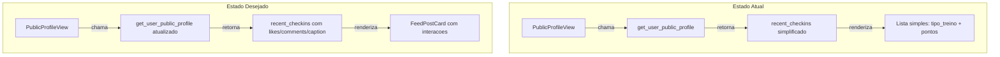

# Correcao de Visibilidade: Feed e Perfil Publico

## Diagnostico

Apos analise completa do banco de dados, RPCs e frontend:

- **RLS em `checkins`**: Ja esta correta -- a policy `checkins_select_tenant` permite leitura cross-user dentro do mesmo tenant (sem filtro `user_id = auth.uid()`).
- **Feed (`get_friend_feed`)**: Funciona como projetado -- so exibe posts do usuario + amigos aceitos. Como a unica amizade no banco esta com status `pending`, ninguem ve posts de terceiros. Isso e **comportamento esperado** (usuario confirmou).
- **PublicProfileView (`get_user_public_profile`)**: A RPC e SECURITY DEFINER e retorna `recent_checkins` corretamente, MAS em formato simplificado (apenas `id`, `date`, `tipo_treino`, `points_awarded`, `foto_url`). Faltam dados essenciais para o FeedPostCard: `likes_count`, `comments_count`, `has_liked`, `feed_caption`, `created_at`.



---

## Epic 1: Migration SQL -- Atualizar RPC `get_user_public_profile`

**Arquivo**: Nova migration `supabase/migrations/YYYYMMDDHHMMSS_fix_public_profile_rich_checkins.sql`

Atualizar a RPC `get_user_public_profile` para que o campo `recent_checkins` retorne dados ricos compativeis com o `FeedPostCard`:

- Adicionar ao subquery: `c.created_at`, `c.feed_caption`
- Adicionar subquery para `likes_count` (count de `likes` por checkin)
- Adicionar subquery para `comments_count` (count de `comments` por checkin)
- Adicionar subquery para `has_liked` (se o caller deu like)

Referencia da estrutura atual em [20260412120000_rpc_user_public_profile.sql](supabase/migrations/20260412120000_rpc_user_public_profile.sql):

```sql
-- Trecho atual (linhas 46-61) que sera substituido:
SELECT c.id, c.checkin_local_date AS date, c.tipo_treino, c.points_awarded, c.foto_url
FROM public.checkins c
WHERE c.user_id = p_user_id AND c.tenant_id = v_tenant AND c.photo_review_status = 'approved'
```

Novo formato dos campos em `recent_checkins`:

```sql
SELECT
  c.id,
  c.checkin_local_date AS date,
  c.tipo_treino,
  c.points_awarded,
  c.foto_url,
  c.created_at,
  c.feed_caption,
  COALESCE((SELECT count(*) FROM public.likes l WHERE l.checkin_id = c.id), 0) AS likes_count,
  COALESCE((SELECT count(*) FROM public.comments co WHERE co.checkin_id = c.id), 0) AS comments_count,
  EXISTS(SELECT 1 FROM public.likes l WHERE l.checkin_id = c.id AND l.user_id = v_caller) AS has_liked
FROM public.checkins c
WHERE c.user_id = p_user_id
  AND c.tenant_id = v_tenant
  AND c.photo_review_status = 'approved'
ORDER BY c.checkin_local_date DESC, c.created_at DESC
LIMIT 20
```

---

## Epic 2: Frontend -- Atualizar PublicProfileView.jsx

**Arquivo**: [src/components/views/PublicProfileView.jsx](src/components/views/PublicProfileView.jsx)

Substituir a secao "Treinos recentes" (linhas 145-183) pelo componente `FeedPostCard`:

- Importar `FeedPostCard` de `./FeedPostCard.jsx`
- Mapear `profile.recent_checkins` para o formato esperado pelo FeedPostCard:
  - `id` -> `id`
  - `user_id` -> `userId` (prop do componente)
  - `display_name` -> `profile.display_name`
  - `tipo_treino` -> `workout_type`
  - `foto_url` -> `foto_url`
  - `points_awarded` -> `points_earned`
  - `created_at` -> `created_at`
  - `feed_caption` -> `caption`
  - `likes_count`, `comments_count`, `has_liked` -> direto
- Adicionar props `onToggleLike`, `onOpenComments` e `onOpenProfile` ao componente
- Adicionar `CommentsDrawer` para suportar comentarios inline
- Receber `onToggleLike`, `onAddComment`, `onLoadComments`, `onDeleteComment` como props (vindos de `useSocialData`)

Estrutura da nova secao:

```jsx
{checkins.length > 0 && (
  <div className="space-y-px -mx-4">
    <h3 className="font-bold text-sm text-zinc-400 uppercase tracking-wider px-4 mb-3">
      Postagens
    </h3>
    {posts.map((post) => (
      <FeedPostCard key={post.id} post={post} onToggleLike={onToggleLike} ... />
    ))}
  </div>
)}
```

---

## Epic 3: Frontend -- Integrar no App.jsx

**Arquivo**: [src/App.jsx](src/App.jsx)

Passar as props de interacao social para o `PublicProfileView`:
- `onToggleLike={social.toggleLike}`
- `onAddComment={social.addComment}`
- `onLoadComments={social.loadComments}`
- `onDeleteComment={social.deleteComment}`
- `currentUserId={session?.user?.id}`

Adicionar refresh do feed apos voltar do PublicProfileView (para refletir likes/comments feitos).

---

## Epic 4: Aplicar Migration no Supabase

Executar a migration via MCP `execute_sql` no projeto Supabase `pjlmemvwqhmpchiiqtol`.