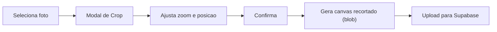

# Foto de Perfil: Crop + Avatar Global

## Situacao Atual

- **Upload**: `EditProfileView.jsx` permite selecionar imagem (jpeg/png/webp, max 5MB) mas **sem crop/posicionamento** -- envia o arquivo direto.
- **Storage**: bucket `avatars` no Supabase, coluna `profiles.avatar_url`.
- **Exibicao**: avatar aparece no feed, comentarios, curtidas, perfil, friends drawer -- mas **NAO aparece** no ranking (HomeView), lista de amigos (FriendsView), desafios (ChallengesView), nem no leaderboard do desafio.

---

## Parte 1: Crop/Enquadramento de Foto

Adicionar a biblioteca `react-easy-crop` para permitir o usuario posicionar e enquadrar a foto antes do upload.

**Fluxo proposto:**

**Arquivos envolvidos:**

- **Novo**: `src/components/ui/image-cropper.jsx` -- componente reutilizavel com `react-easy-crop`, slider de zoom, botoes confirmar/cancelar
- **Editar**: [src/components/views/EditProfileView.jsx](src/components/views/EditProfileView.jsx) -- ao selecionar arquivo, abrir o modal de crop em vez de ir direto para preview. Ao confirmar o crop, gerar o blob recortado e usar como `avatarFile`
- **Novo helper**: `src/lib/crop-image.js` -- funcao utilitaria que recebe imagem + area de crop e retorna um Blob (via canvas)

**Detalhes do crop:**
- Aspect ratio fixo 1:1 (circular)
- Zoom minimo 1x, maximo 3x
- Output: JPEG 400x400px (otimo para avatar, leve)
- Preview circular para o usuario ver como vai ficar

---

## Parte 2: Avatar em Todos os Locais

Garantir que `avatar_url` seja buscado e exibido em todos os contextos onde hoje so aparece icone generico.

### 2a. Ranking na Home

- **Arquivo**: [src/components/views/HomeView.jsx](src/components/views/HomeView.jsx) (linhas ~130-132)
- **Problema**: Mostra `<User />` icon generico, sem `avatar_url`
- **Hook**: [src/hooks/useFitCloudData.js](src/hooks/useFitCloudData.js) (linhas ~53-61) -- RPC do leaderboard nao retorna `avatar_url`
- **Fix**: Alterar a RPC/query do leaderboard para incluir `avatar_url`, e renderizar `` circular no lugar do icone quando disponivel

### 2b. Lista de Amigos

- **Arquivo**: [src/components/views/FriendsView.jsx](src/components/views/FriendsView.jsx) -- `UserRow` (linhas ~97-118) usa icone `User`
- **Fix**: O componente ja recebe dados do perfil; precisa incluir `avatar_url` na query de amigos e renderizar a foto no `UserRow`

### 2c. Desafios (participantes/ranking)

- **Arquivo**: [src/components/views/ChallengesView.jsx](src/components/views/ChallengesView.jsx) -- listagem de participantes/ranking do desafio
- **Fix**: Incluir `avatar_url` na query de participantes e exibir no ranking do desafio

### 2d. Componente Avatar Reutilizavel

Para evitar duplicacao do padrao `

` com fallback para icone `User`, criar:

- **Novo**: `src/components/ui/user-avatar.jsx` -- componente `UserAvatar` com props `src`, `size`, `fallbackName`
- Substitui o padrao repetido em: `FeedPostCard`, `CommentsDrawer`, `LikesDrawer`, `FriendsListDrawer`, `ProfileView`, `PublicProfileView`, `EditProfileView`, `HomeView`, `FriendsView`, `ChallengesView`

---

## Dependencia

- `react-easy-crop` -- unica dependencia nova necessaria (sera instalada via `pnpm add react-easy-crop`)
