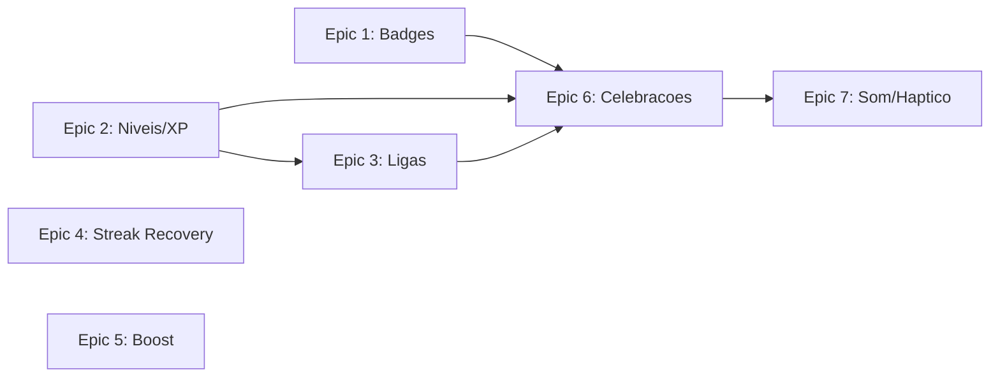
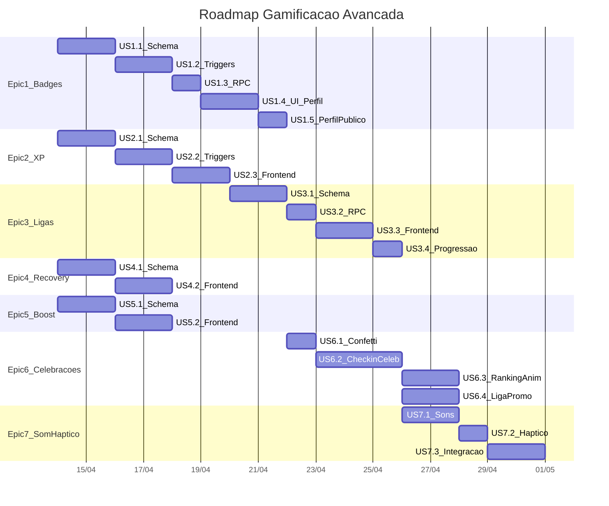

# Gamificacao Avancada — FitRank

## Estado Atual

A gamificacao atual e composta por: `pontos` (incrementados por check-in, +10), `streak` (dias consecutivos), ranking por periodo (dia/semana/mes) via RPC `get_tenant_leaderboard_period`, e desafios mensais. Nao existem: badges, ligas, XP/niveis, streak recovery, boost, animacoes de celebracao nem feedback haptico/sonoro.

**Tabela `profiles`** tem `pontos`, `streak`, `last_checkin_date`, `is_pro` — sem campos de XP, nivel ou liga.

**Fluxo de pontos**: checkin INSERT -> trigger `apply_checkin_to_profile` (soma pontos, recalcula streak) -> trigger `bump_desafio_points_on_checkin` (desafios).

**Frontend**: `HomeView.jsx` exibe streak badge + pontos + ranking. `ProfileView.jsx` exibe grid de stats. Toast simples de 3s no sucesso do check-in. Zero animacoes de celebracao, zero som/haptico.

---

## Dependencias entre Epics

- Epics 1, 2, 4, 5 podem comecar em paralelo
- Epic 3 (Ligas) depende de Epic 2 (XP determina a liga)
- Epic 6 (Celebracoes) depende dos dados de 1, 2 e 3
- Epic 7 (Som/Haptico) e uma camada sobre Epic 6

---

## Epic 1 — Badges / Conquistas

**Objetivo**: Sistema de conquistas desbloqueadas por marcos (streak, check-ins, pontos, social).

### US 1.1 — Schema `badges` + `user_badges`

Migration SQL:

- Tabela `badges` (catalogo): `id` uuid, `slug` text UNIQUE, `name` text, `description` text, `icon` text, `category` text CHECK (streak/checkins/points/social/special), `threshold` int (valor para desbloquear), `is_pro_only` boolean default false, `sort_order` int, `created_at`
- Tabela `user_badges`: `user_id` uuid FK profiles, `badge_id` uuid FK badges, `unlocked_at` timestamptz default now(), PK (user_id, badge_id)
- RLS: `badges` SELECT publico; `user_badges` SELECT publico no tenant, INSERT via SECURITY DEFINER
- Seed com badges iniciais:
  - Streak: "Primeira Semana" (7), "Mestre da Consistencia" (30), "Lenda do Streak" (100)
  - Check-ins: "Primeiro Treino" (1), "Centuriao" (100), "Espartano" (500)
  - Pontos: "Mil Pontos" (1000), "5K Club" (5000)
  - Social: "Sociavel" (10 amigos), "Influencer" (50 amigos)

**Arquivos**: nova migration `supabase/migrations/YYYYMMDD_badges.sql`

### US 1.2 — Trigger de Desbloqueio Automatico

Funcao `check_and_award_badges(p_user_id)` SECURITY DEFINER que:
- Consulta `profiles` (pontos, streak) e contagens (checkins aprovados, amigos)
- Compara com `badges.threshold` por `category`
- Insere em `user_badges` os que faltam (ON CONFLICT DO NOTHING)
- Retorna array de badges recem-desbloqueados (para notificacao)

Trigger `after_checkin_check_badges` em `checkins` AFTER INSERT que chama a funcao.
Trigger `after_friendship_check_badges` em `friendships` AFTER UPDATE (status = accepted).

**Arquivos**: mesma migration ou extensao

### US 1.3 — RPC `get_user_badges` + Notificacao

RPC `get_user_badges(p_user_id)` retorna badges do usuario com `unlocked_at` + dados do catalogo.
Ao desbloquear badge, INSERT em `notifications` tipo `badge_unlocked` com `metadata: { badge_slug, badge_name }`.

**Arquivos**: migration + edicao de `useSocialData.js` ou novo hook

### US 1.4 — UI: Vitrine de Badges no Perfil

Componente `BadgesGrid.jsx` exibido no `ProfileView.jsx` abaixo dos stats:
- Grid de badges: desbloqueados com cor cheia + data, bloqueados em cinza com progresso (ex: "7/30 dias")
- Badges PRO-only com icone de cadeado se `!is_pro`
- Ao clicar em um badge, modal/drawer com descricao e requisito

**Arquivos**: criar `src/components/views/BadgesGrid.jsx`, editar `ProfileView.jsx`

### US 1.5 — Badges no Perfil Publico

Exibir top 3 badges no `PublicProfileView.jsx` como mini-icons ao lado do nome.

**Arquivos**: editar `PublicProfileView.jsx`

---

## Epic 2 — Niveis / XP com Progressao Visual

**Objetivo**: Adicionar XP ao perfil, com niveis (1-100) e barra de progresso visual.

### US 2.1 — Schema: Coluna `xp` + Funcao de Nivel

Migration:
- `ALTER TABLE profiles ADD COLUMN xp int NOT NULL DEFAULT 0`
- Funcao `calculate_level(p_xp int) RETURNS int`: formula `floor(sqrt(xp / 100))` (nivel 1 = 100 XP, nivel 2 = 400 XP, nivel 10 = 10000 XP — curva quadratica)
- Funcao `xp_for_next_level(p_level int) RETURNS int`: retorna XP necessario para o proximo nivel
- View ou funcao helper `profile_level_info(p_user_id)` retornando `level`, `current_xp`, `xp_for_next`, `xp_progress_pct`

**Arquivos**: nova migration

### US 2.2 — XP Awarding via Triggers

Modificar `apply_checkin_to_profile` para tambem incrementar `xp`:
- Check-in = +10 XP (mesmo que pontos)
- Streak bonus: +2 XP por dia de streak ativo (ex: streak 5 = +10 XP extra)
- Badge desbloqueado = +50 XP (na funcao `check_and_award_badges`)

**Arquivos**: migration que faz `CREATE OR REPLACE` do trigger

### US 2.3 — Frontend: Barra de XP + Nivel

Componente `LevelBadge.jsx` (icone circular com numero do nivel + cor por faixa).
Componente `XpProgressBar.jsx` (barra horizontal mostrando progresso ate o proximo nivel).
Integrar em `HomeView.jsx` (ao lado do streak/pontos) e `ProfileView.jsx` (no grid de stats).

Atualizar `profileToUserData` em [`src/lib/profile-map.js`](src/lib/profile-map.js) para calcular `level`, `xpProgress`, `xpForNext` client-side usando a mesma formula.

**Arquivos**: criar componentes em `src/components/ui/`, editar `HomeView.jsx`, `ProfileView.jsx`, `profile-map.js`

---

## Epic 3 — Ligas / Divisoes (Bronze a Diamante)

**Objetivo**: Sistema de divisoes baseado em XP acumulado, conforme PRD.

### US 3.1 — Schema `leagues` + Coluna `league` em profiles

Migration:
- Tabela `leagues` (catalogo): `id`, `slug` (bronze/silver/gold/platinum/diamond), `name`, `min_xp` int, `icon_color` text, `sort_order`
- Seed: Bronze (0), Prata (1000), Ouro (5000), Platina (15000), Diamante (50000)
- `ALTER TABLE profiles ADD COLUMN league text DEFAULT 'bronze'`
- Funcao `recalculate_league(p_user_id)` que atualiza `profiles.league` com base no XP atual
- Chamar `recalculate_league` dentro de `apply_checkin_to_profile` (apos somar XP)

**Arquivos**: nova migration

### US 3.2 — RPC `get_league_leaderboard`

RPC que retorna ranking filtrado por liga: apenas usuarios da mesma `league` do caller, ordenados por pontos do periodo.

**Arquivos**: migration

### US 3.3 — Frontend: Emblema de Liga + Tab no Ranking

Componente `LeagueBadge.jsx` (escudo colorido com nome da liga).
Exibir no `HomeView.jsx` ao lado do nivel.
Adicionar tab "Liga" no ranking da `HomeView` que chama `get_league_leaderboard`.
Cada linha do ranking mostra o mini-emblema da liga do usuario.

**Arquivos**: criar `src/components/ui/LeagueBadge.jsx`, editar `HomeView.jsx`, `useFitCloudData.js`

### US 3.4 — Tela de Progressao de Liga

Drawer/modal `LeagueProgressView.jsx` acessivel pelo tap no emblema:
- Mostra todas as ligas com XP minimo
- Destaca a liga atual com seta de progresso
- Preview da proxima liga com XP faltante

**Arquivos**: criar `src/components/views/LeagueProgressView.jsx`

---

## Epic 4 — Streak Recovery Pago ✅ `completed`

**Objetivo**: Permitir que o usuario pague para recuperar um streak quebrado (conforme PRD V2).

### US 4.1 — Schema `streak_recoveries` ✅

Migration `20260414200800_streak_recovery.sql`:
- Tabela `streak_recoveries`: `id`, `user_id`, `tenant_id`, `recovered_date` date, `streak_before` int, `streak_after` int, `payment_method` text, `created_at`
- RPC `recover_streak(p_date date)` SECURITY DEFINER:
  - Valida que `last_checkin_date` e anterior a ontem (streak esta quebrado)
  - Valida que nao ha recovery para esse usuario no mesmo mes (limite 1/mes)
  - Insere check-in "fantasma" (tipo 'Streak Recovery', sem foto, 0 pontos, feed_visible=false) para o dia perdido
  - Recalcula streak via `recompute_profile_streak`
  - Registra em `streak_recoveries`
  - Somente membros PRO (is_pro=true) podem usar
  - Máximo 3 dias no passado
- RPC `can_recover_streak()` STABLE SECURITY DEFINER:
  - Retorna `{can_recover, gap_date, streak_before, reason}`
  - Validações: streak_active, no_checkins, too_old, not_pro, monthly_limit
- Trigger `apply_checkin_to_profile` atualizado: skip XP para tipo_treino = 'Streak Recovery'

**Arquivos**: nova migration, atualização de `apply_checkin_to_profile`

### US 4.2 — Frontend: Tela de Recovery ✅

- `HomeView.jsx`: Detecta streak quebrado via `can_recover_streak()` no mount. Exibe banner laranja com ícone de escudo + "Streak quebrado!" + badge PRO.
- `StreakRecoveryModal.jsx`: Modal com detalhes (streak anterior, data do gap, limite mensal), confirmação, feedback de sucesso com novo streak.
- `useFitCloudData.js`: Novas funções `checkStreakRecovery` e `recoverStreak`.
- `App.jsx`: Passa `onCheckStreakRecovery` e `onRecoverStreak` ao `HomeView`.

**Arquivos**: criado `src/components/views/StreakRecoveryModal.jsx`, editado `HomeView.jsx`, `useFitCloudData.js`, `App.jsx`

---

## Epic 5 — Boost de Pontos ✅ `completed`

**Objetivo**: Permitir compra limitada de pontos extras (conforme PRD V2).

### US 5.1 — Schema `point_boosts` ✅

Migration `20260414200900_point_boosts.sql`:
- Tabela `point_boosts`: `id`, `user_id`, `tenant_id`, `points` int, `payment_method` text, `created_at`
- Config: max 2 boosts por semana por usuario (validado na RPC)
- RPC `purchase_boost(p_points int)` SECURITY DEFINER:
  - Valida limite semanal (count de boosts na semana atual, segunda a domingo)
  - Valida `p_points` entre 10 e 100
  - Insere em `point_boosts`
  - Insere em `points_ledger` (category 'boost', delta = p_points)
  - Atualiza `profiles.pontos` e `profiles.xp` (+5 XP fixo)
  - Recalcula liga via `recalculate_league`
  - Envia notificação `boost_purchased`
- RPC `get_boost_status()` STABLE SECURITY DEFINER:
  - Retorna `{is_pro, boosts_used, boosts_remaining, max_per_week, min_points, max_points}`

**Arquivos**: nova migration

### US 5.2 — Frontend: Loja de Boost ✅

- `BoostShopDrawer.jsx`: Bottom sheet com 4 opções (10, 25, 50, 100 pts), badge PRO, boosts restantes, confirmação e feedback de sucesso.
- `HomeView.jsx`: Badge de pontos (⚡) agora é clicável e abre o `BoostShopDrawer`.
- `useFitCloudData.js`: Novas funções `getBoostStatus` e `purchaseBoost`.
- `App.jsx`: Props `onGetBoostStatus` e `onPurchaseBoost` passadas ao `HomeView`.

**Arquivos**: criado `src/components/views/BoostShopDrawer.jsx`, editado `HomeView.jsx`, `useFitCloudData.js`, `App.jsx`

---

## Epic 6 — Animacoes de Celebracao ✅ `completed`

**Objetivo**: Feedback visual rico em momentos de conquista.

### US 6.1 — Utilitario de Confetti/Particles ✅

`src/lib/confetti.js`:
- Função `fireConfetti(options)` com Canvas API overlay temporário
- Presets de cores: `achievement`, `rainbow`, `bronze`, `silver`, `gold`, `platinum`, `diamond`, `checkin`
- Opções: `particleCount`, `durationMs`, `origin`, `preset`, `colors`
- Partículas com gravidade, drag, rotação e fade-out

### US 6.2 — Celebracao pos-Check-in ✅

`src/components/views/CelebrationOverlay.jsx`:
- Sequência animada em fases: pontos → streak → level-up → badges
- Cada fase com transição scale-in e delays sequenciais
- Confetti automático ao aparecer; confetti rainbow no level-up; confetti achievement nos badges
- Auto-dismiss calculado dinamicamente; tap para fechar

`App.jsx`:
- `handleCheckin` agora captura estado pré-check-in (level, streak, badges) e compara pós-check-in
- `setCelebration(...)` substitui `showToast` para check-ins cloud bem-sucedidos
- `CelebrationOverlay` renderizado como overlay global

### US 6.3 — Animacao de Subida no Ranking ✅

`useFitCloudData.js`:
- `previousRankRef` (useRef) armazena posições anteriores por uid
- `refreshLeaderboard` agora inclui `rank` e `prevRank` em cada item do leaderboard

`HomeView.jsx`:
- Seta verde (ArrowUp) com bounce quando usuário subiu de posição
- Seta vermelha (ArrowDown) quando desceu
- `useEffect` detecta entrada no top 3 e dispara `fireConfetti({ preset: 'gold' })`

### US 6.4 — Animacao de Promocao de Liga ✅

`src/components/views/LeaguePromotionOverlay.jsx`:
- Tela full-screen com backdrop blur escuro
- Escudo da nova liga com animação scale-in
- Confetti na cor da liga (preset dinâmico por slug)
- Texto "Você subiu para Liga {nome}!" com cor da liga
- Botões "Compartilhar" e "Fechar"

`App.jsx`:
- `prevLeagueRef` + `useEffect` detectam promoção de liga via `profile?.league`
- `LeaguePromotionOverlay` renderizado condicionalmente quando `leaguePromotion` está setado

---

## Epic 7 — Som e Haptic Feedback ✅ `completed`

**Objetivo**: Feedback sensorial nos momentos de conquista.

### US 7.1 — Utilitario de Som ✅

`src/lib/sounds.js`:
- Sons sintetizados via **Web Audio API** (zero dependências, zero arquivos mp3)
- 8 sons: `checkin` (C-E-G ascendente), `streak` (A-C#-E-A fanfarra), `badge` (G-C-E-G-C² conquista), `levelUp` (escala ascendente épica), `leaguePromotion` (sequência majestosa longa), `boost` (rápido e elétrico), `like` (tom agudo sutil), `error` (descendente)
- `playSound(name)` com fallback silencioso
- `setMuted(bool)` / `isMuted()` para controle de preferência
- Auto-resume do AudioContext em browsers que suspendem

### US 7.2 — Utilitario de Haptic Feedback ✅

`src/lib/haptics.js`:
- `navigator.vibrate()` com detecção de suporte
- 7 padrões: `light` (10ms), `medium` (30ms), `heavy` (50ms), `success` ([10,50,30]), `celebration` ([10,30,10,30,50]), `error` ([50,30,50]), `double` ([15,30,15])
- `haptic(pattern)` com fallback silencioso
- `isHapticSupported()` para detecção

### US 7.3 — Integracao nos Momentos de Conquista ✅

Integração completa nos componentes:
- **CelebrationOverlay.jsx**: Check-in → `playSound('checkin')` + `haptic('light')`; Streak milestone (7,30,100) → `playSound('streak')` + `haptic('success')`; Level-up → `playSound('levelUp')` + `haptic('celebration')`; Badge → `playSound('badge')` + `haptic('celebration')`
- **LeaguePromotionOverlay.jsx**: Promoção de liga → `playSound('leaguePromotion')` + `haptic('heavy')` + delayed `haptic('celebration')`
- **BoostShopDrawer.jsx**: Boost comprado → `playSound('boost')` + `haptic('success')`
- **StreakRecoveryModal.jsx**: Streak recuperado → `playSound('streak')` + `haptic('success')`
- **useSocialData.js**: Like (não-unlike) → `haptic('light')` (sem som)

---

## Ordem de Implementacao Recomendada

## Resumo de Impacto por Arquivo

- **Novas migrations**: ~6 arquivos SQL (badges, xp, leagues, streak_recovery, boosts, celebration triggers)
- **Novos componentes**: `BadgesGrid`, `LevelBadge`, `XpProgressBar`, `LeagueBadge`, `LeagueProgressView`, `StreakRecoveryModal`, `BoostShopDrawer`, `CelebrationOverlay`, `LeaguePromotionOverlay`
- **Novos utilitarios**: `confetti.js`, `sounds.js`, `haptics.js`
- **Edicoes principais**: `HomeView.jsx`, `ProfileView.jsx`, `PublicProfileView.jsx`, `App.jsx`, `profile-map.js`, `useFitCloudData.js`, `apply_checkin_to_profile` trigger
- **Novas tabelas**: `badges`, `user_badges`, `leagues`, `streak_recoveries`, `point_boosts`
- **Novos assets**: `public/sounds/` (5-6 arquivos mp3, ~50KB cada)
- **Colunas novas em `profiles`**: `xp` int, `league` text
