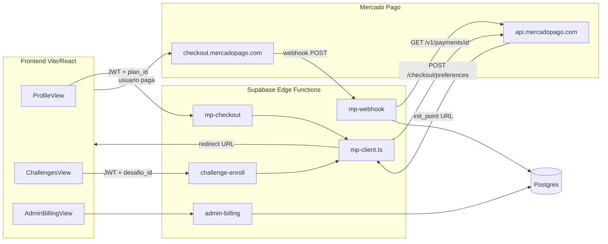

# Migracao Cakto para Mercado Pago Checkout Pro

## Contexto

O FitRank usa a Cakto como provedor de checkout em dois fluxos:
- **Assinatura PRO** (recorrente) -- sera convertida para pagamento unico
- **Taxa de inscricao em desafios** (unico)

O Checkout Pro do Mercado Pago funciona via redirecionamento: o backend cria uma **Preferencia** via REST API (`POST /checkout/preferences`), recebe um `init_point` (URL), e o frontend redireciona o usuario. Apos o pagamento, um **Webhook** notifica o backend com o `payment.id`, que e consultado via `GET /v1/payments/{id}` para obter status e `external_reference`.

## Arquitetura Nova

## Mudancas Detalhadas

### 1. Novo cliente compartilhado: `_shared/mp-client.ts`

Substitui [supabase/functions/_shared/cakto-client.ts](supabase/functions/_shared/cakto-client.ts).

Responsabilidades:
- `createPreference(items, payer, backUrls, externalReference, notificationUrl)` -- POST para `https://api.mercadopago.com/checkout/preferences` com `Authorization: Bearer MP_ACCESS_TOKEN`
- `getPayment(paymentId)` -- GET para `https://api.mercadopago.com/v1/payments/{id}`
- `refundPayment(paymentId)` -- POST para `https://api.mercadopago.com/v1/payments/{id}/refunds`
- `validateWebhookSignature(xSignature, xRequestId, dataId, secret)` -- validacao HMAC-SHA256 do header `x-signature`
- Helpers: `centsToReais(cents)` (reutilizar logica existente)

Env vars: `MP_ACCESS_TOKEN`, `MP_WEBHOOK_SECRET`

### 2. Nova Edge Function: `mp-checkout/index.ts`

Substitui [supabase/functions/cakto-checkout/index.ts](supabase/functions/cakto-checkout/index.ts).

Fluxo:
1. Valida JWT do usuario
2. Recebe `plan_id` no body
3. Busca plano em `subscription_plans` pelo `id`
4. Cria preferencia MP com:
   - `items`: titulo do plano, quantidade 1, `unit_price` = `price_amount / 100`
   - `payer.email`: email do usuario
   - `external_reference`: `sub:{user_id}:{plan_id}`
   - `back_urls.success/failure/pending`: URLs do app (`VITE_PUBLIC_APP_URL/profile?payment=...`)
   - `notification_url`: URL da Edge Function `mp-webhook`
   - `auto_return`: `"approved"`
5. Retorna `{ url: preference.init_point }`

### 3. Nova Edge Function: `mp-webhook/index.ts`

Substitui [supabase/functions/cakto-webhook/index.ts](supabase/functions/cakto-webhook/index.ts).

Fluxo:
1. Recebe notificacao Webhook do MP (header `x-signature`, query `data.id`, `type`)
2. Valida assinatura HMAC com `MP_WEBHOOK_SECRET`
3. Se `type === 'payment'`, busca detalhes via `GET /v1/payments/{data.id}`
4. Extrai `external_reference` para identificar o tipo:
   - `sub:{userId}:{planId}` -- pagamento de assinatura PRO
   - `challenge:{userId}:{desafioId}` -- taxa de desafio
5. Conforme `payment.status`:
   - `approved` -- ativa PRO / inscreve no desafio, registra em `pagamentos`
   - `refunded` -- revoga PRO, atualiza `pagamentos`
   - `rejected` / `cancelled` -- log apenas
6. Atualiza `profiles` via RPC `internal_update_profile_mp`
7. Upsert em `subscriptions` (para PRO) ou `desafio_participantes` (para desafios)

### 4. Atualizar `challenge-enroll/index.ts`

Arquivo: [supabase/functions/challenge-enroll/index.ts](supabase/functions/challenge-enroll/index.ts)

- Remover imports de `cakto-client.ts`
- Importar `mp-client.ts`
- Para desafios pagos: criar preferencia MP em vez de montar URL Cakto
  - `external_reference`: `challenge:{user_id}:{desafio_id}`
  - `items`: titulo do desafio, preco = `entry_fee / 100`
  - `notification_url`: URL do `mp-webhook`
  - `back_urls.success`: `{APP_URL}/challenges?challenge_checkout=success`
- Remover logica de criar ofertas dinamicas Cakto
- Remover uso de `cakto_offer_id` / `cakto_checkout_url` do desafio (nao precisa mais cachear oferta; cada preferencia e criada por pedido)

### 5. Atualizar `admin-billing/index.ts`

Arquivo: [supabase/functions/admin-billing/index.ts](supabase/functions/admin-billing/index.ts)

- Remover imports de `cakto-client.ts` e toda logica de criacao/atualizacao/desabilitacao de ofertas Cakto
- `createPlan`: apenas insere no DB (sem criar oferta na Cakto)
- `updatePlan`: apenas atualiza DB (sem sincronizar oferta)
- `archivePlan`: apenas desativa no DB
- `refundSubscription`: usar `MpClient.refundPayment(mp_payment_id)` para reembolso
- Remover campo `cakto_product_id` do schema de criacao
- Remover `cancelSubscription` a chamada RPC com nome `internal_update_profile_cakto`, trocar por `internal_update_profile_mp`

### 6. Atualizar `admin-challenges/index.ts`

Arquivo: [supabase/functions/admin-challenges/index.ts](supabase/functions/admin-challenges/index.ts)

- Remover limpeza de `cakto_offer_id` / `cakto_checkout_url` ao mudar `entry_fee` (nao precisa mais; preferencias sao criadas sob demanda)

### 7. Nova migration SQL: `20260415_cakto_to_mp.sql`

Renomear colunas e atualizar RPCs:

**profiles:**
- `cakto_customer_email` -> `mp_payer_email`
- `cakto_order_id` -> `mp_payment_id`

**subscription_plans:**
- Dropar `cakto_product_id`, `cakto_offer_id`, `cakto_checkout_url` (nao necessarios com MP)

**subscriptions:**
- `cakto_order_id` -> `mp_payment_id`
- `cakto_customer_email` -> `mp_payer_email`
- Atualizar indice

**desafios:**
- Dropar `cakto_offer_id`, `cakto_checkout_url`

**RPCs a recriar/atualizar:**
- `internal_update_profile_cakto` -> `internal_update_profile_mp` (mesma logica, novos nomes de coluna)
- `profiles_prevent_privilege_escalation` -- atualizar nomes de coluna
- `admin_list_subscriptions` -- atualizar nomes de coluna
- `admin_engagement_segment_match` e RPCs de engajamento -- trocar `cakto_order_id` por `mp_payment_id`
- `admin_desafios_list` e `admin_desafio_detail` -- remover colunas Cakto

### 8. Atualizar Frontend

**[src/components/views/ProfileView.jsx](src/components/views/ProfileView.jsx):**
- Trocar `cakto_offer_id` por `id` nos planos listados
- `handleSubscribe(planId)` em vez de `handleSubscribe(caktoOfferId)`
- Chamar `invokeEdge('mp-checkout', ...)` com `{ plan_id }` em vez de `{ offer_id }`

**[src/components/views/AdminBillingView.jsx](src/components/views/AdminBillingView.jsx):**
- Remover campos `cakto_product_id` do formulario de criacao de plano
- Trocar referencias `cakto_order_id` por `mp_payment_id`

**[src/components/admin/engagement/EngagementFilters.jsx](src/components/admin/engagement/EngagementFilters.jsx):**
- Trocar texto `cakto_order_id` por `mp_payment_id`

### 9. Config e Cleanup

**[supabase/config.toml](supabase/config.toml):**
- Remover secoes `[functions.cakto-checkout]` e `[functions.cakto-webhook]`
- Adicionar `[functions.mp-checkout]` e `[functions.mp-webhook]`

**[.env.example](.env.example):**
- Remover `CAKTO_CLIENT_ID`, `CAKTO_CLIENT_SECRET`, `CAKTO_WEBHOOK_SECRET`, `CAKTO_PRO_PRODUCT_ID`, `CAKTO_CHALLENGE_PRODUCT_ID`
- Adicionar `MP_ACCESS_TOKEN`, `MP_WEBHOOK_SECRET`

**Deletar:**
- `supabase/functions/_shared/cakto-client.ts`
- `supabase/functions/cakto-checkout/` (diretorio inteiro)
- `supabase/functions/cakto-webhook/` (diretorio inteiro)
- `docs/cakto_setup/` (se existir)

### 10. Configurar Webhook no Mercado Pago

Usar o MCP `save_webhook` para configurar a URL de callback apontando para a Edge Function `mp-webhook`:
- `callback`: `https://<SUPABASE_URL>/functions/v1/mp-webhook`
- `topics`: `["payment"]`

## Decisoes Importantes

- **Sem recorrencia automatica**: o usuario PRO precisara renovar manualmente a cada periodo. Podemos adicionar lembretes (push notification) quando o periodo estiver prestes a expirar.
- **`external_reference`** substitui o `sck` da Cakto como mecanismo de identificacao de usuario/contexto.
- **Idempotencia**: o webhook pode receber a mesma notificacao mais de uma vez; verificar `id_externo` existente antes de inserir em `pagamentos`.
- **`current_period_end`**: ao aprovar pagamento PRO, calcular `current_period_end` = now + intervalo do plano (ex: 30 dias para mensal).
