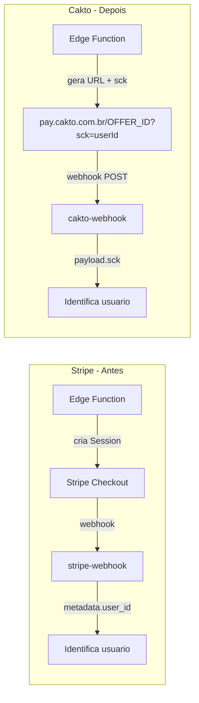

# Migração Stripe para Cakto

## Diferenças Arquiteturais Fundamentais



- **Autenticacao**: OAuth2 com `client_id` + `client_secret` -> `access_token` (expira em ~10h) vs API Key fixa do Stripe
- **Checkout**: URL estatica por Oferta (`pay.cakto.com.br/OFFER_ID`) vs Session dinamica do Stripe
- **Identificacao do usuario**: parametro `sck` na URL de checkout retornado no webhook vs `metadata` da Session
- **Sem Billing Portal**: Cakto nao oferece portal de cliente; informacoes de assinatura serao exibidas na UI do FitRank
- **Gestao de assinaturas via API**: Cakto nao possui endpoints para cancelar/pausar assinaturas programaticamente; cancelamento sera via refund da API ou via dashboard Cakto
- **Webhook**: Validado por campo `secret` no payload (nao por assinatura de header)

## Pre-requisitos (manual do usuario)

1. Criar conta em [app.cakto.com.br](https://app.cakto.com.br)
2. Gerar chaves API (client_id, client_secret) no Painel Cakto
3. Criar um **Produto** para "Assinatura PRO FitRank" no painel (type: subscription)
4. Configurar variaveis de ambiente:
   - `CAKTO_CLIENT_ID`
   - `CAKTO_CLIENT_SECRET`
   - `CAKTO_WEBHOOK_SECRET` (gerado ao criar webhook no painel)
   - `CAKTO_PRO_PRODUCT_ID` (UUID do produto de assinatura)

---

## Fase 1 -- Migration: Adaptar Schema do Banco

Arquivo: `supabase/migrations/XXXXXX_stripe_to_cakto.sql`

Alteracoes no schema:

- **`profiles`**: renomear `stripe_customer_id` -> `cakto_customer_email`, `stripe_subscription_id` -> `cakto_order_id`
- **`subscription_plans`**: renomear `stripe_product_id` -> `cakto_product_id`, `stripe_price_id` -> `cakto_offer_id`, adicionar `cakto_checkout_url text`
- **`subscriptions`**: renomear `stripe_subscription_id` -> `cakto_order_id`, `stripe_customer_id` -> `cakto_customer_email`
- **`desafios`**: adicionar `cakto_offer_id text`, `cakto_checkout_url text` (para ofertas criadas dinamicamente)
- Atualizar RPCs: `internal_update_profile_stripe` -> `internal_update_profile_cakto`, `admin_list_subscription_plans`, `admin_list_subscriptions`, `admin_billing_metrics`
- Atualizar filtros de engajamento que referenciam `stripe_subscription_id`
- Atualizar constraint de audit log se necessario

---

## Fase 2 -- Modulo Compartilhado: Cakto API Helper

Arquivo: `supabase/functions/_shared/cakto-client.ts`

Modulo reutilizado por todas as Edge Functions que interagem com a Cakto:

```typescript
// Estrutura do modulo
export class CaktoClient {
  private accessToken: string | null;
  private expiresAt: number;

  constructor(clientId: string, clientSecret: string);
  async authenticate(): Promise<void>; // POST /public_api/token/
  async get(endpoint: string, params?: Record<string,string>): Promise<any>;
  async post(endpoint: string, body: Record<string,any>): Promise<any>;

  // Helpers especificos
  async createOffer(productId: string, data: OfferInput): Promise<Offer>;
  async getOrder(orderId: string): Promise<Order>;
  async listOrders(filters?: OrderFilters): Promise<PaginatedOrders>;
  async refundOrder(orderId: string): Promise<void>;
}
```

---

## Fase 3 -- Edge Functions

### 3a. Remover funcoes Stripe (deletar arquivos)

- `supabase/functions/stripe-checkout/` (checkout de assinatura)
- `supabase/functions/stripe-portal/` (billing portal)
- `supabase/functions/stripe-webhook/` (webhook Stripe)

### 3b. Criar `cakto-webhook` (nova)

Arquivo: `supabase/functions/cakto-webhook/index.ts`

- Recebe POST da Cakto
- Valida `payload.secret === CAKTO_WEBHOOK_SECRET`
- Eventos tratados:
  - `purchase_approved`: identifica usuario via `sck`, ativa PRO ou inscreve em desafio
  - `subscription_created`: registra assinatura em `subscriptions`
  - `subscription_canceled`: desativa PRO, atualiza `subscriptions`
  - `subscription_renewed`: renova periodo em `subscriptions`
  - `subscription_renewal_refused`: marca assinatura como past_due
  - `refund` / `chargeback`: reverte acesso
- Usa `sck` para identificar `user_id` (e `desafio_id` para desafios)
- Fallback: match por `customer.email` em `auth.users`

### 3c. Criar `cakto-checkout` (nova, substitui stripe-checkout)

Arquivo: `supabase/functions/cakto-checkout/index.ts`

- Autentica usuario via JWT
- Busca plano ativo em `subscription_plans` com `cakto_checkout_url`
- Retorna URL de checkout com parametros: `?email=USER_EMAIL&sck=USER_ID`
- Nao cria session dinamica (diferente do Stripe)

### 3d. Modificar `admin-billing`

Arquivo: [supabase/functions/admin-billing/index.ts](supabase/functions/admin-billing/index.ts)

- Substituir SDK Stripe pelo `CaktoClient`
- `createPlan`: cria Oferta via API Cakto -> salva `cakto_offer_id` e `cakto_checkout_url`
- `updatePlan`: atualiza Oferta via API Cakto
- `archivePlan`: desativa Oferta via API Cakto
- Remover: `cancelSubscription`, `pauseSubscription`, `resumeSubscription`, `changeSubscriptionPlan` (Cakto nao suporta via API)
- Manter: `listPlans`, `listSubscriptions` (via DB), `metrics` (via DB)
- Adicionar: `refundSubscription` (via API Cakto `refundOrder`)

### 3e. Modificar `challenge-enroll`

Arquivo: [supabase/functions/challenge-enroll/index.ts](supabase/functions/challenge-enroll/index.ts)

- Substituir Stripe por Cakto
- Se `entry_fee > 0` e desafio nao tem `cakto_offer_id`:
  - Criar Oferta via API Cakto (produto: desafio, preco: entry_fee, tipo: unique)
  - Salvar `cakto_offer_id` e `cakto_checkout_url` no desafio
- Retornar URL: `cakto_checkout_url?email=USER_EMAIL&sck=USER_ID:DESAFIO_ID`

---

## Fase 4 -- Frontend

### 4a. Modificar `ProfileView.jsx`

Arquivo: [src/components/views/ProfileView.jsx](src/components/views/ProfileView.jsx)

- Remover chamada a `stripe-checkout` e `stripe-portal`
- Chamar `cakto-checkout` para obter URL de checkout
- Redirecionar para URL da Cakto (window.location.href)
- Remover botao "Gerenciar Assinatura" (Cakto nao tem portal)
- Exibir info da assinatura atual inline (status, proxima renovacao)

### 4b. Modificar `AdminBillingView.jsx`

Arquivo: [src/components/views/AdminBillingView.jsx](src/components/views/AdminBillingView.jsx)

- Atualizar formulario de plano: remover campos Stripe, usar campos Cakto
- Remover acoes: pausar, retomar, trocar plano
- Manter: criar plano, editar plano, arquivar plano, listar assinantes
- Adicionar: reembolsar assinatura
- Atualizar labels e textos

### 4c. Modificar `ChallengesView.jsx`

Arquivo: [src/components/views/ChallengesView.jsx](src/components/views/ChallengesView.jsx)

- Atualizar redirect de retorno: `challenge_checkout=success` vira callback da Cakto
- Fluxo: usuario clica "Inscrever" -> `challenge-enroll` retorna URL Cakto -> redireciona

### 4d. Limpar `AdminEngagementView.jsx`

Arquivo: [src/components/views/AdminEngagementView.jsx](src/components/views/AdminEngagementView.jsx)

- Atualizar referencias a "Stripe" no filtro de segmentacao

### 4e. Limpar `App.jsx`

Arquivo: [src/App.jsx](src/App.jsx)

- Remover imports e rotas de componentes Stripe removidos

---

## Fase 5 -- Configuracao e Limpeza

- **`supabase/config.toml`**: remover `[functions.stripe-checkout]`, `[functions.stripe-portal]`, `[functions.stripe-webhook]`; adicionar `[functions.cakto-webhook]`, `[functions.cakto-checkout]`
- **`.env.example`**: adicionar `CAKTO_CLIENT_ID`, `CAKTO_CLIENT_SECRET`, `CAKTO_WEBHOOK_SECRET`, `CAKTO_PRO_PRODUCT_ID`
- **`docs/stripe_setup`**: remover ou substituir por `docs/cakto_setup`
- **`docs/mcp.json`**: remover entrada Stripe MCP
- **Arquivos auxiliares SQL** (`_mcp_part*.sql`): atualizar ou remover referencias a `stripe_subscription_id`
- **Planos antigos** (`.cursor/plans/monetizacao_stripe_*`): nenhuma alteracao necessaria (historico)
- **Variaveis de ambiente no Supabase**: remover `STRIPE_SECRET_KEY`, `STRIPE_WEBHOOK_SECRET`; adicionar secrets Cakto

---

## Fase 6 -- Deploy e Webhook

1. Aplicar migration via MCP (`apply_migration`)
2. Deploy das Edge Functions novas/modificadas
3. Configurar webhook na Cakto (painel ou API):
   - URL: `https://PROJECT_REF.supabase.co/functions/v1/cakto-webhook`
   - Eventos: `purchase_approved`, `subscription_created`, `subscription_canceled`, `subscription_renewed`, `subscription_renewal_refused`, `refund`, `chargeback`
   - Anotar o `secret` gerado e salvar como `CAKTO_WEBHOOK_SECRET`

---

## Limitacoes da Cakto vs Stripe

| Funcionalidade | Stripe | Cakto |
|---|---|---|
| Pausar/retomar assinatura | Via API | Nao disponivel |
| Trocar plano de assinatura | Via API | Nao disponivel |
| Portal de cobranca do cliente | Stripe Portal | Nao existe |
| Cancelar assinatura | Via API | Apenas via refund ou dashboard |
| Criar checkout dinamico | Session API | URL estatica por Oferta |
| Metodos de pagamento | Configuravel | Definido no produto/oferta |
