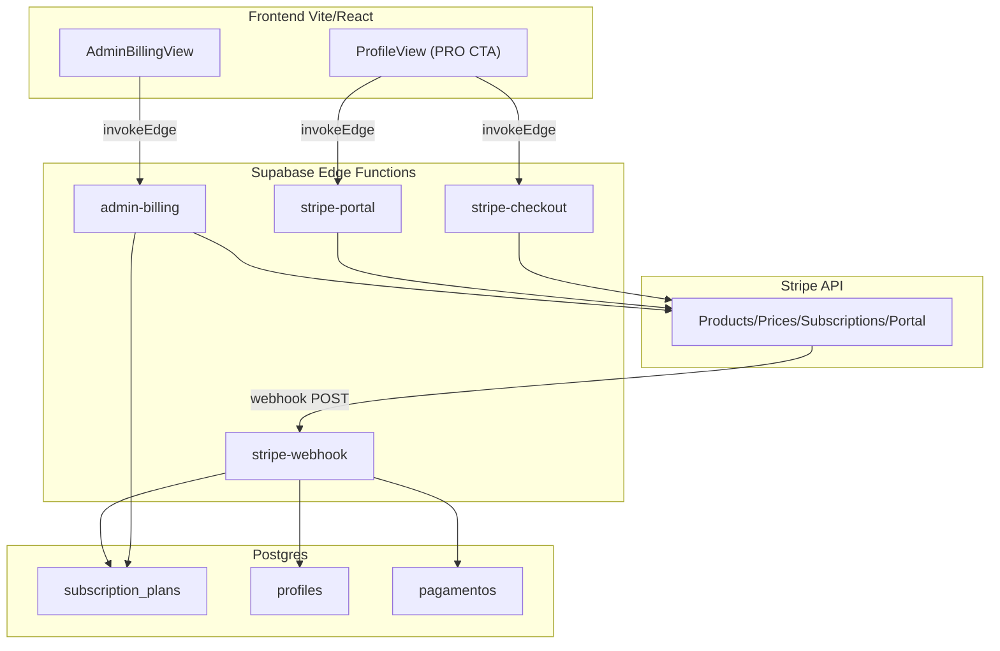

# Implementacao Monetizacao Stripe - Epico 6

## Arquitetura geral

---

## Fase 1 -- Migration: tabela `subscription_plans`

Criar a tabela `subscription_plans` que funciona como catalogo local dos planos sincronizados com o Stripe.

**Arquivo:** `supabase/migrations/YYYYMMDDHHMMSS_subscription_plans.sql`

**Colunas principais:**
- `id` uuid PK
- `stripe_product_id` text UNIQUE NOT NULL
- `stripe_price_id` text UNIQUE NOT NULL
- `name` text NOT NULL
- `description` text
- `price_amount` integer NOT NULL (centavos)
- `currency` text NOT NULL DEFAULT 'brl'
- `interval` text NOT NULL ('month'|'year')
- `interval_count` integer NOT NULL DEFAULT 1
- `features` jsonb DEFAULT '[]' (lista de features do plano)
- `limits` jsonb DEFAULT '{}' (ex: `{"max_checkins_day": 5, "max_boost": 2}`)
- `is_active` boolean NOT NULL DEFAULT true
- `sort_order` integer NOT NULL DEFAULT 0
- `metadata` jsonb DEFAULT '{}'
- `created_at`, `updated_at` timestamptz

**RLS:** SELECT para `authenticated` (usuarios veem planos ativos); INSERT/UPDATE/DELETE apenas via service_role (Edge Functions admin).

Tambem criar migration para tabela `subscriptions` (detalhe de assinatura local):
- `id` uuid PK
- `user_id` uuid FK profiles
- `tenant_id` uuid FK tenants
- `plan_id` uuid FK subscription_plans
- `stripe_subscription_id` text UNIQUE
- `stripe_customer_id` text
- `status` text NOT NULL ('active'|'trialing'|'past_due'|'canceled'|'paused'|'unpaid')
- `current_period_start` timestamptz
- `current_period_end` timestamptz
- `cancel_at_period_end` boolean DEFAULT false
- `canceled_at` timestamptz
- `metadata` jsonb DEFAULT '{}'
- `created_at`, `updated_at` timestamptz

**RLS:** SELECT para o proprio usuario; INSERT/UPDATE via service_role.

---

## Fase 2 -- Edge Function: `stripe-webhook`

**Arquivo:** `supabase/functions/stripe-webhook/index.ts`

Recebe eventos do Stripe e atualiza o banco. Nao requer autenticacao JWT (webhook vem direto do Stripe).

**Eventos tratados:**
- `checkout.session.completed` -- cria/atualiza subscription local, atualiza `profiles.is_pro`, `stripe_customer_id`, `stripe_subscription_id`
- `customer.subscription.updated` -- atualiza status, periodo, `cancel_at_period_end`
- `customer.subscription.deleted` -- marca subscription como canceled, remove `is_pro`
- `customer.subscription.paused` -- marca como paused, remove `is_pro`
- `customer.subscription.resumed` -- marca como active, restaura `is_pro`
- `invoice.payment_succeeded` -- registra em `pagamentos`
- `invoice.payment_failed` -- registra em `pagamentos` com status failed

**Seguranca:** Verificacao de assinatura Stripe via `Stripe-Signature` header + `STRIPE_WEBHOOK_SECRET`. Idempotencia via `id_externo` unico em `pagamentos`.

**Atualizacao de `profiles`:** Usa `SET LOCAL fitrank.internal_profile_update = '1'` para bypassar a trigger de protecao antes de atualizar `is_pro`, `stripe_customer_id`, `stripe_subscription_id`.

---

## Fase 3 -- Edge Function: `stripe-checkout`

**Arquivo:** `supabase/functions/stripe-checkout/index.ts`

**POST** -- Cria uma Checkout Session no Stripe.

**Fluxo:**
1. Valida JWT do usuario
2. Recebe `{ price_id }` (id do plano desejado)
3. Busca/cria Stripe Customer (usa `stripe_customer_id` do profile se existir)
4. Cria `checkout.session` com `mode: 'subscription'`, `success_url`, `cancel_url`
5. Retorna `{ url }` para redirect

---

## Fase 4 -- Edge Function: `stripe-portal`

**Arquivo:** `supabase/functions/stripe-portal/index.ts`

**POST** -- Cria uma sessao do Stripe Customer Portal para o usuario gerenciar sua assinatura (metodo de pagamento, cancelamento, upgrade).

**Fluxo:**
1. Valida JWT
2. Busca `stripe_customer_id` do profile
3. Cria `billing_portal.session`
4. Retorna `{ url }`

---

## Fase 5 -- Edge Function: `admin-billing`

**Arquivo:** `supabase/functions/admin-billing/index.ts`

CRUD completo para o admin gerenciar planos e assinaturas. Segue o mesmo padrao de autorizacao das outras Edge Functions admin (verifica `is_platform_master`).

**Endpoints (via query param `action`):**

**Planos:**
- `GET ?action=list-plans` -- Lista todos os planos (subscription_plans)
- `POST ?action=create-plan` -- Cria produto + preco no Stripe, insere em `subscription_plans`
- `PATCH ?action=update-plan` -- Atualiza metadata do plano (nome, descricao, features, limits, is_active, sort_order). Se mudar preco, cria novo Price no Stripe e arquiva o antigo
- `DELETE ?action=archive-plan` -- Desativa plano (soft delete: `is_active = false`) e arquiva no Stripe

**Assinaturas:**
- `GET ?action=list-subscriptions` -- Lista assinaturas com filtros (status, tenant, user)
- `PATCH ?action=update-subscription` -- Atualiza assinatura (mudar plano / upgrade-downgrade via Stripe)
- `POST ?action=cancel-subscription` -- Cancela assinatura (imediata ou ao fim do periodo)
- `POST ?action=pause-subscription` -- Pausa assinatura (Stripe pause collection)
- `POST ?action=resume-subscription` -- Resume assinatura pausada

**Cada acao gera registro em `platform_admin_audit_log`** (mesmo padrao das outras Edge Functions admin).

---

## Fase 6 -- Frontend: `AdminBillingView.jsx`

**Arquivo:** [src/components/views/AdminBillingView.jsx](src/components/views/AdminBillingView.jsx)

Painel admin completo seguindo o padrao visual das outras telas admin (titulo + voltar, Cards, Buttons, etc.).

**Secoes:**

### 6a -- Gestao de Planos
- Tabela com todos os planos (nome, preco, intervalo, status, features)
- Botao "Novo Plano" abre formulario (modal/drawer):
  - Nome, descricao, preco (BRL), intervalo (mensal/anual), features (lista editavel), limites (JSON), sort_order
- Editar plano inline ou via modal
- Ativar/desativar plano
- Badge visual de status (ativo/inativo)

### 6b -- Gestao de Assinaturas
- Lista de assinaturas com filtros (status, tenant, busca por usuario)
- Detalhes: usuario, plano, status, periodo atual, proximo vencimento
- Acoes por assinatura:
  - Cancelar (com confirmacao)
  - Pausar / Resumir
  - Mudar plano (upgrade/downgrade)
- Badges de status coloridos (active=verde, past_due=amarelo, canceled=vermelho, paused=cinza)

### 6c -- Metricas resumidas (header)
- Total de assinantes ativos
- MRR estimado (soma dos planos ativos)
- Churn (cancelamentos no periodo)

---

## Fase 7 -- Integracao no App

### 7a -- Navegacao admin
- Adicionar `AdminBillingView` em [src/App.jsx](src/App.jsx) (mesmo padrao das outras views admin)
- Adicionar botao "Assinaturas" no painel admin em [src/components/views/ProfileView.jsx](src/components/views/ProfileView.jsx) com icone `CreditCard`
- Props: `onOpenBilling` no `ProfileView`

### 7b -- CTA PRO no ProfileView
- O card "Seja um Membro PRO" (ja existe em [ProfileView.jsx](src/components/views/ProfileView.jsx) linhas 494-503) passa a chamar `stripe-checkout` e redirecionar para o Stripe
- Se o usuario ja for PRO, mostrar botao "Gerenciar Assinatura" que abre o Customer Portal

### 7c -- Config do Supabase
- Adicionar `stripe-webhook`, `stripe-checkout`, `stripe-portal`, `admin-billing` em [supabase/config.toml](supabase/config.toml) com `verify_jwt = false` (webhook) e as demais sem override (JWT validado manualmente)

---

## Arquivos criados/modificados (resumo)

| Arquivo | Acao |
|---------|------|
| `supabase/migrations/YYYYMMDD_subscription_plans.sql` | Criar |
| `supabase/functions/stripe-webhook/index.ts` | Criar |
| `supabase/functions/stripe-checkout/index.ts` | Criar |
| `supabase/functions/stripe-portal/index.ts` | Criar |
| `supabase/functions/admin-billing/index.ts` | Criar |
| `supabase/config.toml` | Modificar |
| `src/components/views/AdminBillingView.jsx` | Criar |
| `src/App.jsx` | Modificar |
| `src/components/views/ProfileView.jsx` | Modificar |

---

## Decisoes tecnicas

- **Sem `@stripe/stripe-js` no frontend**: todas as chamadas Stripe passam pelas Edge Functions; o frontend apenas redireciona para URLs retornadas (checkout/portal). Isso evita instalar novas dependencias.
- **Stripe SDK no Deno**: usar `import Stripe from 'https://esm.sh/stripe@17'` nas Edge Functions (padrao Supabase).
- **Webhook sem JWT**: o `stripe-webhook` nao usa auth do Supabase; valida via `Stripe-Signature`. Configurar `verify_jwt = false` no config.toml.
- **Idempotencia**: webhook usa `stripe_subscription_id` e `id_externo` como chaves de deduplicacao.
- **Bypass trigger**: usa `SET LOCAL fitrank.internal_profile_update = '1'` (padrao ja existente) para atualizar campos protegidos.
