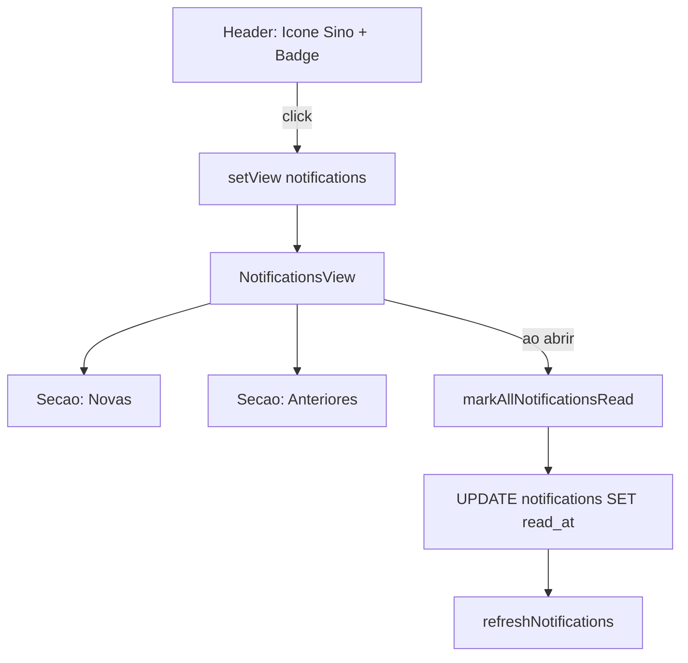

# Notificacoes Estilo Instagram

## Estado Atual

- Notificacoes sao uma lista simples embutida no [ProfileView.jsx](src/components/views/ProfileView.jsx) (linhas 127-160)
- O botao no canto superior direito do header e um icone `User` **sem acao** ([App.jsx](src/App.jsx) linhas 179-188)
- O hook [useFitCloudData.js](src/hooks/useFitCloudData.js) busca **apenas notificacoes nao lidas** (linhas 120-134)
- Tabela `public.notifications` ja possui coluna `read_at` e indices para unread + created_at ([migration](supabase/migrations/20260409173000_notifications_and_rejection_reasons.sql))
- A marcacao como lida acontece inline no App.jsx (linhas 228-234) via update direto no Supabase

## Arquitetura da Solucao



---

## Epic 1: Hook de Dados (useFitCloudData)

**Objetivo:** Buscar tanto notificacoes novas quanto o historico de lidas.

**Arquivo:** [src/hooks/useFitCloudData.js](src/hooks/useFitCloudData.js)

**Alteracoes:**

- **1a.** Renomear o estado `notifications` para manter compatibilidade e adicionar `readNotifications`:
  - `notifications` -- continua sendo as nao-lidas (para badge count)
  - `readNotifications` -- ultimas 50 notificacoes ja lidas (historico)

- **1b.** Criar `refreshReadNotifications`:
```js
const refreshReadNotifications = useCallback(async () => {
  const { data } = await supabase
    .from('notifications')
    .select('id, type, title, body, data, created_at, read_at')
    .eq('user_id', userId)
    .not('read_at', 'is', null)
    .order('created_at', { ascending: false })
    .limit(50);
  setReadNotifications(data ?? []);
}, [supabase, userId]);
```

- **1c.** Criar `markAllNotificationsRead` -- marca TODAS as nao-lidas de uma vez:
```js
const markAllNotificationsRead = useCallback(async () => {
  await supabase
    .from('notifications')
    .update({ read_at: new Date().toISOString() })
    .eq('user_id', userId)
    .is('read_at', null);
  await refreshNotifications();
  await refreshReadNotifications();
}, [supabase, userId]);
```

- **1d.** Incluir `refreshReadNotifications` no `refreshAll` e exportar os novos estados/funcoes

---

## Epic 2: Componente NotificationsView

**Objetivo:** Criar tela dedicada estilo Instagram Activity.

**Arquivo a criar:** [src/components/views/NotificationsView.jsx](src/components/views/NotificationsView.jsx)

**Layout:**
- Header fixo com botao "Voltar" (seta) e titulo "Notificacoes"
- **Secao "Novas"** -- lista de `notifications` (nao lidas), com fundo destacado (bg-zinc-900/80 ou similar)
- **Secao "Anteriores"** -- lista de `readNotifications`, agrupadas por tempo:
  - "Hoje", "Ontem", "Esta semana", "Este mes", "Anteriores"
- Cada item: icone por tipo (AlertTriangle para rejeicao, CheckCircle para aprovacao, etc.), titulo em negrito, corpo em cinza, tempo relativo (formatTimeAgo)
- Estado vazio: ilustracao "Nenhuma notificacao" com texto
- Ao abrir a view, chamar `markAllNotificationsRead()` automaticamente (marca novas como lidas)

**Estrutura visual de cada item:**
```
[Icone]  Titulo em negrito                    2h
         Corpo da notificacao em cinza
```

---

## Epic 3: Integracao no App.jsx

**Objetivo:** Conectar o sino no header e a nova view ao fluxo do app.

**Arquivo:** [src/App.jsx](src/App.jsx)

**Alteracoes:**

- **3a. Header** -- Substituir o botao com icone `User` (linhas 184-188) por icone `Bell` com badge de contagem:
```jsx
<button onClick={() => setView('notifications')} className="relative ...">
  <Bell size={20} className="text-zinc-400" />
  {cloud.notifications.length > 0 && (
    <span className="absolute -top-1 -right-1 w-4 h-4 bg-red-500 rounded-full
      text-[10px] font-bold flex items-center justify-center">
      {cloud.notifications.length}
    </span>
  )}
</button>
```

- **3b. Roteamento** -- Adicionar bloco condicional para `view === 'notifications'`:
```jsx
{view === 'notifications' && useCloud && (
  <NotificationsView
    notifications={cloud.notifications}
    readNotifications={cloud.readNotifications}
    onMarkAllRead={cloud.markAllNotificationsRead}
    onBack={() => setView('home')}
  />
)}
```

- **3c. Remover notificacoes do ProfileView** -- Remover a secao de notificacoes embutida e as props `notifications` / `onMarkNotificationRead` do ProfileView

---

## Epic 4: Limpeza do ProfileView

**Objetivo:** Remover a secao de notificacoes inline que sera substituida.

**Arquivo:** [src/components/views/ProfileView.jsx](src/components/views/ProfileView.jsx)

- Remover props `notifications` e `onMarkNotificationRead` da interface
- Remover o bloco JSX condicional `{notifications.length > 0 && ...}` (linhas ~129-160)
- Remover import nao utilizado de `Button` se for o unico uso
