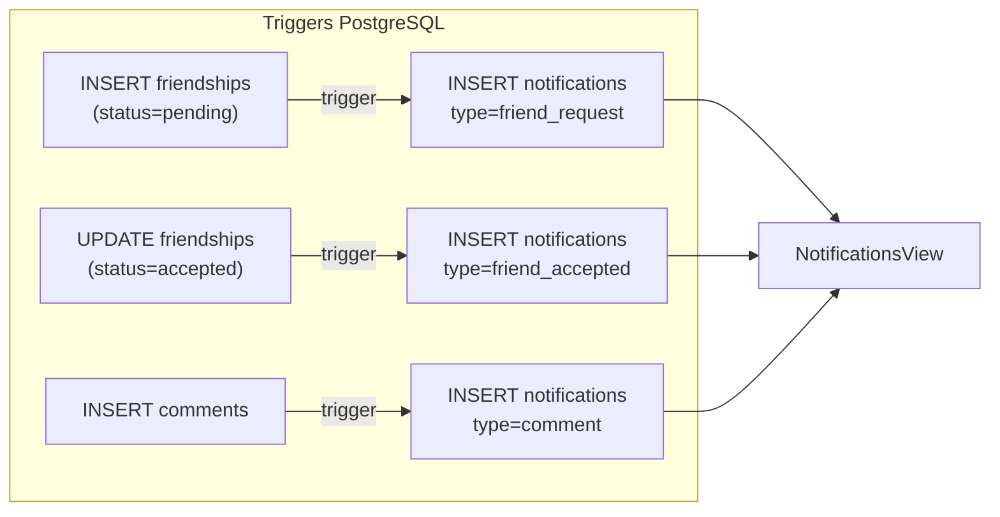

# Notificacoes Sociais: Follow Request + Comentario

## Contexto Atual

- Tabela `public.notifications` ja existe com schema completo (`type`, `title`, `body`, `data` jsonb, `read_at`) -- [migration](supabase/migrations/20260409173000_notifications_and_rejection_reasons.sql)
- **Nao ha triggers SQL** que criem notificacoes -- hoje so a Edge Function `admin-moderation` insere (via service role)
- **Nao ha policy INSERT** para `authenticated` na tabela -- inserções devem ser server-side (triggers `SECURITY DEFINER`)
- O [NotificationsView.jsx](src/components/views/NotificationsView.jsx) ja mapeia `friend_request` e `friend_accepted` para icones, mas **nao** tem `comment`
- Ha uma inconsistencia: a Edge Function insere `type: 'checkin_photo_rejected'` mas o mapa UI usa `photo_rejected`

## Decisao Arquitetural: Triggers vs Edge Functions

Triggers `SECURITY DEFINER` sao a melhor abordagem porque:
- Automaticos -- qualquer INSERT/UPDATE nas tabelas gera notificacao sem depender do frontend
- Mesma transacao -- consistencia garantida
- Padrao ja usado no projeto (ex: `apply_checkin_to_profile`, `on_checkin_rejected_revert_points`)



---

## Epic 1: Banco de Dados -- Triggers de Notificacao

**Arquivo a criar:** `supabase/migrations/20260412140000_social_notification_triggers.sql`

### 1a. Trigger: Solicitacao de amizade (friend_request)

Dispara `AFTER INSERT ON public.friendships` quando `status = 'pending'`:

```sql
CREATE FUNCTION public.notify_on_friend_request()
RETURNS trigger LANGUAGE plpgsql SECURITY DEFINER
SET search_path = public AS $$
DECLARE v_name text;
BEGIN
  IF NEW.status != 'pending' THEN RETURN NEW; END IF;

  SELECT COALESCE(p.display_name, p.nome, 'Alguém')
  INTO v_name FROM public.profiles p WHERE p.id = NEW.requester_id;

  INSERT INTO public.notifications (user_id, tenant_id, type, title, body, data)
  VALUES (
    NEW.addressee_id, NEW.tenant_id, 'friend_request',
    'Nova solicitação de amizade',
    v_name || ' quer te seguir.',
    jsonb_build_object('friendship_id', NEW.id, 'requester_id', NEW.requester_id)
  );
  RETURN NEW;
END; $$;
```

### 1b. Trigger: Amizade aceita (friend_accepted)

Dispara `AFTER UPDATE OF status ON public.friendships` quando muda para `accepted`:

```sql
CREATE FUNCTION public.notify_on_friend_accepted()
-- Notifica o requester_id quando o addressee aceita
-- Body: "{nome} aceitou sua solicitação."
-- data: { friendship_id, addressee_id }
```

### 1c. Trigger: Comentario em post (comment)

Dispara `AFTER INSERT ON public.comments`:
- Busca o `user_id` dono do check-in
- **Pula se comentarista == dono** (sem auto-notificacao)
- Busca nome do comentarista via `profiles`

```sql
CREATE FUNCTION public.notify_on_comment()
-- type: 'comment'
-- title: 'Novo comentário'
-- body: "{nome} comentou no seu treino."
-- data: { comment_id, checkin_id, commenter_id }
-- Guard: NEW.user_id != checkin_owner_id
```

---

## Epic 2: Frontend -- Atualizar NotificationsView

**Arquivo:** [src/components/views/NotificationsView.jsx](src/components/views/NotificationsView.jsx)

### 2a. Adicionar tipo `comment` ao mapeamento

```js
// Adicionar ao NOTIFICATION_ICONS:
comment: MessageCircle

// Adicionar ao NOTIFICATION_COLORS:
comment: 'text-purple-400 bg-purple-500/10'
```

### 2b. Corrigir mapeamento de `checkin_photo_rejected`

A Edge Function insere `type: 'checkin_photo_rejected'`, mas o mapa UI so tem `photo_rejected`. Adicionar alias:

```js
checkin_photo_rejected: ImageOff  // mesmo icone de photo_rejected
```

---

## Epic 3: Frontend -- Refresh apos acoes sociais

**Arquivo:** [src/hooks/useSocialData.js](src/hooks/useSocialData.js)

### 3a. Nenhuma alteracao necessaria no fluxo de dados

Os triggers criam notificacoes automaticamente no banco. O hook `useFitCloudData` ja:
- Faz polling a cada 15s (`refreshNotificationsRef.current()`)
- Escuta realtime em `checkins` (que tambem chama `refreshNotifications`)
- Faz refresh no focus/visibilitychange

O destinatario da notificacao vera a badge atualizar no proximo ciclo de polling (maximo 15s). Nao e necessario adicionar realtime na tabela `notifications` neste momento.
