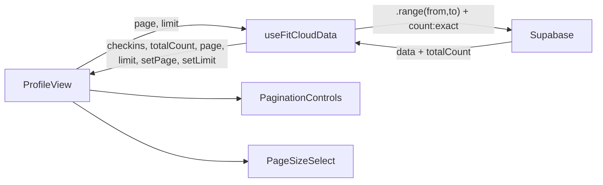

# Paginacao Server-Side para Check-ins

## Arquitetura

Como o app usa navegacao por `useState` (sem router), o estado de paginacao (`page`, `limit`) sera gerenciado via `useState` dentro do hook `useFitCloudData`. O hook expoe os valores e setters para o `ProfileView` consumir.



---

## Arquivo 1: [src/hooks/useFitCloudData.js](src/hooks/useFitCloudData.js)

### Mudancas em `refreshCheckins`

- Adicionar estados `checkinPage` (default `0`), `checkinLimit` (default `10`), `checkinCount` (default `0`), `checkinsLoading` (default `false`)
- Mudar a query para usar `{ count: 'exact' }` e `.range(from, to)`:

```js
const from = checkinPage * checkinLimit;
const to = from + checkinLimit - 1;

const { data, count, error } = await supabase
  .from('checkins')
  .select('id, checkin_local_date, ...', { count: 'exact' })
  .eq('user_id', userId)
  .order('checkin_local_date', { ascending: false })
  .order('created_at', { ascending: false })
  .range(from, to);
```

- Guardar `count` em `setCheckinCount(count ?? 0)`
- Envolver em `setCheckinsLoading(true/false)`
- Adicionar `checkinPage` e `checkinLimit` ao array de deps do `useCallback`
- Resetar `checkinPage` para `0` quando `checkinLimit` mudar (via `useEffect`)
- Resetar `checkinPage` para `0` apos `insertCheckin` e `retryCheckin` (antes do `refreshAll`)

### Mudancas no retorno do hook

Adicionar ao objeto retornado:

```js
return {
  // ...existentes...
  checkinPage,
  setCheckinPage,
  checkinLimit,
  setCheckinLimit,
  checkinCount,
  checkinsLoading,
};
```

### Impacto no card de stats

O `ProfileView` usa `checkins.filter(c => c.photo_review_status !== 'rejected').length` para o card "Treinos". Com paginacao, esse valor seria apenas da pagina atual. Solucao: usar `checkinCount` (total do banco) no card em vez de `checkins.length`. A contagem exata de treinos aprovados pode vir de `userData.pontos` ou simplesmente exibir o total (`checkinCount`) sem filtrar por status, ja que e uma metrica de "total de treinos registrados".

**Alternativa mais precisa:** adicionar uma segunda query leve no hook que busca apenas o `count` de check-ins nao-rejeitados:

```js
const { count: approvedCount } = await supabase
  .from('checkins')
  .select('id', { count: 'exact', head: true })
  .eq('user_id', userId)
  .neq('photo_review_status', 'rejected');
```

Expor como `checkinApprovedCount` no retorno do hook. Isso roda em paralelo com a query paginada (custo minimo).

---

## Arquivo 2: [src/App.jsx](src/App.jsx)

### Passar novas props ao ProfileView

Na renderizacao condicional `view === 'profile'` (linha 185), passar as props extras do hook:

```jsx
<ProfileView
  // ...existentes...
  checkinPage={cloud.checkinPage}
  checkinLimit={cloud.checkinLimit}
  checkinCount={cloud.checkinCount}
  checkinApprovedCount={cloud.checkinApprovedCount}
  checkinsLoading={cloud.checkinsLoading}
  onPageChange={cloud.setCheckinPage}
  onLimitChange={cloud.setCheckinLimit}
/>
```

Para o modo offline (`!useCloud`), manter o comportamento atual (sem paginacao, `checkins` completo).

---

## Arquivo 3: [src/components/views/ProfileView.jsx](src/components/views/ProfileView.jsx)

### Novas props

```js
export function ProfileView({
  // ...existentes...
  checkinPage = 0,
  checkinLimit = 10,
  checkinCount = 0,
  checkinApprovedCount,
  checkinsLoading = false,
  onPageChange,
  onLimitChange,
})
```

### Card "Treinos" -- usar contagem do servidor

Substituir `checkins.filter(...).length` por `checkinApprovedCount ?? checkins.length` para que o valor reflita o total real, nao apenas a pagina atual.

### Seletor de quantidade (acima da lista)

Renderizar entre o titulo "Historico de Treinos" e a lista. Componente inline simples com botoes pill:

```jsx
<div className="flex items-center gap-2">
  <span className="text-[11px] text-zinc-500">Exibir:</span>
  {[5, 10, 20, 50].map((n) => (
    <button
      key={n}
      onClick={() => onLimitChange?.(n)}
      className={`px-2.5 py-1 rounded-full text-[11px] font-bold transition-colors ${
        checkinLimit === n
          ? 'bg-green-500/10 text-green-500 border border-green-500/30'
          : 'text-zinc-500 hover:text-zinc-300'
      }`}
    >
      {n}
    </button>
  ))}
</div>
```

### Controles de paginacao (abaixo da lista)

Calcular `totalPages = Math.ceil(checkinCount / checkinLimit)`. Renderizar:

- Botao "Anterior" (desabilitado se `checkinPage === 0`)
- Numeros de pagina (1, 2, 3...) com destaque na pagina ativa, colapsando com `...` se muitas
- Botao "Proximo" (desabilitado se `checkinPage >= totalPages - 1`)
- Texto discreto "Pagina X de Y"

Estilo: botoes `rounded-lg` com `bg-zinc-800/50` e ativo `bg-green-500/10 text-green-500`.

### Estado de loading

Quando `checkinsLoading` for `true`, exibir um indicador sutil (ex: `opacity-50` na lista + spinner pequeno) em vez de remover o conteudo, para evitar layout shift.

---

## Nao criar novos arquivos de componente

Os controles de paginacao e o seletor sao suficientemente simples para ficar inline no `ProfileView`. Se ficarem extensos demais, podem ser extraidos futuramente, mas para esta iteracao o inline e preferivel (menos arquivos, menos props).

## Nao instalar dependencias

Tudo feito com Tailwind e React puro.
