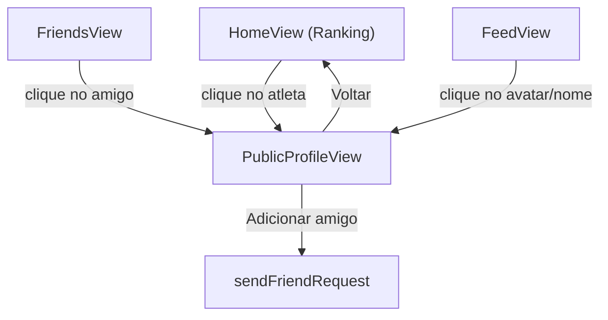

# Perfil Publico -- Plano de Implementacao

## Contexto Atual

- Navegacao por `useState('home')` com `setView(...)` em [src/App.jsx](src/App.jsx) -- sem React Router.
- [ProfileView.jsx](src/components/views/ProfileView.jsx) (~500 linhas) e acoplado ao usuario logado: admin panel, retry de check-in, notificacoes, sign-out, paginacao.
- RLS em `profiles`: ja permite `SELECT` de perfis do mesmo tenant (`profiles_select_same_tenant`).
- RLS em `checkins`: precisa verificar se permite leitura cross-user no mesmo tenant (provavelmente restrito a `user_id = auth.uid()`).
- Nao existe RPC dedicada para buscar dados publicos de um usuario especifico.

## Decisao Arquitetural

**Criar `PublicProfileView.jsx` separado** em vez de refatorar `ProfileView`. Motivo: a ProfileView atual tem logica densa de admin, retry, notificacoes e edicao que exigiria dezenas de condicionais `if(isOwn)` em cada secao. Um componente dedicado reaproveita o **design visual** (cards de stats, historico agrupado por data) sem poluir o componente original.

A busca de dados sera feita por uma **unica RPC** `get_user_public_profile(p_user_id)` com `SECURITY DEFINER` que valida internamente o tenant, retornando tudo em uma chamada.

---

## Fase 1: Banco de Dados e RLS

### 1.1 RPC `get_user_public_profile`

Criar uma RPC que retorna os dados publicos de um usuario do mesmo tenant em uma unica chamada.

**Arquivo**: `supabase/migrations/YYYYMMDD_rpc_user_public_profile.sql`

**Retorno**:
- `user_id uuid`
- `display_name text` (COALESCE com `nome`)
- `created_at timestamptz`
- `streak int`
- `pontos int`
- `is_pro boolean`
- `academia text`
- `approved_checkins_count bigint`
- `friendship_status text` (null, 'pending', 'accepted')
- `recent_checkins jsonb` (ultimos 20 check-ins aprovados: id, date, tipo_treino, points_awarded, foto_url)

**Logica interna** (SECURITY DEFINER, `SET search_path = public`):
- Validar que o usuario-alvo pertence ao mesmo tenant via `current_tenant_id()`
- Buscar dados de `profiles`
- Contar check-ins aprovados
- Buscar ultimos 20 check-ins aprovados (ordenados por data desc)
- Verificar status de amizade com `auth.uid()`

Nao precisamos alterar RLS de `checkins` porque a RPC usa `SECURITY DEFINER` (executa com permissoes do owner).

### 1.2 Nenhuma alteracao de RLS necessaria

- `profiles`: ja coberto por `profiles_select_same_tenant`
- `checkins`: a RPC SECURITY DEFINER contorna a restricao
- `friendships`: ja tem policies adequadas

---

## Fase 2: Navegacao e Estado

### 2.1 Novo estado em `App.jsx`

Adicionar em [src/App.jsx](src/App.jsx):

- `const [publicProfileUserId, setPublicProfileUserId] = useState(null);`
- Nova view string: `'public-profile'`
- Helper: `const openPublicProfile = (userId) => { setPublicProfileUserId(userId); setView('public-profile'); };`

### 2.2 Renderizacao condicional

No bloco de views condicionais do App.jsx, adicionar:

```jsx
{view === 'public-profile' && publicProfileUserId && (
  <PublicProfileView
    userId={publicProfileUserId}
    onBack={() => setView('home')}
    onOpenFriends={() => setView('friends')}
  />
)}
```

### 2.3 Passar callback para views existentes

- **HomeView**: receber `onOpenProfile(userId)` -- cada item do leaderboard fica clicavel (exceto o proprio usuario, que vai para `'profile'`)
- **FriendsView**: receber `onOpenProfile(userId)` -- cada amigo na lista fica clicavel
- **FeedPostCard / FeedView**: receber `onOpenProfile(userId)` -- clicar no nome/avatar do post abre o perfil

---

## Fase 3: Componentes UI

### 3.1 Criar `PublicProfileView.jsx`

**Arquivo**: `src/components/views/PublicProfileView.jsx`

**Props**: `userId`, `onBack`, `onOpenFriends`

**Estrutura interna**:
1. `useEffect` chama RPC `get_user_public_profile(userId)` ao montar
2. Estado: `profile`, `loading`, `error`
3. Secoes visuais (reaproveitando design da ProfileView):
   - Header: avatar + nome + "Desde {data}" + badge do tenant
   - Cards de stats (3 colunas): Streak, Pontos, Treinos aprovados
   - Botao de amizade: "Adicionar amigo" / "Solicitado" / "Amigos" (com base em `friendship_status`)
   - Historico de treinos (read-only): agrupado por data, sem retry, sem paginacao (ultimos 20)
   - Botao "Voltar"
4. **Nao inclui**: notificacoes, admin panel, PRO banner, sign-out, retry, paginacao

### 3.2 Tornar itens do Leaderboard clicaveis em `HomeView.jsx`

Em [src/components/views/HomeView.jsx](src/components/views/HomeView.jsx):
- Aceitar nova prop `onOpenProfile`
- Cada item do ranking recebe `onClick` que chama `onOpenProfile(u.uid)` (se nao for o proprio usuario)
- Adicionar `cursor-pointer` e hover visual nos itens

### 3.3 Tornar amigos clicaveis em `FriendsView.jsx`

Em [src/components/views/FriendsView.jsx](src/components/views/FriendsView.jsx):
- Aceitar nova prop `onOpenProfile`
- O componente `UserRow` recebe `onClick` opcional
- Na `FriendsTab`, cada amigo fica clicavel

### 3.4 Tornar header do post clicavel em `FeedPostCard.jsx`

Em [src/components/views/FeedPostCard.jsx](src/components/views/FeedPostCard.jsx):
- Aceitar nova prop `onOpenProfile`
- O avatar + nome no header do post ficam clicaveis
- O nome na legenda tambem fica clicavel

---

## Fluxo de Navegacao



---

## Ordem de Implementacao

1. **Fase 1.1**: Criar migration com RPC `get_user_public_profile` e aplicar no Supabase
2. **Fase 2.1-2.2**: Adicionar estado e renderizacao condicional no App.jsx
3. **Fase 3.1**: Criar PublicProfileView.jsx
4. **Fase 3.2**: Tornar leaderboard clicavel no HomeView
5. **Fase 3.3**: Tornar amigos clicaveis no FriendsView
6. **Fase 3.4**: Tornar posts clicaveis no FeedPostCard
