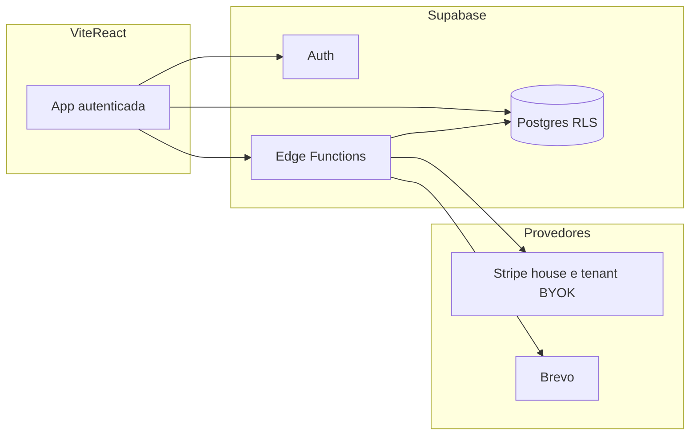

# Plano de implementação FitRank (SaaS)

## Contexto e premissas

- **PRD atual** ([docs/prd.md](c:\Users\fjoao\fitrank\docs\prd.md)): MVP com cadastro, ranking, check-in (1/dia, +10 pts), histórico, desafio mensal; monetização (Pix, PRO, streak recovery, boost, ligas em roadmap).
- **Código atual**: UI funcional com dados **apenas no browser** ([`src/lib/persist.js`](c:\Users\fjoao\fitrank\src\lib\persist.js)); não há migrations Supabase no repo ainda; stack alvo do projeto (regras do workspace) é **Vite/React + Supabase + Edge Functions**, com evolução natural para **TypeScript** alinhada ao guia em [`.cursor/rules/coding.mdc`](c:\Users\fjoao\fitrank\.cursor\rules\coding.mdc).
- **BYOK (interpretação para o plano)**: cada **tenant** (ex.: academia / organização) pode **cadastrar e usar suas próprias chaves de API** (Stripe para cobranças no contexto do tenant; Brevo opcional para envio “white-label”), enquanto a **assinatura do próprio FitRank** pelo tenant (SaaS fee) pode usar a conta Stripe **da plataforma** (house account). Se a intenção for outra variante de BYOK (ex.: só chaves Brevo, ou só Connect sem armazenar secret), a Fase 3 ajusta o desenho sem refazer as fases 1–2.

---

## Fase 1 — Fundação multi-tenant e dados (RLS)

**Objetivo:** modelo de dados e isolamento por tenant; autenticação; base para substituir `localStorage`.

### Epic 1.1 — Modelo de tenancy e perfis

| ID | User story |
|----|------------|
| US-1.1.1 | Como **arquiteto**, quero uma entidade `tenants` (slug, nome, status) para que todo dado de negócio seja escopado por `tenant_id`. |
| US-1.1.2 | Como **usuário**, quero me cadastrar (e-mail/senha) e ser associado a um tenant (convite, signup com código da academia, ou tenant default em dev). |
| US-1.1.3 | Como **admin master** (papel global), quero listar/ativar tenants sem violar RLS de outros tenants (via `service_role` apenas em Edge Functions ou claims específicas). |

### Epic 1.2 — Schema alinhado ao PRD + extensões SaaS

| ID | User story |
|----|------------|
| US-1.2.1 | Como **produto**, quero `profiles` (ou extensão de `auth.users`) com `tenant_id`, nome, academia, pontos, streak, flags `is_pro`, metadados de Stripe customer/subscription onde couber. |
| US-1.2.2 | Como **produto**, quero `checkins` com `user_id`, `tenant_id`, `data`, `tipo_treino`, `foto_url`, constraint **1 check-in por usuário por dia por esporte** (índice único parcial ou validação em Edge Function). |
| US-1.2.3 | Como **produto**, quero `desafios` e participação/ranking de desafio mensal escopados por `tenant_id`. |
| US-1.2.4 | Como **produto**, quero `pagamentos` (ou eventos de pagamento) ligados a `user_id`/`tenant_id` para rastrear tipo, valor, status. |

### Epic 1.3 — RLS como pilar crítico

| ID | User story |
|----|------------|
| US-1.3.1 | Como **segurança**, quero **RLS ativado** em todas as tabelas com políticas do tipo: leitura/escrita apenas se `tenant_id` da linha = `tenant_id` do usuário autenticado (obtido via JWT claim ou join em `profiles`). |
| US-1.3.2 | Como **segurança**, quero que **nenhuma política** dependa apenas de dados enviados pelo cliente sem validação server-side para writes sensíveis (ex.: pontos, `is_pro`). |
| US-1.3.3 | Como **dev**, quero funções SQL auxiliares (`current_tenant_id()`, etc.) e testes manuais/documentados de cenários “usuário A não lê dados do tenant B”. |

**Entregáveis:** pasta `supabase/migrations/`, políticas RLS versionadas, seeds mínimos; cliente Supabase no front apenas para queries permitidas pelas políticas.

---

## Fase 2 — MVP funcional na nuvem (substitui protótipo local)

**Objetivo:** espelhar o que o PRD chama de V1 usando o backend; reutilizar componentes existentes em [`src/components/`](c:\Users\fjoao\fitrank\src\components).

### Epic 2.1 — Auth e sessão no app

| ID | User story |
|----|------------|
| US-2.1.1 | Como **usuário**, quero login/logout e recuperação de sessão sem perder o contexto do tenant. |
| US-2.1.2 | Como **dev**, quero rotas ou guards no app (layout protegido) impedindo acesso ao ranking/check-in sem sessão válida. |

### Epic 2.2 — Ranking e check-in em tempo real

| ID | User story |
|----|------------|
| US-2.2.1 | Como **usuário**, quero ver ranking do **meu tenant** ordenado por pontos, atualizado via **Realtime** ou polling otimizado. |
| US-2.2.2 | Como **usuário**, quero fazer check-in com a mesma regra de negócio do PRD (+10, streak), persistido no Postgres; foto opcional via **Storage** com RLS por tenant/pasta. |

### Epic 2.3 — Histórico e desafio mensal

| ID | User story |
|----|------------|
| US-2.3.1 | Como **usuário**, quero histórico de check-ins e pontos acumulados. |
| US-2.3.2 | Como **usuário**, quero participar de um **desafio mensal** com ranking próprio dentro do tenant. |

**Entregáveis:** remoção gradual da dependência de [`persist.js`](c:\Users\fjoao\fitrank\src\lib\persist.js) para dados de produção (manter fallback opcional só para demo offline, se desejado).

---

## Fase 3 — Assinaturas Stripe e modelo BYOK

**Objetivo:** monetização SaaS (plataforma) + capacidade do tenant de operar com **próprias chaves** onde fizer sentido, sem vazar segredos no browser.

### Epic 3.1 — Stripe “house” (assinatura FitRank pelo tenant ou usuário PRO global)

| ID | User story |
|----|------------|
| US-3.1.1 | Como **negócio**, quero **Checkout Session** ou **Pricing Table** para plano PRO / taxa SaaS por tenant, criada via **Edge Function** com `service_role` e validação (zod). |
| US-3.1.2 | Como **sistema**, quero **webhook Stripe** (Edge Function dedicada) idempotente atualizando `subscriptions`, `is_pro` ou flags de tenant conforme produto definido. |
| US-3.1.3 | Como **usuário/tenant**, quero **Customer Portal** para gerenciar método de pagamento e cancelamento. |

### Epic 3.2 — BYOK: armazenamento e uso seguro das chaves do tenant

| ID | User story |
|----|------------|
| US-3.2.1 | Como **tenant admin**, quero cadastrar **Stripe secret key restrita** (ex.: restricted key) ou preferencialmente **Stripe Connect** (recomendado: menos superfície que guardar secret longa) — o plano de implementação deve **escolher uma estratégia primária** (Connect vs secret cifrada) na especificação técnica. |
| US-3.2.2 | Como **segurança**, quero segredos **cifrados em repouso** (pgsodium / Vault do Supabase ou KMS) e **somente descriptografados em Edge Functions**; nunca colunas plaintext de `sk_live_*` em logs. |
| US-3.2.3 | Como **ops**, quero rotação: substituir chave, invalidar cache, auditar `updated_at` e operador. |

### Epic 3.3 — Conciliação com PRD (Pix / microtransações)

| ID | User story |
|----|------------|
| US-3.3.1 | Como **produto**, quero definir se **Pix** entra via **Stripe Payment Methods BR**, link estático, ou gateway auxiliar; registrando resultado em `pagamentos`. |
| US-3.3.2 | Como **produto**, quero mapear **streak recovery**, **boost** e **ligas** para Price IDs / créditos internos em fases posteriores (V2), já prevendo tabelas e webhooks. |

**Entregáveis:** funções `stripe-webhook`, `create-checkout-session`, `tenant-billing-settings` (nomes exemplificativos), variáveis de ambiente no Supabase (secrets), documentação de fluxos e estados de assinatura.

---

## Fase 4 — Brevo e comunicação transacional

**Objetivo:** e-mails disparados só do backend; BYOK opcional para SMTP/API key do tenant.

### Epic 4.1 — E-mails da plataforma

| ID | User story |
|----|------------|
| US-4.1.1 | Como **usuário**, quero receber e-mail de boas-vindas e reset de senha (integração Auth + Brevo onde aplicável). |
| US-4.1.2 | Como **usuário**, quero notificações de desafio / lembrete de check-in (fila simples ou cron Edge + tabela `notification_queue`). |

### Epic 4.2 — BYOK Brevo (se necessário)

| ID | User story |
|----|------------|
| US-4.2.1 | Como **tenant admin**, quero configurar chave Brevo cifrada para envios com remetente da academia (mesmo padrão de cofre da Fase 3). |

**Entregáveis:** Edge Function `send-email` com template id + validação; segredos em env do Supabase; rate limit básico.

---

## Fase 5 — Hardening de segredos, observabilidade e conformidade mínima

**Objetivo:** fechar o pilar “gestão segura de chaves API” de ponta a ponta.

| ID | User story |
|----|------------|
| US-5.1 | Como **segurança**, quero **matriz de segredos**: o que fica em Netlify (só `anon`), o que fica em Supabase secrets, o que é BYOK por tenant. |
| US-5.2 | Como **segurança**, quero auditoria: quem alterou chaves (user id, IP se disponível, timestamp). |
| US-5.3 | Como **SRE**, quero alertas em falhas de webhook Stripe e fila de e-mail (logs estruturados + opcional integração futura). |

**Nota:** Evitar commit de tokens em arquivos versionados (ex.: configs MCP); usar variáveis locais/secret stores.

---

## Fase 6 — Preparação para lançamento

**Objetivo:** confiança para go-live: testes automatizados, pipeline Netlify, checklist operacional.

### Epic 6.1 — Testes E2E

| ID | User story |
|----|------------|
| US-6.1.1 | Como **QA**, quero suíte E2E (ex.: **Playwright**) cobrindo: signup/login, check-in feliz/caminho duplicado, isolamento básico entre dois tenants (dados não vazam na UI). |
| US-6.1.2 | Como **QA**, quero testes de contrato das Edge Functions críticas (webhook com payloads de teste / Stripe CLI em CI opcional). |

### Epic 6.2 — CI/CD (Netlify)

| ID | User story |
|----|------------|
| US-6.2.1 | Como **dev**, quero **build** Vite na Netlify com variáveis `VITE_SUPABASE_URL` e `VITE_SUPABASE_ANON_KEY` por ambiente (preview vs production). |
| US-6.2.2 | Como **dev**, quero **branch previews** e proteção de **main** com checagem de lint/typecheck/testes antes do merge (GitHub Actions ou Netlify plugin). |
| US-6.2.3 | Como **dev**, quero pipeline que rode **migrations** via Supabase (MCP ou CI com `supabase link` + `db push` / migrações revisadas), com gate manual em produção. |

### Epic 6.3 — Go-live

| ID | User story |
|----|------------|
| US-6.3.1 | Como **ops**, quero checklist: RLS smoke tests, rotação de chaves, domínio + HTTPS, CORS e redirect URLs do Auth alinhados à URL Netlify. |
| US-6.3.2 | Como **ops**, quero plano de rollback (migrations reversíveis ou feature flags) e monitoramento pós-deploy (erros de função, taxa 4xx/5xx). |
| US-6.3.3 | Como **produto**, quero métricas do PRD instrumentadas (DAU, retenção 7d streak, MRR) — eventos mínimos no client + agregações futuras. |

---

## Ordem sugerida e riscos

- **Ordem:** Fase 1 → 2 → 3 → 4 → 5 → 6. As fases 3 e 4 podem iniciar em paralelo após US-2.1.x estável (auth + tenant no JWT).
- **Maior risco técnico:** BYOK com **secret key** do Stripe exige criptografia e políticas impecáveis; **preferir Stripe Connect** reduz armazenamento de segredos de pagamento no seu banco.
- **Dívida atual:** app em **JSX** vs guia **TypeScript** — alocar um epic transversal “migração incremental para TS” nas fases 1–2 se quiser aderência estrita ao guia sem big-bang.

---

## Identificação

Este plano foi elaborado no modo de planejamento (sem alterações no repositório). Modelo: **Auto (agente roteador Cursor)**.
