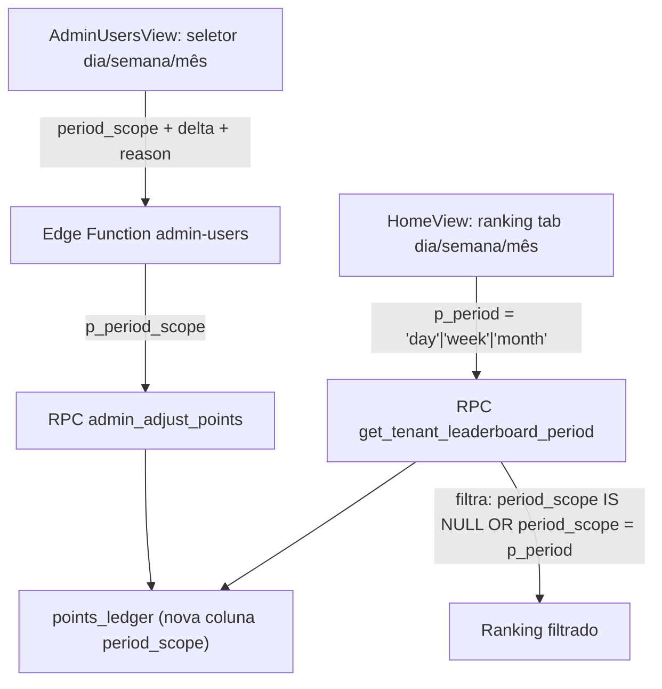

# Ajuste de Pontos por Período (dia/semana/mês)

## Contexto

Atualmente, ao ajustar pontos via admin, os pontos entram no `points_ledger` com uma `effective_date` e aparecem em **todos** os rankings cujo intervalo contenha aquela data (diário, semanal e mensal). O usuário quer que o admin selecione o período-alvo e os pontos apareçam **apenas** naquele ranking.

## Arquitetura da Solução



## 1. Nova migration SQL

Criar migration `supabase/migrations/YYYYMMDDHHMMSS_points_ledger_period_scope.sql`:

- **Adicionar coluna** `period_scope` em `points_ledger`:
  ```sql
  ALTER TABLE public.points_ledger
    ADD COLUMN period_scope text
    CHECK (period_scope IN ('day', 'week', 'month'));
  ```
  - Nullable: `NULL` = aparece em todos os períodos (backward compat para entradas antigas e check-ins)

- **Atualizar `admin_adjust_points`** para aceitar `p_period_scope text DEFAULT NULL` e gravar na coluna:
  - Baseado na versão atual em [`supabase/migrations/20260411100400_bump_desafio_date_range.sql`](supabase/migrations/20260411100400_bump_desafio_date_range.sql)
  - Adicionar parametro `p_period_scope text default null`
  - No INSERT: `period_scope = p_period_scope`

- **Atualizar `get_tenant_leaderboard_period`** para aceitar `p_period text DEFAULT NULL`:
  - Baseado na versão atual em [`supabase/migrations/20260409224000_leaderboard_period_include_points_ledger.sql`](supabase/migrations/20260409224000_leaderboard_period_include_points_ledger.sql)
  - DROP da assinatura antiga (2 params) e CREATE com 3 params (date, date, text DEFAULT NULL)
  - No LEFT JOIN do `points_ledger`, adicionar condição:
    ```sql
    AND (l.period_scope IS NULL OR l.period_scope = p_period)
    ```
  - Quando `p_period IS NULL`, incluir tudo (backward compat)

## 2. Edge Function `admin-users`

Em [`supabase/functions/admin-users/index.ts`](supabase/functions/admin-users/index.ts):

- Adicionar `period_scope` ao schema Zod `adjustPointsSchema`:
  ```typescript
  period_scope: z.enum(['day', 'week', 'month']).optional()
  ```
- Passar `p_period_scope: period_scope ?? null` na chamada ao RPC

## 3. Frontend — AdminUsersView

Em [`src/components/views/AdminUsersView.jsx`](src/components/views/AdminUsersView.jsx):

- Novo estado: `const [pointsPeriod, setPointsPeriod] = useState('month')`
- Reset em `loadDetail`: `setPointsPeriod('month')`
- Adicionar **toggle buttons** (Dia / Semana / Mês) no formulário de ajuste, entre o campo "Pontos" e "Motivo"
- Enviar `period_scope: pointsPeriod` no payload de `runAdminAction`
- A `effective_date` será calculada como hoje (cai naturalmente no dia/semana/mês atual)

## 4. Frontend — Leaderboard hook

Em [`src/hooks/useFitCloudData.js`](src/hooks/useFitCloudData.js):

- Na chamada `supabase.rpc('get_tenant_leaderboard_period', {...})`, adicionar `p_period: rankingPeriod`
- Isso garante que o ranking de cada aba filtre corretamente os pontos com `period_scope`

## Impacto e Backward Compatibility

- Entradas antigas no `points_ledger` com `period_scope = NULL` continuam aparecendo em todos os rankings (sem quebra)
- Pontos de check-in (vindos da tabela `checkins`) nao são afetados — continuam aparecendo em todos os períodos
- `profiles.pontos` (total global) continua sendo atualizado normalmente, independente do `period_scope`
