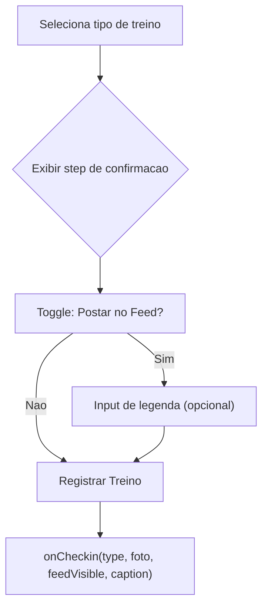

# Post no Feed com Legenda -- Plano de Implementacao

## Contexto Atual

- O check-in salva na tabela `checkins` com: `user_id`, `tenant_id`, `checkin_local_date`, `tipo_treino`, `foto_url`.
- O feed social (`get_friend_feed` RPC) exibe **todos** os check-ins aprovados do usuario e amigos -- nao existe conceito de "postar no feed" nem campo de legenda.
- O `CheckinModal` ([src/components/views/CheckinModal.jsx](src/components/views/CheckinModal.jsx)) coleta tipo de treino + foto e chama `onCheckin(type, foto)`.
- O `insertCheckin` em [src/hooks/useFitCloudData.js](src/hooks/useFitCloudData.js) faz upload da foto e insere na tabela.
- O `FeedPostCard` ([src/components/views/FeedPostCard.jsx](src/components/views/FeedPostCard.jsx)) exibe `display_name + workout_type` como legenda fixa.

## Decisao Arquitetural

Adicionar dois campos na tabela `checkins`:
- `feed_visible boolean NOT NULL DEFAULT true` -- controla se o check-in aparece no feed
- `feed_caption text DEFAULT NULL` -- legenda personalizada (max 200 chars)

Motivo: manter tudo na mesma tabela evita joins extras e o RPC `get_friend_feed` ja consulta `checkins` diretamente. A alternativa (tabela separada `feed_posts`) adicionaria complexidade desnecessaria neste estagio.

---

## Epic 1: Banco de Dados

### US 1.1: Migration -- novos campos em `checkins`

Arquivo: `supabase/migrations/YYYYMMDD_checkins_feed_caption.sql`

```sql
ALTER TABLE public.checkins
  ADD COLUMN feed_visible boolean NOT NULL DEFAULT true,
  ADD COLUMN feed_caption text DEFAULT NULL
    CONSTRAINT checkins_caption_length CHECK (feed_caption IS NULL OR char_length(trim(feed_caption)) <= 200);
```

- `feed_visible = true` por default para nao quebrar check-ins existentes (todos continuam visiveis).
- Constraint de 200 chars na legenda.

### US 1.2: Atualizar RPC `get_friend_feed`

Arquivo: `supabase/migrations/YYYYMMDD_feed_rpc_caption.sql`

`CREATE OR REPLACE` da funcao `get_friend_feed` com:
- Adicionar `feed_caption text` ao `returns table`
- Adicionar filtro `AND c.feed_visible = true` no `WHERE`
- Retornar `c.feed_caption`

---

## Epic 2: Fluxo de Check-in (Frontend)

### US 2.1: Tela intermediaria pos-tipo no `CheckinModal`

Apos o usuario selecionar o tipo de treino, **antes de chamar `onCheckin`**, exibir um step de confirmacao com:

- Toggle "Postar no Feed" (ligado por default)
- Se ligado: campo de texto para legenda (placeholder: "Escreva uma legenda...", max 200 chars, opcional)
- Botao "Registrar Treino"

Fluxo visual:



Mudancas em [src/components/views/CheckinModal.jsx](src/components/views/CheckinModal.jsx):
- Novo estado: `step` ('select-type' | 'confirm'), `selectedType`, `feedVisible`, `caption`
- `handleType` agora so avanca para step 'confirm'
- Novo `handleConfirm` que chama `onCheckin(selectedType, foto, feedVisible, caption)`

### US 2.2: Propagar campos no `handleCheckin` e `insertCheckin`

Mudancas em [src/App.jsx](src/App.jsx):
- `handleCheckin` recebe 4 args: `(workoutType, fotoFile, feedVisible, caption)`
- Passa para `cloud.insertCheckin(workoutType, fotoFile, feedVisible, caption)`

Mudancas em [src/hooks/useFitCloudData.js](src/hooks/useFitCloudData.js):
- `insertCheckin` aceita `feedVisible = true` e `caption = null` como parametros
- Inclui `feed_visible: feedVisible` e `feed_caption: caption?.trim() || null` no insert

---

## Epic 3: Feed Social (Exibicao)

### US 3.1: Mapear `feed_caption` no `useSocialData`

Mudanca em [src/hooks/useSocialData.js](src/hooks/useSocialData.js):
- No mapeamento de `loadFeed`, adicionar `caption: r.feed_caption ?? null`

### US 3.2: Exibir legenda no `FeedPostCard`

Mudanca em [src/components/views/FeedPostCard.jsx](src/components/views/FeedPostCard.jsx):
- Substituir a linha fixa `<span className="font-semibold">{post.display_name}</span> {post.workout_type}` por:
  - Se `post.caption` existir: `<span className="font-semibold">{post.display_name}</span> {post.caption}`
  - Senao: manter o comportamento atual (display_name + workout_type)

---

## Ordem de Implementacao Recomendada

1. **US 1.1** -- Migration dos campos (banco)
2. **US 1.2** -- Atualizar RPC (banco)
3. **US 2.1** -- Tela de confirmacao no CheckinModal (frontend)
4. **US 2.2** -- Propagar campos no insertCheckin (frontend)
5. **US 3.1** -- Mapear caption no hook social (frontend)
6. **US 3.2** -- Exibir legenda no FeedPostCard (frontend)

Cada step e independente e testavel. Os steps 1-2 podem ser aplicados sem quebrar nada (defaults preservam comportamento atual). Os steps 3-6 do frontend ativam a feature progressivamente.
