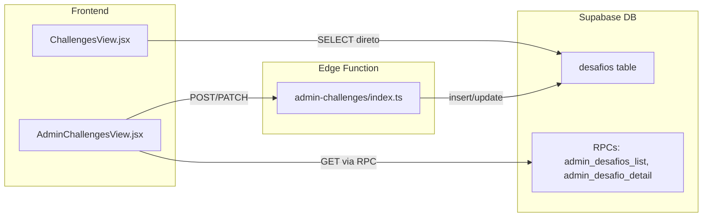

# Configuracao de Premiacao nos Desafios

## Arquitetura Atual

O fluxo de desafios envolve 4 camadas:



---

## Epic 1: Migration SQL -- Novas Colunas

**Arquivo**: nova migration `supabase/migrations/YYYYMMDDHHMMSS_desafios_reward_config.sql`

Adicionar duas colunas a tabela `desafios`:

```sql
ALTER TABLE public.desafios
  ADD COLUMN IF NOT EXISTS reward_winners_count integer NOT NULL DEFAULT 3,
  ADD COLUMN IF NOT EXISTS reward_distribution_type text NOT NULL DEFAULT 'equal';

ALTER TABLE public.desafios
  ADD CONSTRAINT desafios_reward_distribution_check
  CHECK (reward_distribution_type IN ('equal', 'weighted'));

ALTER TABLE public.desafios
  ADD CONSTRAINT desafios_reward_winners_check
  CHECK (reward_winners_count >= 1 AND reward_winners_count <= 50);
```

Nao e necessario alterar RLS (as policies existentes ja cobrem SELECT/INSERT/UPDATE com `select('*')`).

As RPCs `admin_desafios_list` e `admin_desafio_detail` em [20260411100500_desafios_admin_rpcs.sql](supabase/migrations/20260411100500_desafios_admin_rpcs.sql) retornam `d.*` ou campos explicitos. Verificar se retornam `SELECT *` (nesse caso as colunas novas vem automaticamente) ou se precisam de atualizacao.

---

## Epic 2: Edge Function -- Aceitar Novos Campos

**Arquivo**: [supabase/functions/admin-challenges/index.ts](supabase/functions/admin-challenges/index.ts)

Atualizar 3 schemas Zod e a logica de insert/update:

- **`createSchema`** (linha 64): adicionar:
  - `reward_winners_count: z.number().int().min(1).max(50).default(3)`
  - `reward_distribution_type: z.enum(['equal', 'weighted']).default('equal')`

- **`updateSchema`** (linha 75): adicionar os mesmos campos como `.optional()`

- **Insert** (linha 245-261): adicionar `reward_winners_count` e `reward_distribution_type` ao objeto de insert

- **Update fields** (linha 433-442): adicionar mapeamento:
  ```typescript
  if (upd.reward_winners_count !== undefined) fields.reward_winners_count = upd.reward_winners_count;
  if (upd.reward_distribution_type !== undefined) fields.reward_distribution_type = upd.reward_distribution_type;
  ```

---

## Epic 3: Admin UI -- Campos de Premiacao

**Arquivo**: [src/components/views/AdminChallengesView.jsx](src/components/views/AdminChallengesView.jsx)

Adicionar ao `formData` e ao formulario:

- **Estado inicial** (linha ~80): adicionar `reward_winners_count: 3` e `reward_distribution_type: 'equal'` ao `formData`

- **Formulario** (apos campo `max_participantes`): adicionar secao "Premiacao" com:
  - Input type number para "Qtd. de Premiados" (min=1, max=50)
  - Select/toggle para "Tipo de Divisao" com opcoes "Divisao Igual" e "Media Ponderada"

- **handleSave** (POST/PATCH): incluir os dois novos campos no body enviado a Edge Function

- **handleEdit** (ao carregar desafio para edicao): preencher formData com `reward_winners_count` e `reward_distribution_type` do desafio carregado

---

## Epic 4: User UI -- Exibir Info de Premiacao

**Arquivo**: [src/components/views/ChallengesView.jsx](src/components/views/ChallengesView.jsx)

- **Query SELECT** (linha ~52): adicionar `reward_winners_count, reward_distribution_type` a lista de campos no select

- **Card do desafio**: adicionar badge visual abaixo das informacoes existentes:
  ```
  [Trophy icon] Top 3 dividem o premio (Divisao Igual)
  ```
  Com icone `Trophy` do lucide-react, usando cores douradas (`text-yellow-500`) para destaque

- **Logica de label**: mapear `reward_distribution_type`:
  - `'equal'` -> "Divisao Igual"
  - `'weighted'` -> "Media Ponderada"

---

## Epic 5: Aplicar Migration no Supabase

Executar a migration via MCP `execute_sql` no projeto `pjlmemvwqhmpchiiqtol`.

Verificar se as RPCs `admin_desafios_list` e `admin_desafio_detail` precisam de atualizacao (se usam `SELECT *` ou campos explicitos). Se explicitos, atualizar para incluir os novos campos.

---

## Regras de Negocio

- **Media Ponderada (`weighted`)**: distribuicao padrao onde o 1o lugar recebe proporcionalmente mais. Exemplo com 3 premiados: 1o = 50%, 2o = 30%, 3o = 20%. Esta logica sera usada futuramente no encerramento do desafio.
- **Divisao Igual (`equal`)**: premio dividido igualmente entre os N primeiros.
- **Permissoes**: Apenas `is_platform_master` pode definir/alterar (ja garantido pela Edge Function, linha 159).
- Os novos campos sao editaveis em desafios com status `rascunho` ou `ativo` (mesma regra dos demais campos).
