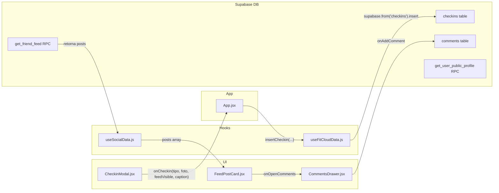

# Privacidade por Postagem (Check-in)

## Arquitetura Atual do Fluxo



---

## Epic 1: Migration SQL -- Novas Colunas + Bloqueio de Comentarios

**Arquivo**: nova migration `supabase/migrations/YYYYMMDDHHMMSS_checkins_privacy_settings.sql`

### 1.1 Adicionar colunas na tabela `checkins`

```sql
ALTER TABLE public.checkins
  ADD COLUMN IF NOT EXISTS allow_comments boolean NOT NULL DEFAULT true,
  ADD COLUMN IF NOT EXISTS hide_likes_count boolean NOT NULL DEFAULT false;
```

### 1.2 Atualizar RLS da tabela `comments` para bloquear insercao

A policy atual de insert (`comments_insert`) em [20260412160000_fix_likes_comments_rls_and_like_notify.sql](supabase/migrations/20260412160000_fix_likes_comments_rls_and_like_notify.sql) verifica se o check-in e aprovado. Basta adicionar a condicao `AND c.allow_comments = true` na subquery EXISTS:

```sql
DROP POLICY IF EXISTS comments_insert ON public.comments;

CREATE POLICY comments_insert ON public.comments
  FOR INSERT TO authenticated
  WITH CHECK (
    user_id = auth.uid()
    AND tenant_id = public.current_tenant_id()
    AND EXISTS (
      SELECT 1 FROM public.checkins c
      WHERE c.id = comments.checkin_id
        AND c.tenant_id = public.current_tenant_id()
        AND c.photo_review_status = 'approved'
        AND c.allow_comments = true
    )
  );
```

### 1.3 Atualizar RPC `get_friend_feed`

A RPC em [20260412110100_feed_rpc_caption.sql](supabase/migrations/20260412110100_feed_rpc_caption.sql) retorna campos explicitos (RETURNS TABLE). Precisa:

- Adicionar `allow_comments boolean` e `hide_likes_count boolean` ao RETURNS TABLE
- Adicionar `c.allow_comments` e `c.hide_likes_count` ao SELECT

### 1.4 Atualizar RPC `get_user_public_profile`

A RPC em [20260412150000_public_profile_rich_checkins.sql](supabase/migrations/20260412150000_public_profile_rich_checkins.sql) retorna `recent_checkins` via `row_to_json(sub)`. Basta adicionar `c.allow_comments` e `c.hide_likes_count` ao subSELECT interno (linhas 49-60), e eles aparecerao automaticamente no JSON.

---

## Epic 2: Frontend -- Toggles no CheckinModal

**Arquivos**:
- [src/components/views/CheckinModal.jsx](src/components/views/CheckinModal.jsx)
- [src/hooks/useFitCloudData.js](src/hooks/useFitCloudData.js)
- [src/App.jsx](src/App.jsx)

### 2.1 CheckinModal.jsx

Adicionar dois novos estados:
- `allowComments` (default `true`)
- `hideLikesCount` (default `false`)

Dentro do bloco `{feedVisible && (...)}` (linhas 203-218), apos o campo de legenda e antes do botao "Registrar Treino", adicionar uma secao "Configuracoes Avancadas" com dois toggles estilizados (mesmo padrao visual do toggle "Postar no Feed"):

- **Toggle 1**: "Permitir comentarios" -- icone `MessageCircle`, controla `allowComments`
- **Toggle 2**: "Ocultar curtidas" -- icone `EyeOff`, controla `hideLikesCount`

Atualizar `handleConfirm` (linha 75) para passar os novos campos:
```
onCheckin(selectedType, foto, feedVisible, trimmed, allowComments, hideLikesCount)
```

Resetar os estados em `handleBack` e `handleClose`.

### 2.2 App.jsx

Atualizar `handleCheckin` (linha 97) para aceitar e repassar os dois novos parametros:

```javascript
const handleCheckin = async (workoutType, fotoFile, feedVisible, feedCaption, allowComments, hideLikesCount) => {
  await cloud.insertCheckin(workoutType, fotoFile, feedVisible, feedCaption, allowComments, hideLikesCount);
```

### 2.3 useFitCloudData.js -- insertCheckin

Atualizar a assinatura da funcao `insertCheckin` (linha 295) para aceitar `allowComments = true` e `hideLikesCount = false`.

Adicionar os campos ao objeto de insert (linhas 327-335):
```javascript
const { error: insErr } = await supabase.from('checkins').insert({
  user_id: userId,
  tenant_id: tenantId,
  checkin_local_date: today,
  tipo_treino: tipoTreino,
  foto_url,
  feed_visible: feedVisible,
  feed_caption: feedCaption?.trim() || null,
  allow_comments: allowComments,
  hide_likes_count: hideLikesCount
});
```

---

## Epic 3: Frontend -- Exibicao Condicional

**Arquivos**:
- [src/components/views/FeedPostCard.jsx](src/components/views/FeedPostCard.jsx)
- [src/components/views/CommentsDrawer.jsx](src/components/views/CommentsDrawer.jsx)

### 3.1 FeedPostCard.jsx

O componente recebe `post` como prop. As novas colunas `allow_comments` e `hide_likes_count` virao automaticamente nos dados do feed.

Adicionar nova prop `currentUserId` para distinguir dono do post vs. visitante.

**Likes count** (linhas 99-104): se `post.hide_likes_count === true` E `currentUserId !== post.user_id`, nao renderizar o `<p>` com contagem de curtidas. O dono do post sempre ve suas proprias curtidas.

**Botao de comentar** (linhas 81-83): se `post.allow_comments === false`, desabilitar visualmente o botao `MessageCircle` (opacidade reduzida, sem onClick).

**Link "Ver comentarios"** (linhas 117-125): se `post.allow_comments === false`, ocultar o link "Ver todos os N comentarios".

### 3.2 CommentsDrawer.jsx

Adicionar nova prop `allowComments` (boolean).

Se `allowComments === false`:
- Ocultar o `<div>` do input de comentario (linhas 129-147)
- Exibir no lugar uma mensagem: "Os comentarios estao desativados para esta publicacao." com estilo `text-zinc-500 text-sm text-center py-4`
- Os comentarios existentes (se houver) continuam visiveis, apenas o input e removido

### 3.3 Passagem de props

Verificar em [src/App.jsx](src/App.jsx) e [src/components/views/PublicProfileView.jsx](src/components/views/PublicProfileView.jsx) onde `FeedPostCard` e `CommentsDrawer` sao usados, para garantir que `currentUserId` e `allowComments` sejam passados corretamente.

---

## Epic 4: Aplicar Migration no Supabase

Executar a migration via MCP `apply_migration` no projeto `pjlmemvwqhmpchiiqtol`, incluindo:
- ALTER TABLE (colunas)
- DROP + CREATE POLICY (comments_insert)
- DROP + CREATE FUNCTION (get_friend_feed com novos campos)
- CREATE OR REPLACE FUNCTION (get_user_public_profile com novos campos)

Verificar com queries de teste que:
- Colunas existem com defaults corretos
- RLS bloqueia comentario em post com `allow_comments = false`
- RPCs retornam os novos campos
