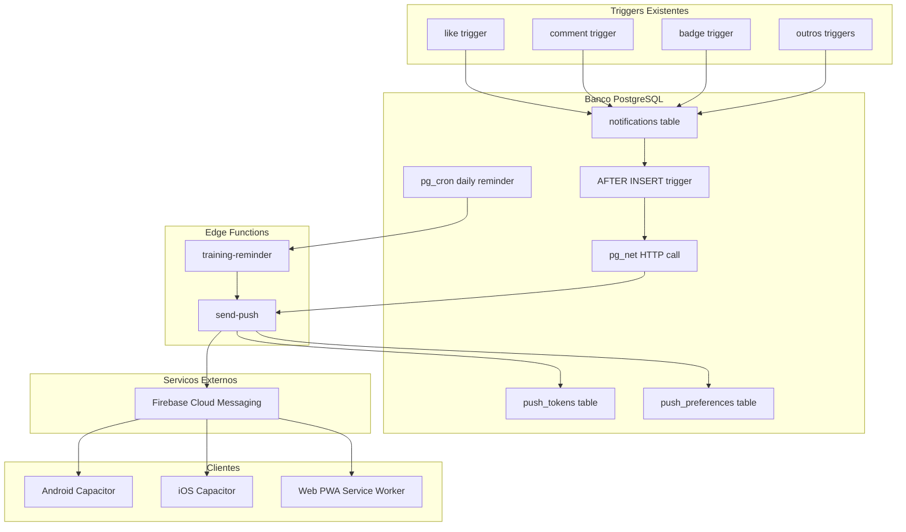

# Push Notifications -- Plano de Implementacao

## Contexto Atual

- **Notificacoes in-app**: tabela `public.notifications` com ~10 tipos (like, comment, friend_request, badge_unlocked, league_promoted, etc.), criadas por triggers PL/pgSQL e Edge Functions
- **Polling 15s**: `useFitCloudData.js` faz polling a cada 15s para notificacoes nao lidas; sem realtime direto na tabela `notifications`
- **Capacitor**: Core 8.3.x instalado, pasta `android/` existe, pasta `ios/` nao existe, **nenhum plugin** alem de core/android/ios/cli
- **PWA**: `vite-plugin-pwa` com Workbox, service worker registrado em producao, sem Web Push API
- **Firebase**: nenhum projeto FCM configurado
- **Cron**: nenhum job agendado no Supabase
- **Perfil**: tabela `profiles` sem coluna de push token

## Decisoes Arquiteturais

- **FCM como hub unificado**: Firebase Cloud Messaging para Android nativo + Web Push. iOS via APNs (intermediado pelo FCM)
- **Edge Function centralizada**: uma unica `send-push` Edge Function que recebe `user_id` + `title` + `body` + `data`, busca tokens do usuario e despacha via FCM HTTP v1 API
- **Trigger no banco**: um trigger `AFTER INSERT ON notifications` chama `pg_net` (HTTP extension do Supabase) para invocar a Edge Function automaticamente -- zero mudanca nos fluxos existentes
- **Cron via Supabase**: `pg_cron` extension para agendar lembrete diario de treino
- **Preferencias granulares**: o usuario controla quais tipos de push recebe e horarios de silencio

---

## Epic 1 -- Infraestrutura de Push (Schema + Firebase)

**Objetivo**: Criar as tabelas de tokens e preferencias, e documentar o setup do projeto Firebase.

### US 1.1 -- Tabela `push_tokens`

Migration SQL criando `public.push_tokens`:
- `id` uuid PK
- `user_id` uuid FK -> auth.users ON DELETE CASCADE
- `tenant_id` uuid FK -> tenants
- `token` text NOT NULL UNIQUE
- `platform` text NOT NULL CHECK (platform IN ('android', 'ios', 'web'))
- `device_info` jsonb (user agent, modelo, OS version)
- `created_at` timestamptz
- `updated_at` timestamptz

RLS: usuario so ve/edita seus proprios tokens. Indice em `(user_id)`.

### US 1.2 -- Tabela `push_preferences`

Migration SQL criando `public.push_preferences`:
- `user_id` uuid PK FK -> auth.users ON DELETE CASCADE
- `enabled` boolean DEFAULT true (master switch)
- `training_reminder` boolean DEFAULT true
- `reminder_time` time DEFAULT '08:00' (horario do lembrete)
- `quiet_start` time NULL (inicio do modo silencioso)
- `quiet_end` time NULL (fim do modo silencioso)
- `social` boolean DEFAULT true (likes, comments, mentions)
- `friends` boolean DEFAULT true (requests, accepts)
- `achievements` boolean DEFAULT true (badges, leagues, streaks)
- `admin` boolean DEFAULT true (moderacao, mensagens admin)
- `updated_at` timestamptz

RLS: usuario so ve/edita sua propria linha. Upsert on conflict.

### US 1.3 -- Guia de Setup Firebase

Criar `docs/firebase-setup.md` com passo a passo:
- Criar projeto Firebase Console
- Habilitar Cloud Messaging
- Gerar `google-services.json` (Android) e `GoogleService-Info.plist` (iOS)
- Gerar chave de conta de servico (JSON) para a Edge Function
- Gerar par VAPID keys para Web Push
- Salvar secrets no Supabase: `FIREBASE_SERVICE_ACCOUNT_JSON`, `VAPID_PUBLIC_KEY`, `VAPID_PRIVATE_KEY`

**Arquivos**: nova migration SQL, `docs/firebase-setup.md`

---

## Epic 2 -- Push Nativo Android + iOS (Capacitor) ⏸️ SUSPENSA

> **Motivo**: Requer conta de desenvolvedor Apple (Apple Developer Program). Retomar quando disponível.

**Objetivo**: Registrar tokens de push nos dispositivos nativos e salva-los no banco.

### US 2.1 -- Instalar e Configurar @capacitor/push-notifications

- `pnpm add @capacitor/push-notifications`
- Editar [capacitor.config.json](capacitor.config.json) para adicionar config do plugin (se necessario)
- Colocar `google-services.json` em `android/app/`
- Gerar projeto iOS: `npx cap add ios`, colocar `GoogleService-Info.plist`
- `npx cap sync`

### US 2.2 -- Hook `usePushNotifications.js`

Criar `src/hooks/usePushNotifications.js`:
- Detectar plataforma (Capacitor nativo vs web)
- No nativo: `PushNotifications.requestPermissions()` + `PushNotifications.register()`
- Listener `registration`: salvar token via `upsertPushToken(token, platform)`
- Listener `pushNotificationReceived` (app em foreground): mostrar toast in-app
- Listener `pushNotificationActionPerformed` (tap na notif): navegar para a tela relevante usando `navigate()` do `useNavigationStack`
- Cleanup dos listeners no unmount

### US 2.3 -- Funcao `upsertPushToken`

Em `useFitCloudData.js` ou utilitario dedicado:
- Upsert em `push_tokens` com `ON CONFLICT (token) DO UPDATE SET updated_at = now()`
- Ao fazer logout: deletar o token do dispositivo atual
- Ao fazer login: re-registrar

### US 2.4 -- Configuracao Nativa Android

Editar `android/app/build.gradle`:
- Adicionar `google-services` plugin
- Verificar `minSdkVersion` >= 21

Editar `android/app/src/main/AndroidManifest.xml`:
- Permissao POST_NOTIFICATIONS (Android 13+)
- Default notification channel

### US 2.5 -- Configuracao Nativa iOS

- `npx cap add ios` (criar projeto)
- Habilitar Push Notifications capability no Xcode
- Habilitar Background Modes > Remote Notifications
- Configurar APNs key no Firebase Console

**Arquivos**: `src/hooks/usePushNotifications.js`, `capacitor.config.json`, `android/` configs, `ios/` novo

---

## Epic 3 -- Web Push (PWA / Service Worker)

**Objetivo**: Push notifications no browser para usuarios que usam a PWA sem instalar o app nativo.

### US 3.1 -- Registro de Web Push Token

Criar `src/lib/web-push-register.js`:
- Verificar `'PushManager' in window`
- Pedir permissao: `Notification.requestPermission()`
- Obter subscription: `registration.pushManager.subscribe({ userVisibleOnly: true, applicationServerKey: VAPID_PUBLIC_KEY })`
- Converter subscription para string (endpoint + keys) e salvar como token na tabela `push_tokens` com `platform = 'web'`

### US 3.2 -- Service Worker Push Handler

Editar o service worker (via `workbox` injectManifest ou custom SW):
- Listener `push` event: extrair payload, exibir `self.registration.showNotification(title, options)`
- Listener `notificationclick`: abrir/focar a janela do app na URL correta (`clients.openWindow`)
- Badge count: `navigator.setAppBadge(count)` quando suportado

### US 3.3 -- Integrar no Hook Unificado

Estender `usePushNotifications.js`:
- Se `Capacitor.isNativePlatform()` === false e `'PushManager' in window`: usar web push flow
- Mesma interface: `requestPermission()`, `getToken()`, `upsertPushToken()`
- Unificacao: o hook decide automaticamente qual caminho usar

**Arquivos**: `src/lib/web-push-register.js`, service worker custom ou config Workbox, `src/hooks/usePushNotifications.js`

---

## Epic 4 -- Backend de Despacho (Edge Function + Trigger)

**Objetivo**: Quando uma notificacao in-app e criada, enviar push automaticamente.

### US 4.1 -- Edge Function `send-push`

Criar `supabase/functions/send-push/index.ts`:
- Recebe `{ user_id, title, body, data, type }` via POST
- Busca tokens do usuario em `push_tokens`
- Busca preferencias em `push_preferences`
- Verifica: `enabled === true`, tipo permitido (mapear `type` para categoria de preferencia), fora do horario silencioso
- Dispara para FCM HTTP v1 API (`https://fcm.googleapis.com/v1/projects/{project}/messages:send`) com auth via service account JWT
- Para cada token: payload com `notification.title`, `notification.body`, `data` (para deep link)
- Tratar tokens invalidos: remover da tabela `push_tokens` quando FCM retorna `UNREGISTERED`
- Nao falhar silenciosamente: logar erros

### US 4.2 -- Trigger `notify_push_on_insert`

Migration SQL:
- Habilitar extensao `pg_net` (se nao habilitada): `CREATE EXTENSION IF NOT EXISTS pg_net`
- Criar funcao `notify_push_on_insert()` SECURITY DEFINER que:
  - Extrai `NEW.user_id`, `NEW.type`, `NEW.title`, `NEW.body`, `NEW.data`
  - Chama `net.http_post()` para a URL da Edge Function `send-push` com o payload
  - Usa `service_role` key no header Authorization
- Trigger: `AFTER INSERT ON notifications FOR EACH ROW EXECUTE FUNCTION notify_push_on_insert()`

Isso faz com que **todas as notificacoes existentes** (likes, comments, badges, league, streak, moderation, etc.) gerem push automaticamente, sem alterar nenhum trigger existente.

### US 4.3 -- Mapeamento tipo -> categoria de preferencia

Na Edge Function, mapear:
- `like`, `comment`, `mention`, `share` -> `social`
- `friend_request`, `friend_accepted` -> `friends`
- `badge_unlocked`, `league_promoted`, `streak_recovered`, `boost_purchased` -> `achievements`
- `admin_message`, `checkin_photo_rejected` -> `admin`

**Arquivos**: `supabase/functions/send-push/index.ts`, nova migration SQL

---

## Epic 5 -- Lembretes Diarios de Treino (Cron)

**Objetivo**: Feature de retencao mais critica -- lembrar o usuario de treinar se ele ainda nao fez check-in hoje.

### US 5.1 -- Edge Function `training-reminder`

Criar `supabase/functions/training-reminder/index.ts`:
- Invocada via cron (nao precisa de JWT do usuario)
- Autentica com `service_role`
- Query: buscar usuarios que:
  - Tem `push_preferences.training_reminder = true`
  - Tem pelo menos 1 token em `push_tokens`
  - `profiles.last_checkin_date < CURRENT_DATE` (nao treinou hoje)
  - Horario atual esta proximo do `push_preferences.reminder_time` (+-30min window)
- Para cada usuario elegivel: chamar internamente a logica de `send-push` (ou inserir em `notifications` com type `training_reminder` e deixar o trigger despachar)
- Mensagens variadas baseadas no streak:
  - Streak > 0: "Nao perca seu streak de {streak} dias! Hora de treinar"
  - Streak = 0: "Bora comecar uma nova sequencia? Registre seu treino hoje"
  - Streak > 7: "Voce esta on fire com {streak} dias! Mantenha o ritmo"

### US 5.2 -- Cron Job via pg_cron

Migration SQL:
- `CREATE EXTENSION IF NOT EXISTS pg_cron`
- `SELECT cron.schedule('training-reminder', '*/30 * * * *', ...)` -- a cada 30 minutos
- O job chama `net.http_post()` para a Edge Function `training-reminder`
- A funcao filtra usuarios cujo `reminder_time` cai na janela atual

### US 5.3 -- Tipo de notificacao `training_reminder`

- Adicionar ao `NotificationsView.jsx` o icone e texto para `training_reminder`
- Icone: `Dumbbell` (ja importado no HomeView)
- Ao tocar: navegar para `checkin-modal`

**Arquivos**: `supabase/functions/training-reminder/index.ts`, migration SQL, `NotificationsView.jsx`

---

## Epic 6 -- UI de Preferencias + Integracao no App

**Objetivo**: Permitir que o usuario controle suas preferencias de push e integrar o hook no fluxo do app.

### US 6.1 -- Componente `PushPreferencesView.jsx` ✅ completed

Criado `src/components/views/PushPreferencesView.jsx`:
- Switch master "Notificacoes Push" (on/off)
- Secao "Lembretes": toggle + seletor de horario (time picker)
- Secao "Social": toggle para likes/comments/mencoes
- Secao "Amigos": toggle para solicitacoes/aceitacoes
- Secao "Conquistas": toggle para badges/ligas/streaks
- Secao "Administracao": toggle para moderacao
- Horario silencioso: dois time pickers (inicio/fim) ou desativado
- Salvar via upsert em `push_preferences`
- Acessivel a partir do `ProfileView` (botao de sino ao lado de "Editar perfil")

### US 6.2 -- Integrar `usePushNotifications` no App.jsx ✅ completed

- Hook `usePushNotifications` integrado no `App.jsx` apos autenticacao
- Dialog `PushPermissionPrompt` com delay de 8s apos login para UX amigavel
- Texto explicando o valor: "Receba lembretes para treinar e nao perca seu streak!"
- Respeita recusa via `localStorage` (cooldown de 7 dias via `dismissPrompt`)
- No logout: remove token do dispositivo (via cleanup no hook)

### US 6.3 -- Navegacao ao Tocar na Push ✅ completed

- Service Worker (`push-sw.js`) mapeia `data.type` para views corretas:
  - `like`, `comment`, `mention` -> `/feed`
  - `friend_request` -> `/friends`
  - `badge_unlocked` -> `/profile`
  - `training_reminder` -> `/checkin-modal`
- Hook `usePushNotifications` escuta `PUSH_NOTIFICATION_CLICK` do SW e usa `navigate()`
- `NotificationsView` suporta click em `training_reminder` e friend-related notifications

### US 6.4 -- Badge Count ✅ completed

- `navigator.setAppBadge(count)` chamado via `useEffect` no App.jsx quando `cloud.notifications.length` muda
- `navigator.clearAppBadge()` chamado quando count volta a zero
- Capacitor nativo (setBadgeCount) sera adicionado na Epic 2 quando Firebase estiver configurado

**Arquivos**: `src/components/views/PushPreferencesView.jsx`, `src/hooks/usePushNotifications.js`, `src/App.jsx`, `NotificationsView.jsx`

---

## Ordem de Implementacao

1. **Epic 1** (Schema + Firebase) -- fundacao, sem risco, pre-requisito para tudo
2. **Epic 4** (Backend dispatch) -- a peca mais critica; uma vez pronta, qualquer token registrado ja recebe push
3. **Epic 2** (Android + iOS nativo) -- registro de tokens nos dispositivos
4. **Epic 3** (Web Push) -- ampliar para usuarios da PWA
5. **Epic 5** (Lembretes diarios) -- a feature de retencao mais impactante
6. **Epic 6** (UI preferencias + integracao) -- polish e controle do usuario
