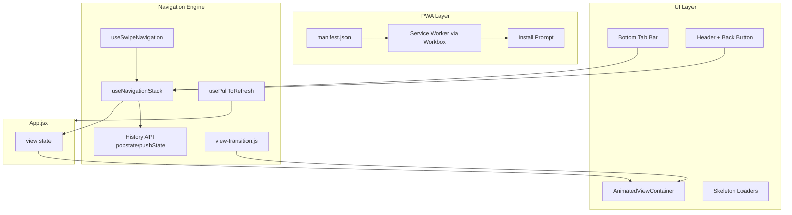

# PWA + Navegacao Fluida para FitRank

## Contexto Atual

- **Sem PWA**: nenhum `manifest.json`, service worker, ou meta tags PWA em [`index.html`](index.html)
- **Navegacao por estado**: [`App.jsx`](src/App.jsx) usa `useState('home')` com `setView(...)` -- sem URL routing, sem transicoes entre telas
- **Capacitor presente**: [`capacitor.config.json`](capacitor.config.json) com `webDir: "dist"` -- cobre canal nativo mas ignora web
- **Animacoes basicas**: [`index.css`](src/styles/index.css) tem apenas `fade-in`, `slide-up`, `toast-in`
- **Vite minimo**: [`vite.config.js`](vite.config.js) so tem `@vitejs/plugin-react`
- **5 tabs na bottom bar**: Home, Feed, (+) Check-in, Desafios, Perfil
- **~18 telas** + drawers/modais/overlays

---

## Epic 1 -- Fundacao PWA (Manifest + Meta + Icones)

**Objetivo**: Tornar o app instalavel via browser em Android e iOS.

### US 1.1 -- Web App Manifest

Criar `public/manifest.json`:
- `name`: "FitRank", `short_name`: "FitRank"
- `start_url`: "/", `display`: "standalone", `orientation`: "portrait"
- `theme_color`: "#000000", `background_color`: "#000000"
- Array `icons` com 192x192 e 512x512 (PNG, maskable)
- `categories`: ["fitness", "health"]

### US 1.2 -- Meta Tags PWA no index.html

Editar [`index.html`](index.html):
- `<link rel="manifest" href="/manifest.json">`
- `<meta name="theme-color" content="#000000">`
- `<meta name="description" content="...">`
- `<meta name="apple-mobile-web-app-capable" content="yes">`
- `<meta name="apple-mobile-web-app-status-bar-style" content="black-translucent">`
- `<link rel="apple-touch-icon" href="/icons/icon-192.png">`
- Favicon real (substituir `data:,`)

### US 1.3 -- Gerar Icones do App

Criar `public/icons/` com:
- `icon-192.png` (192x192)
- `icon-512.png` (512x512)
- `icon-maskable-192.png` (maskable, safe zone)
- `icon-maskable-512.png` (maskable)
- `apple-touch-icon.png` (180x180)

**Arquivos**: `public/manifest.json`, `index.html`, `public/icons/*`

---

## Epic 2 -- Service Worker + Offline (vite-plugin-pwa)

**Objetivo**: Cache inteligente, funcionamento offline basico, prompt de instalacao.

### US 2.1 -- Instalar e Configurar vite-plugin-pwa

- Instalar `vite-plugin-pwa` via `pnpm add -D vite-plugin-pwa`
- Editar [`vite.config.js`](vite.config.js) para adicionar `VitePWA({...})`
- Estrategia: `generateSW` (Workbox auto)
- `registerType: 'autoUpdate'` para atualizar silenciosamente
- Runtime caching rules:
  - App shell (HTML/JS/CSS): **CacheFirst**
  - API Supabase (`pjlmemvwqhmpchiiqtol.supabase.co`): **NetworkFirst** com fallback
  - Imagens/avatares (Storage Supabase): **CacheFirst** com expiracao 7 dias
  - Edge Functions: **NetworkOnly**

### US 2.2 -- Registrar Service Worker

Criar `src/lib/register-sw.js`:
- Usar `registerSW` exportado pelo plugin
- Callback `onOfflineReady` para toast "App pronto para uso offline"
- Callback `onNeedRefresh` para toast "Nova versao disponivel" com botao "Atualizar"
- Integrar no [`src/main.jsx`](src/main.jsx)

### US 2.3 -- Fallback Offline Graceful

- Criar pagina offline minimal (`public/offline.html` ou componente React)
- Quando sem rede e sem cache: exibir tela amigavel com logo + "Sem conexao"
- Manter dados locais via `persist.js` existente como complemento

### US 2.4 -- Prompt de Instalacao (A2HS)

Criar `src/components/ui/InstallPrompt.jsx`:
- Capturar evento `beforeinstallprompt`
- Exibir banner fixo no topo: "Instale o FitRank" com botao
- Para iOS (sem evento nativo): detectar Safari + exibir instrucoes "Compartilhar > Adicionar a Tela Inicio"
- Persistir dismissal em `localStorage` (nao mostrar por 7 dias apos fechar)

**Arquivos**: `vite.config.js`, `src/lib/register-sw.js`, `src/main.jsx`, `src/components/ui/InstallPrompt.jsx`

---

## Epic 3 -- Sistema de Navegacao com Transicoes Animadas

**Objetivo**: Transicoes fluidas entre telas, como um app nativo. Swipe horizontal entre tabs, scroll vertical natural.

### US 3.1 -- View Transition Engine

Criar `src/lib/view-transition.js`:
- Wrapper sobre a `document.startViewTransition` API (Chrome 111+)
- Fallback CSS para Safari/Firefox: aplicar classes de animacao manualmente
- Funcao `navigateWithTransition(setView, newView, direction)`:
  - `direction`: `'forward'` (slide-left), `'back'` (slide-right), `'up'` (slide-up para modais), `'fade'`
  - Determinar direcao automaticamente com base no indice da tab

### US 3.2 -- Layout com AnimatedViewContainer

Criar `src/components/ui/AnimatedViewContainer.jsx`:
- Wraps a area de conteudo principal entre o header e a bottom bar
- Recebe `currentView` e `direction`
- Aplica animacao CSS de entrada/saida:
  - Tabs laterais (Home/Feed/Desafios): **slide horizontal** (300ms ease-out)
  - Sub-telas (Perfil > Editar): **slide da direita** (push)
  - Modais/Drawers: manter **slide-up** existente
  - Notificacoes/Admin: **fade** rapido
- Usa `key={currentView}` + CSS transitions/animations

### US 3.3 -- Integrar no App.jsx

Refatorar [`App.jsx`](src/App.jsx):
- Substituir o bloco condicional `{view === 'home' && ...}` por `<AnimatedViewContainer>`
- Mapa de views com metadata:
  ```
  const VIEW_META = {
    home: { index: 0, group: 'tab' },
    feed: { index: 1, group: 'tab' },
    challenges: { index: 2, group: 'tab' },
    profile: { index: 3, group: 'tab' },
    'edit-profile': { parent: 'profile', group: 'sub' },
    'public-profile': { parent: 'feed', group: 'sub' },
    notifications: { group: 'overlay' },
    ...
  }
  ```
- Calcular `direction` automaticamente:
  - Tab com index maior = `'forward'`, menor = `'back'`
  - Sub-tela = `'forward'`, voltar = `'back'`
  - Overlay = `'up'`

### US 3.4 -- Swipe Horizontal entre Tabs

Criar `src/hooks/useSwipeNavigation.js`:
- Detectar gestos de swipe horizontal via `touchstart`/`touchmove`/`touchend`
- Threshold: 50px minimo, velocidade minima
- Cancelar se scroll vertical dominante (angulo > 30 graus)
- Tabs navegaveis: `['home', 'feed', 'challenges', 'profile']`
- Swipe direita (dedo pra direita) = tab anterior; esquerda = tab seguinte
- Feedback visual durante o arrasto (translateX parcial)
- Ignorar swipe em areas de scroll horizontal (stories ring, hashtags carousel)

### US 3.5 -- Scroll Vertical com Pull-to-Refresh

- Adicionar `overscroll-behavior: contain` no body (prevenir bounce do browser)
- Criar `src/hooks/usePullToRefresh.js`:
  - Detectar pull-down no topo da pagina
  - Exibir indicador de loading (spinner verde)
  - Chamar `refreshAll()` / `loadFeed()` conforme a tela ativa
  - Threshold: 80px de pull
- Integrar nas telas Home, Feed, Desafios, Perfil

### US 3.6 -- Animacoes CSS de Transicao

Editar [`src/styles/index.css`](src/styles/index.css) com novos keyframes:
- `slide-in-right` / `slide-out-left` (forward navigation)
- `slide-in-left` / `slide-out-right` (back navigation)
- `slide-in-up` / `slide-out-down` (modal enter/exit)
- `scale-fade-in` / `scale-fade-out` (overlay)
- Duracao: 250-300ms, `ease-out` / `cubic-bezier(0.32, 0.72, 0, 1)` (iOS-like)

**Arquivos**: `src/lib/view-transition.js`, `src/components/ui/AnimatedViewContainer.jsx`, `src/hooks/useSwipeNavigation.js`, `src/hooks/usePullToRefresh.js`, `src/App.jsx`, `src/styles/index.css`

---

## Epic 4 -- Botao Voltar + Historico de Navegacao

**Objetivo**: Navegacao com stack de historico (botao voltar do Android/browser funciona corretamente).

### US 4.1 -- Stack de Navegacao

Criar `src/hooks/useNavigationStack.js`:
- Manter um array `history` de views visitadas
- `navigate(view)`: push na stack + setView
- `goBack()`: pop da stack + setView com direction `'back'`
- Tabs sempre resetam a stack (nao acumulam)
- Sub-telas (edit-profile, public-profile) acumulam na stack

### US 4.2 -- Integrar com History API do Browser

- `pushState` / `popstate` para que o botao voltar do browser/Android funcione
- URL path simples: `/`, `/feed`, `/challenges`, `/profile`, `/profile/edit`, `/user/:id`
- Ao receber `popstate`: chamar `goBack()` do hook
- Ao abrir URL direta: parsear path e setar view inicial
- Deep links funcionam (compartilhar URL de perfil publico, hashtag, etc.)

### US 4.3 -- Botao Voltar Visual

- Adicionar seta de voltar no header para sub-telas (edit-profile, public-profile, admin-*, notifications, hashtag-feed)
- Ao clicar: `goBack()` com transicao `'back'`
- Tabs principais: sem seta (bottom bar basta)

**Arquivos**: `src/hooks/useNavigationStack.js`, `src/App.jsx`

---

## Epic 5 -- Polish e Otimizacao Mobile

**Objetivo**: Detalhes que fazem o app parecer nativo.

### US 5.1 -- Safe Areas e Notch

Editar CSS/HTML:
- `viewport-fit=cover` na meta viewport
- `env(safe-area-inset-top)` no header
- `env(safe-area-inset-bottom)` na bottom bar
- Testar com iPhone (notch) e Android (gesture bar)

### US 5.2 -- Prevencao de Comportamentos Web

- `touch-action: manipulation` no body (remover delay 300ms de tap)
- `-webkit-tap-highlight-color: transparent`
- `user-select: none` em areas interativas (mas permitir em texto/inputs)
- `overscroll-behavior: none` na bottom bar
- Prevenir zoom indesejado: `maximum-scale=1` na meta viewport (cuidado com acessibilidade)

### US 5.3 -- Skeleton Loading nas Telas

- Criar `src/components/ui/Skeleton.jsx` (retangulos animados pulse)
- Substituir "Carregando..." por skeletons em:
  - HomeView (ranking list)
  - FeedView (feed cards)
  - ProfileView (stats + checkins)

### US 5.4 -- Splash Screen PWA

- Gerar splash screens para iOS via meta tags `apple-touch-startup-image`
- Android: automatico via manifest (background_color + icon)
- Tela de loading inicial estilizada no `index.html` (antes do React montar)

**Arquivos**: `index.html`, `src/styles/index.css`, `src/components/ui/Skeleton.jsx`, varias views

---

## Diagrama de Arquitetura



---

## Ordem de Implementacao Recomendada

1. **Epic 1** (Manifest + Meta) -- base, sem risco, testavel imediatamente
2. **Epic 2** (Service Worker) -- depende do Epic 1
3. **Epic 3** (Navegacao + Transicoes) -- maior impacto visual, independente dos Epics 1-2
4. **Epic 4** (Historico + Back) -- complementa Epic 3
5. **Epic 5** (Polish) -- refinamentos finais
