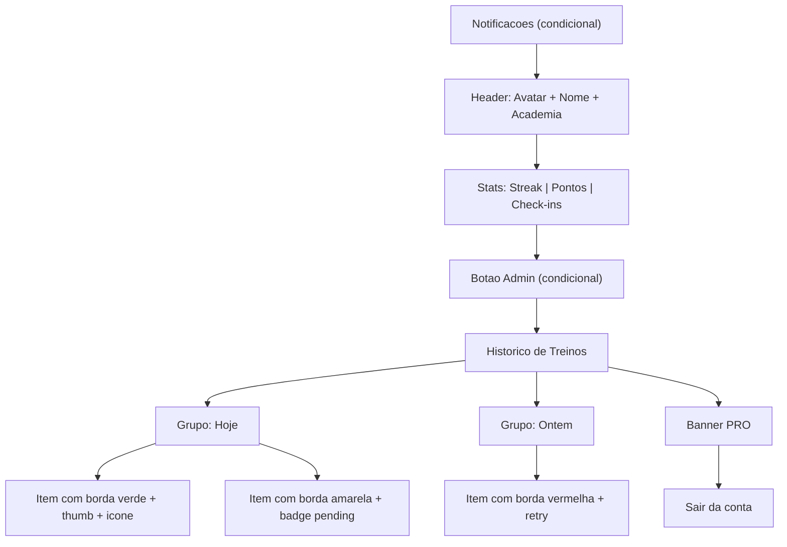

# Redesign Completo da ProfileView

## Arquivo principal: [src/components/views/ProfileView.jsx](src/components/views/ProfileView.jsx)

Toda a refatoracao acontece neste unico arquivo. Nenhuma prop nova e necessaria no `App.jsx`.

---

## 1. Header do Perfil -- visual mais imersivo

**Atual:** Avatar centralizado + nome + "Desde..." empilhados, sem fundo.

**Novo:**
- Fundo com gradiente sutil `bg-gradient-to-b from-green-500/5 to-transparent` envolvendo avatar + nome
- Avatar mantido (24x24), mas com ring de borda `ring-2 ring-green-500/30` em vez do border grosso
- Nome e data em layout mais compacto; slug da academia como badge pill discreto

---

## 2. Cards de Estatisticas -- adicionar 3a metrica

**Atual:** Grid 2 colunas (Streak + Pontos).

**Novo:**
- Grid 3 colunas: **Streak** | **Pontos** | **Check-ins** (total de treinos aprovados)
- O count de check-ins e derivado do array `checkins` filtrado por `photo_review_status !== 'rejected'`
- Cards mais compactos com `py-4` em vez de `py-6`
- Numeros com `tabular-nums` para alinhamento

---

## 3. Historico de Treinos -- redesign principal

### 3a. Agrupamento por data

Criar helper `groupCheckinsByDate(checkins)` que retorna um `Map<string, checkin[]>` agrupando por `checkin_local_date`. Renderizar com headers de grupo:

```jsx
<div className="text-xs font-bold uppercase text-zinc-500 tracking-wide px-1 pt-2">
  Hoje  // ou "Ontem", "8 abr", etc.
</div>
```

Helper `formatDateLabel(dateStr)`:
- Hoje -> "Hoje"
- Ontem -> "Ontem"
- Mesmo ano -> "10 abr"
- Outro ano -> "10 abr 2025"

### 3b. Borda lateral colorida por status

Cada item de check-in recebe borda esquerda de 3px:
- `border-l-green-500` -- aprovado
- `border-l-yellow-500` -- pendente
- `border-l-red-500` -- rejeitado

Layout do item: `border-l-[3px] rounded-xl` combinado com `bg-zinc-900/50`.

### 3c. Thumbnail melhorado com overlay de status

- Tamanho aumentado para `w-12 h-12` (48px), `rounded-xl`
- Quando ha foto: imagem com `object-cover`
- Quando nao ha foto: icone do tipo de treino (ver 3e)
- Overlay de status no canto inferior-direito do thumbnail:
  - Approved: circulo verde com `Check` icon (8px)
  - Pending: circulo amarelo com `Clock` icon (8px)
  - Rejected: circulo vermelho com `X` icon (8px)

### 3d. Datas amigaveis

Substituir `toLocaleDateString('pt-BR')` pelo helper `formatDateLabel()` descrito em 3a. A data do grupo ja serve como contexto, entao dentro do item nao precisa repetir a data completa.

### 3e. Icones por tipo de treino

Mapear `tipo_treino` para icones lucide. Quando nao ha foto, o thumbnail mostra o icone do tipo. Mapa sugerido (usando icones ja disponiveis no lucide-react):

- Musculacao -> `Dumbbell`
- Crossfit -> `Zap`
- Funcional -> `Activity`
- Cardio -> `Heart` (ou `HeartPulse`)
- Corrida -> `Footprints`
- Outro -> `Flame`
- Fallback -> `CheckCircle2`

Importar os icones necessarios: `Dumbbell, Activity, HeartPulse, Footprints, Clock`.

### 3f. Pontos com estilo diferenciado por status

- **Aprovado:** `+10 PTS` em verde com fundo `bg-green-500/10`, fonte bold
- **Pendente:** `+10 PTS` em amarelo com fundo `bg-yellow-500/10`, com icone de relogio pequeno
- **Rejeitado:** `0 PTS` em zinc-500, texto riscado (`line-through`), mais discreto

### 3g. Check-in rejeitado -- area de retry mais limpa

- Motivo da rejeicao em linha unica compacta (em vez de empilhar multiplas `<p>`)
- Botao "Reenviar foto" com destaque maior: pill `bg-orange-500/10 border border-orange-500/30 px-3 py-1.5 rounded-full` em vez de texto solto
- Manter logica existente de `retryFileRef` / `retryTargetRef` intacta

---

## 4. Banner PRO -- visual mais atrativo

- Adicionar gradiente diagonal `bg-gradient-to-br from-yellow-500/5 via-transparent to-yellow-500/5`
- Icone Crown com leve `drop-shadow` dourado
- Botao "Ver Beneficios" com `variant="secondary"` em vez de outline

---

## 5. Botao Sair -- manter no final

Sem alteracao significativa, apenas garantir espaco (`mt-2`) entre o PRO banner e o botao.

---

## Resumo visual da nova hierarquia



## Nao alterar

- Props recebidas pelo componente (nenhuma nova necessaria)
- Logica de retry (`handleRetryFile`, refs)
- Drawer do admin
- Fetch de `photo_rejection_reasons`
