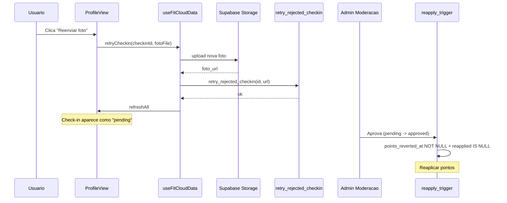

# Reenvio de foto apos rejeicao de check-in

## Contexto

Quando um check-in e rejeitado, os pontos sao revertidos e o usuario nao tem como tentar novamente. O indice unico `checkins_one_user_day_sport` impede novo INSERT para o mesmo dia/tipo, entao a solucao e fazer UPDATE no check-in existente com nova foto e status resetado.

## Problema com o trigger de reaprovacao

O trigger `on_checkin_reapproved_reapply_points` so dispara quando `old.photo_review_status = 'rejected'`. Apos o retry, o status vai para `'pending'`. Quando o admin aprovar (`pending -> approved`), o trigger NAO dispara e os pontos nao sao reaplicados.

**Solucao:** Ajustar a condicao do trigger para verificar `points_reverted_at IS NOT NULL AND points_reapplied_at IS NULL` em vez de exigir `old = 'rejected'`.

## Arquitetura



## 1. Migration SQL

Nova migration `supabase/migrations/20260411100900_retry_rejected_checkin.sql`:

### RPC `retry_rejected_checkin`

```sql
create or replace function public.retry_rejected_checkin(
  p_checkin_id uuid,
  p_new_foto_url text
)
returns void
language plpgsql
security definer
set search_path = public
as $$
declare
  v_checkin record;
begin
  select * into v_checkin from public.checkins
  where id = p_checkin_id for update;

  if v_checkin is null then
    raise exception 'Check-in nao encontrado';
  end if;
  if v_checkin.user_id != auth.uid() then
    raise exception 'Sem permissao';
  end if;
  if v_checkin.photo_review_status != 'rejected' then
    raise exception 'Apenas check-ins rejeitados podem ser reenviados';
  end if;
  if p_new_foto_url is null or length(trim(p_new_foto_url)) = 0 then
    raise exception 'URL da nova foto obrigatoria';
  end if;

  update public.checkins set
    foto_url = p_new_foto_url,
    photo_review_status = 'pending',
    photo_reviewed_at = null,
    photo_reviewed_by = null,
    photo_rejection_reason_code = null,
    photo_rejection_note = null,
    photo_is_suspected = false,
    points_reapplied_at = null,
    points_reapplied_by = null,
    points_reapplied_amount = null
  where id = p_checkin_id;

  insert into public.checkin_moderation_audit (...) values (...);
end;
$$;
```

- `points_reverted_at/by/amount` sao **mantidos** (necessarios para o trigger de reaprovacao saber que pontos precisam ser reaplicados)
- `points_reapplied_at/by/amount` sao **limpos** (permite novo ciclo de reaprovacao)

### RLS: nao e necessaria policy UPDATE

A RPC usa `SECURITY DEFINER` e valida `auth.uid()` internamente. O usuario nunca faz UPDATE direto na tabela.

### Ajuste em `on_checkin_reapproved_reapply_points`

Trocar a condicao `old.photo_review_status is distinct from 'rejected'` por `old.photo_review_status is not distinct from 'approved'`:

```sql
-- ANTES:
if old.photo_review_status is distinct from 'rejected' then return new; end if;

-- DEPOIS:
if old.photo_review_status is not distinct from 'approved' then return new; end if;
```

Isso faz o trigger disparar em:
- `rejected -> approved` (caso existente, admin aprova direto)
- `pending -> approved` (caso novo, apos retry do usuario)
- **NAO** dispara em `approved -> approved` (no-op)

As guards `points_reverted_at IS NULL` e `points_reapplied_at IS NOT NULL` ja existentes garantem idempotencia.

## 2. Frontend - Hook

Em [`src/hooks/useFitCloudData.js`](src/hooks/useFitCloudData.js), adicionar `retryCheckin`:

- Recebe `(checkinId, fotoFile)`
- Upload para `checkin-photos` (mesma logica de `insertCheckin`)
- Chama `supabase.rpc('retry_rejected_checkin', { p_checkin_id, p_new_foto_url })`
- Chama `refreshAll()` no sucesso
- Exporta a funcao no return

## 3. Frontend - ProfileView

Em [`src/components/views/ProfileView.jsx`](src/components/views/ProfileView.jsx):

- Receber prop `onRetryCheckin` (callback do hook)
- No bloco de check-ins rejeitados (apos "Foto rejeitada" + motivo), adicionar botao "Reenviar foto"
- Ao clicar, abrir input de arquivo (hidden `<input type="file">`)
- Ao selecionar foto, chamar `onRetryCheckin(checkinId, file)`
- Mostrar loading durante o upload e toast de sucesso/erro

## 4. App.jsx

Passar `retryCheckin` do hook `cloud` como prop para `ProfileView` via `onRetryCheckin`.
