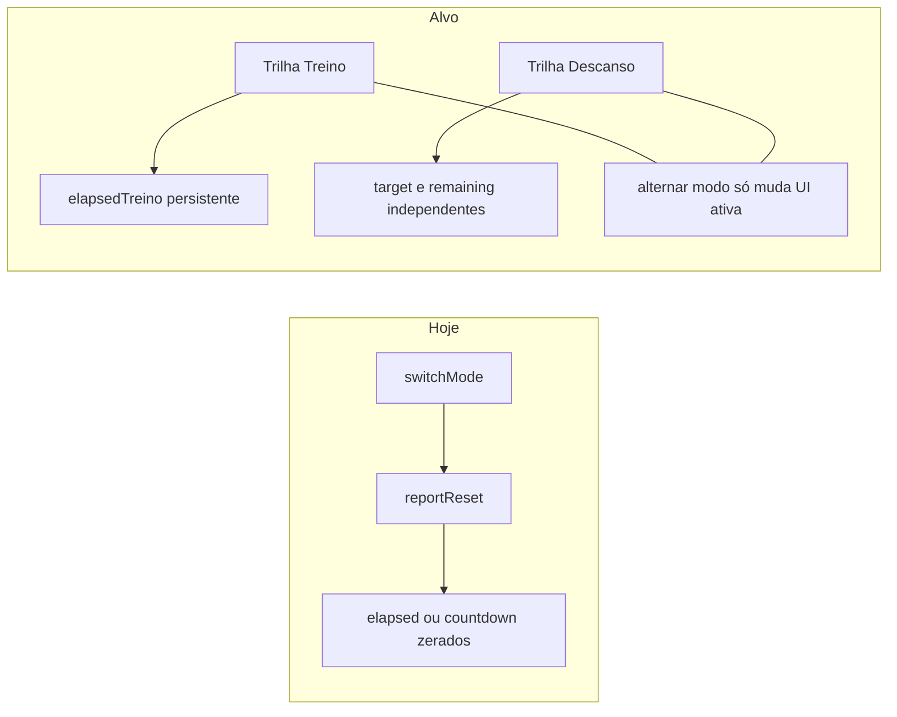

# Plano: Timer de treino + descanso (UX, modelo de estado e a11y)

## Contexto e problema atual

- Shell principal: [`src/App.jsx`](src/App.jsx) — rota `timer` renderiza `WorkoutTimerView` com [`useWorkoutTimer`](src/hooks/useWorkoutTimer.js); `MiniTimer` usa o mesmo hook quando `running`.
- Tela: [`src/components/views/WorkoutTimerView.jsx`](src/components/views/WorkoutTimerView.jsx).
- **Causa raiz do “zerar ao trocar”:** a função `switchMode` (aprox. linhas 183–197) ao mudar para `stopwatch` faz `setElapsed(0)` e `baseElapsedRef.current = 0`; ao mudar para `countdown` reposiciona o countdown. Ou seja, a troca de aba **foi implementada como reset de sessão**, não como alternância entre dois timers.
- O hook [`useWorkoutTimer.js`](src/hooks/useWorkoutTimer.js) guarda um único `baseElapsed` + `startedAt` + `running` e reutiliza o mesmo campo para lógica de cronômetro e de countdown (`reportStart(countdownRemaining, countdownTarget)`), o que **acopla** os dois modos e dificulta preservar o treino enquanto o descanso roda ou está pausado.

## Princípios de produto (UX)

1. **Duas trilhas mentais:** “Tempo de treino” (soma da sessão) e “Descanso” (timer regressivo com preset). Trocar de aba **só muda o foco visual e os controles primários**, não apaga a outra trilha (salvo ação explícita “Zerar treino” / “Novo descanso”, se existirem).
2. **Comportamento ao alternar com timer rodando:** pausar automaticamente a trilha ativa ao trocar de modo (evita dois `setInterval` e ambiguidade de “o que está contando”). Alternativa mais avançada: manter treino **em segundo plano** enquanto descanso corre — exige modelo “dois relógios ativos” e UX mais complexa; **recomendação fase 1:** pausar ao trocar + mensagem curta (“Treino pausado ao abrir descanso”).
3. **Finalizar treino:** `onFinish` hoje alimenta `prefillDuration` no check-in ([`App.jsx`](src/App.jsx) ~678–681). O valor deve continuar sendo **tempo de treino acumulado da sessão**, não o countdown de descanso — revisar `handleFinishWorkout` (hoje há ramo `mode === 'countdown'` que usa `countdownTarget - countdownRemaining`, o que **não** representa duração de treino).

## Epics e user stories

### Epic A — Modelo de estado e hook (`useWorkoutTimer`)

| ID | User story | Critérios de aceite |
|----|------------|---------------------|
| A.1 | Como atleta, quero que o **tempo de treino** permaneça ao ir para “Descanso” e voltar, para não perder a sessão. | Alternar Cronômetro ↔ Descanso sem diminuir `elapsedTreino` acumulado (pausado ou não, conforme regra acordada). |
| A.2 | Como atleta, quero **configurar e rodar** o descanso sem apagar o treino. | `countdownTarget` / `countdownRemaining` independentes de `elapsedTreino`; presets e input customizado continuam funcionando. |
| A.3 | Como dev, preciso de uma API de hook **clara** para a UI e o `MiniTimer`. | `ref.current` (ou retorno tipado) expõe: `activeMode`, `stopwatch: { running, baseElapsed, startedAt }`, `rest: { running, remaining, target, startedAt? }` (nomes ajustáveis); `reportPause` / `reportStart` atualizam só a trilha afetada. |
| A.4 | Como atleta vindo do plano, abrir timer já em descanso ([`App.jsx`](src/App.jsx) ~559–563 + [`WorkoutPlanView`](src/components/views/WorkoutPlanView.jsx)) deve **preservar** o treino já acumulado, se houver. | Navegação com `mode = countdown` não zera `elapsedTreino` existente. |

**Notas técnicas:** reescrever [`useWorkoutTimer.js`](src/hooks/useWorkoutTimer.js) para duas estruturas (ou um objeto `session` serializável). Cuidado com `reportStart` linha 17 que hoje sobrescreve `ref.current` com spread parcial — garantir que **não descarte** campos da outra trilha. `reportFinish` deve retornar **apenas** segundos de treino e resetar explicitamente o que for “fim de sessão”.

### Epic B — `WorkoutTimerView` (UI e fluxos)

| ID | User story | Critérios de aceite |
|----|------------|---------------------|
| B.1 | Como atleta, quero **entender** qual modo estou vendo e o que cada um mede. | Cabeçalho ou subtítulo claro; anel/progresso: treino = progresso opcional ou indeterminado; descanso = fração `remaining/target`. |
| B.2 | Como atleta, quero trocar de modo **sem medo** de perder dados. | Remover reset em `switchMode`; opcional: confirmação só se houver treino > 0 **e** ação destrutiva rara (ex.: “Zerar tudo”); na fase 1 basta não destruir ao trocar. |
| B.3 | Como atleta, quero ver **resumo** quando estiver no descanso (ex.: “Treino: 12:34” pequeno acima do countdown). | Linha secundária `tabular-nums` com tempo de treino congelado/pausado visível no modo descanso. |
| B.4 | Como atleta, quero **reset** que seja previsível. | “Reset” no cronômetro afeta só treino; no descanso afeta só countdown (ou presets claros). Evitar `reportReset` global que zere as duas trilhas sem intenção. |

Arquivo principal: [`WorkoutTimerView.jsx`](src/components/views/WorkoutTimerView.jsx) (`switchMode`, `handleFinishWorkout`, `handleReset`, efeito de mount ~54–81 alinhado ao novo formato do `ref`).

### Epic C — `MiniTimer` e integração App

| ID | User story | Critérios de aceite |
|----|------------|---------------------|
| C.1 | Como atleta, quero que o **mini timer** reflita o que importa quando minimizo. | Ex.: mostrar treino se `activeMode === 'stopwatch'`, senão countdown; ou “treino + rest” compacto; documentar escolha no código. |
| C.2 | Como atleta, o mini timer não deve sumir só porque estou no modo descanso pausado. | Ajustar condição `if (!running)` em [`MiniTimer.jsx`](src/components/ui/MiniTimer.jsx) para considerar “sessão ativa” (treino > 0 ou descanso não finalizado). |

### Epic D — Acessibilidade e polish

| ID | User story | Critérios de aceite |
|----|------------|---------------------|
| D.1 | Como usuário de leitor de tela, quero **abas** semânticas entre Cronômetro e Descanso. | `role="tablist"` no container; botões com `role="tab"`, `aria-selected`, `aria-controls` / `id` dos painéis; foco visível. |
| D.2 | Como usuário com baixa visão, quero **contraste e tamanho** mantidos nos estados selecionado/pausa. | Revisar cores `green-500` / `orange-500` vs texto preto (WCAG onde aplicável). |
| D.3 | Como usuário sensível a movimento, quero respeito a **prefers-reduced-motion**. | Reduzir/anular `transition-all` no anel ou animações quando `prefers-reduced-motion: reduce`. |
| D.4 | Como usuário de leitor de tela, quero **anúncios úteis** do tempo sem spam. | `aria-live="polite"` em região só para marcos (ex.: fim de descanso, pausa) ou intervalo longo; **não** atualizar live region a cada 250 ms. |
| D.5 | Labels dos ícones | Garantir `aria-label` descritivos em Play/Pausa/Reset/Finalizar (hoje alguns genéricos como “Reset”). |

### Epic E — Validação

| ID | User story | Critérios de aceite |
|----|------------|---------------------|
| E.1 | QA manual: matriz de cenários | Treino rodando → descanso → voltar; descanso fim → som/haptic; plano abre descanso com treino pré-existente; finalizar com treino > 0 em cada modo ativo. |
| E.2 | (Opcional) E2E Playwright | Um teste smoke na rota `timer` com mocks mínimos de navegação, se o projeto já tiver infraestrutura para `view === 'timer'`. |

## Fases sugeridas

1. **Fase 1 — Estado e correção funcional:** Epic A + ajustes mínimos em B (`switchMode`, `handleFinishWorkout`). Entrega: alternância sem perder treino; prefill de check-in correto.
2. **Fase 2 — UX de sessão:** Epic B (resumo treino no modo descanso, reset por trilha, copy de ajuda) + Epic C.
3. **Fase 3 — A11y e polish:** Epic D + Epic E.

## Riscos e decisões

- **Dois timers “rodando” ao mesmo tempo:** aumenta complexidade e consumo de bateria; adiar para fase futura salvo requisito explícito.
- **Persistência offline / reload:** hoje o estado vive em memória; se quiser sobreviver a refresh, planejar `sessionStorage` em epic separado.
- **Sincronização `timerRef` vs `useState` local:** após refatorar o hook, alinhar o `useEffect` de mount em `WorkoutTimerView` para uma única fonte de verdade e evitar drift.

## Arquivos tocados (resumo)

| Arquivo | Papel |
|---------|--------|
| [`src/hooks/useWorkoutTimer.js`](src/hooks/useWorkoutTimer.js) | Novo modelo de duas trilhas + APIs de pause/start/finish |
| [`src/components/views/WorkoutTimerView.jsx`](src/components/views/WorkoutTimerView.jsx) | `switchMode`, resets, finish, UI resumo |
| [`src/components/ui/MiniTimer.jsx`](src/components/ui/MiniTimer.jsx) | Exibição e visibilidade conforme sessão |
| [`src/App.jsx`](src/App.jsx) | Apenas se a inicialização do ref ao abrir do plano precisar do novo contrato |

Nenhuma migration de banco; impacto só em front.
